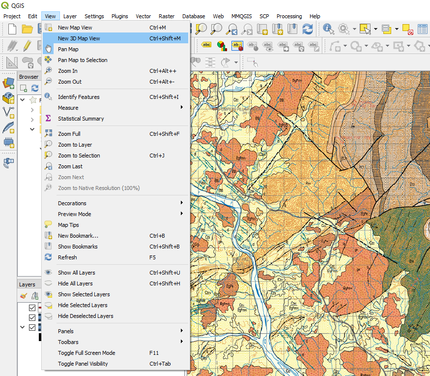
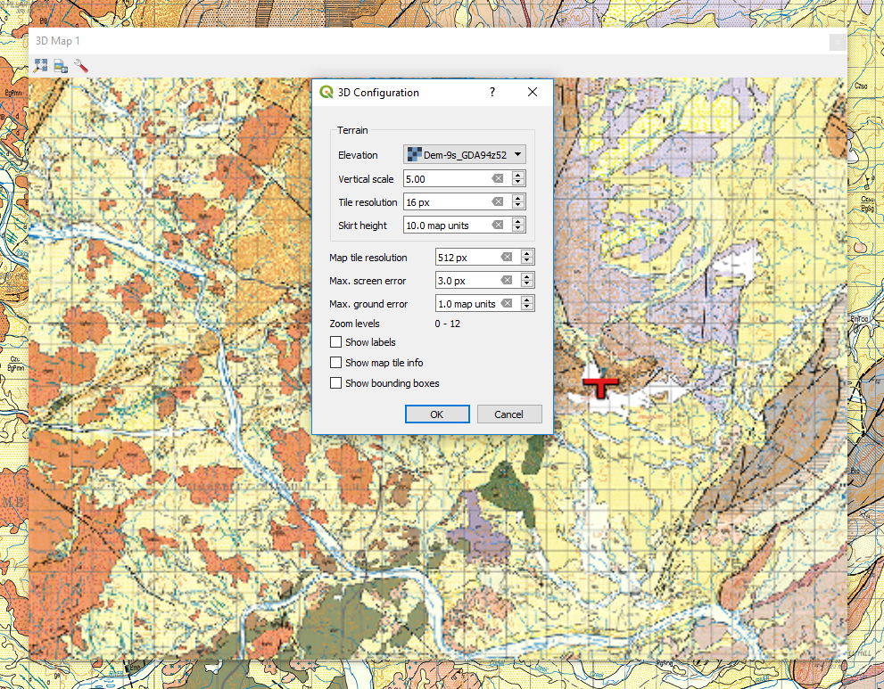
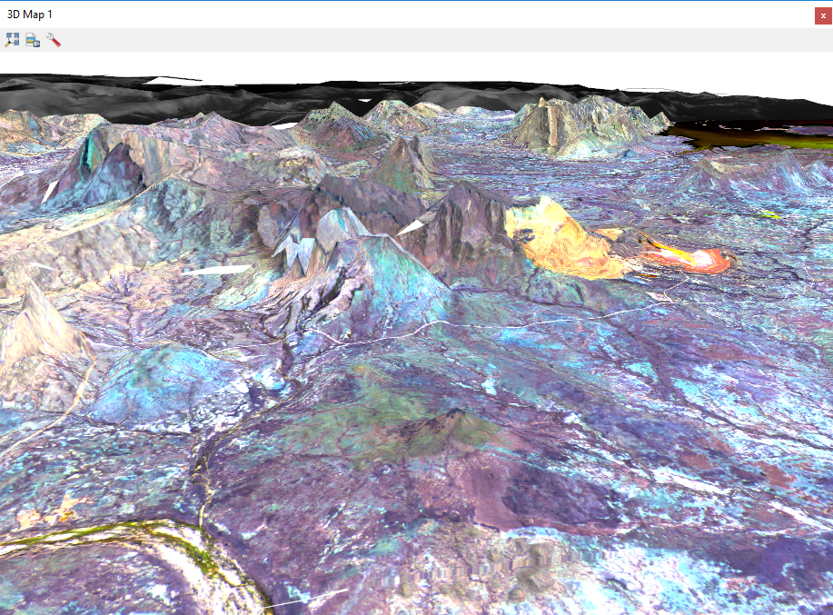

===========
3D Map View
===========

The layers require to be projected, i.e. not a geographic projection, lat/long, and they should all be in the same projection.

To run the 3D view, place the layers into the map window with the DEM layer at the bottom of the layer stack. Go to the View > New 3D Map View menu item and create a 3D map window. Resize the window to suit and select the little spanner symbol to open-up the options dialog.

Select the layer to be used as the “Elevation”, set the vertical exaggeration and press OK. Use the hand icon to move the display in the window. To tilt the display to see the 3D effect, hold the shift key and drag the mouse towards down. With the shift key depressed you can also rotate the image. Scroll speed will be dependant upon the size of your grid files and the speed of your PC.

Any image displayed in the map window can be used for 3D display.
