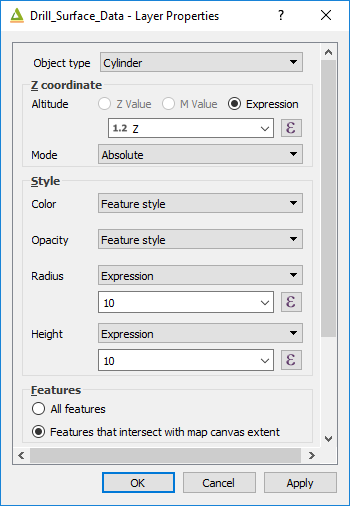

===================
QGIS2Threejs Plugin
===================

This plugin is more flexible than the 3D map view at the present stage of its development for geological application. The layers require to be projected, i.e. not a geographic lat/long projection, and they should all be in the same projection. If you have data in 3D, i.e. with x, y and z coordinates, then this plugin can display the data. If you get weird effects, you may have a lat/long layer in the map window which may be causing problems. Close any lat/long layers and re-run the plugin.

To use this plugin, load a DEM or any type of grid file over which you would like to drape data. For example you may wish to drape a satellite image or geological map over a digital terrain model.

Make sure the grid is on the bottom, with the layers to be draped on top of the DEM/grid layer. Run the QGIS2Threejs plugin and select the DEM layer.

Vertical exaggeration can be changed using the Scene > World Settings dialog box.

If you have vector data with a z (e.g. RL or elevation data) then right click on the vector layer name in the QGIS2Threejs window and select the z value to use in the “Z Coordinate” options. Downhole drill hole data can be plotted using this method.

The image below shows a Google Earth image, draped over a SRTM digital terrain model, with a vector file of surface samples and drill hole sampling.

