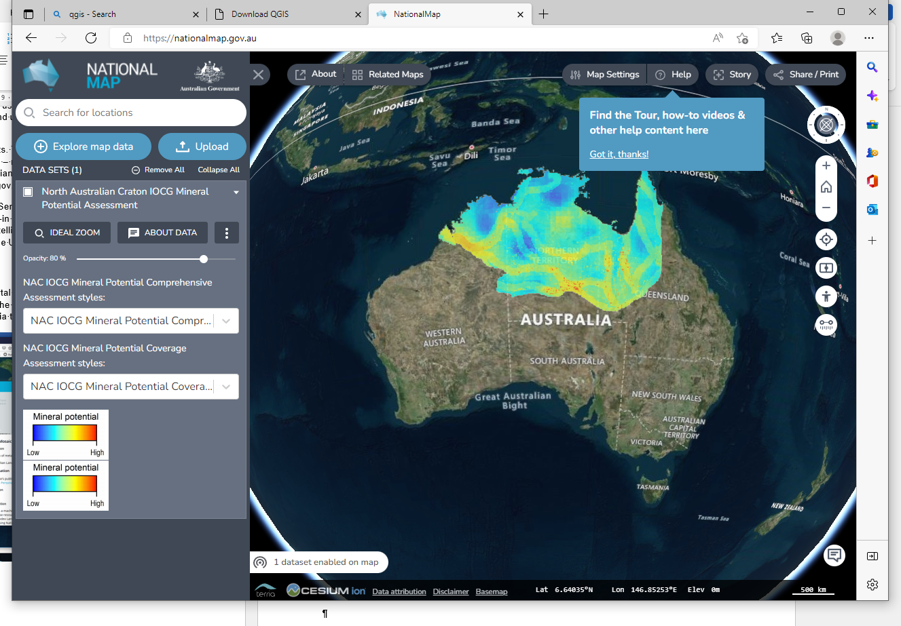

====================
Australian Data Sets
====================

The Australian government has the `National Map portal <https://nationalmap.gov.au>`_ where data can be accessed for Australia-wide data sets or from the individual states and territories. The WA DEMIRS (Department of Energy, Mines, Industrial Regulation and Safety) data can also be accessed via this portal.

