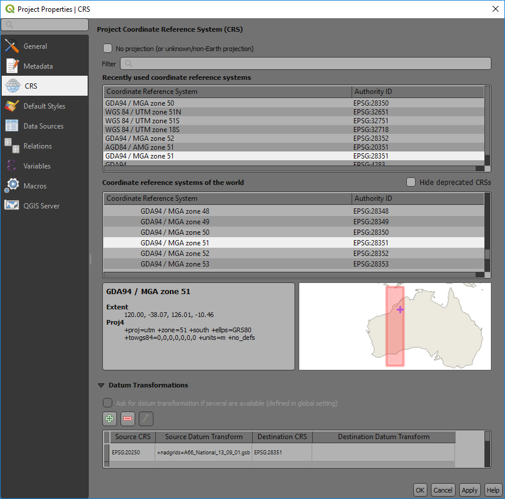

============================
Coordinate Reference Systems
============================

When using GIS data, it is very important to know the coordinate reference system (CRS) of the data. Choosing the wrong projection will misplace the data or prevent it from appearing on your map. QGIS can re-project data on-the-fly (OTF) when bringing data into a map window that has a different CRS to the file being imported. If QGIS cannot recognise the projection of the layer being imported, it will flash a yellow warning banner and usually defaults the layer projection to WGS 84. Open the layer properties for the layer and correct its projection.

Note that the CRS in the PROJECT PROPERTIES dialog box affects the way the data is displayed in the map window. The CRS dialog box in the LAYER properties box affects where the points are located on the planet. It is very important to know the CRS of the data being imported into the map window.

The CRS dialog box remembers your recent CRS used and these can be quickly selected from the “Recently Used…” information box. If you have not used a particular projection previously, you can type in the CRS name or EPSG number of the projection into the “Filter” box. For example, the Australian GDA94 geographic CRS has an EPSG of 4283. Note that if you type “GDA94” into the filter box it may give you an option of GDA94 as a Projected Coordinate System (EPSG 4938), this is incorrect and will cause problems when trying to display GDA94 lat/long data. Always check you have selected the correct CRS.

GDA94 UTM zones can be easily selected by entering the EPSG starting with “283”, then add the zone number, for example GDA94 zone 50 would be EPSG 28350. GDA2020 has a lat/long EPSG of 7844 and a UTM EPSG of 78xx where xx is the GDA zone number.

WGS84 UTM zones can be selected using “327” then the zone number for the southern hemisphere and “326” plus the UTM zone for the northern hemisphere.

The lower map window shows the area of the world where the projection is valid.

If you are using a local grid with no real world projection, you can select the “No Projection” tick box at the top of the window.

Note that in recent QGIS releases you get a coordinate transformation window open up when QGIS is reprojecting layers on the fly from WGS84 projections. QGIS is reminding you that the WGS84 projection transformations are only accurate to 2 to 3 metres.
