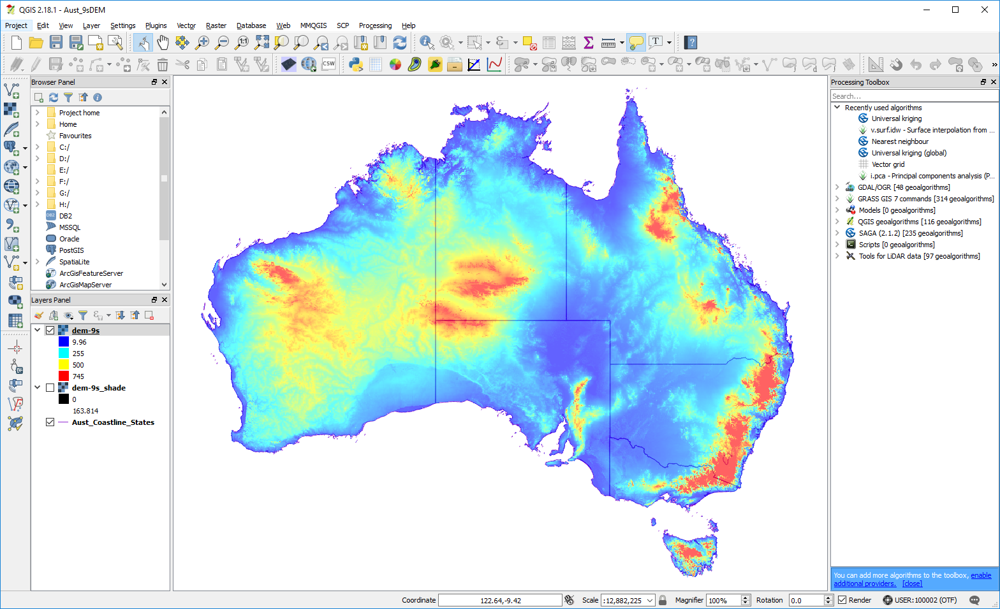
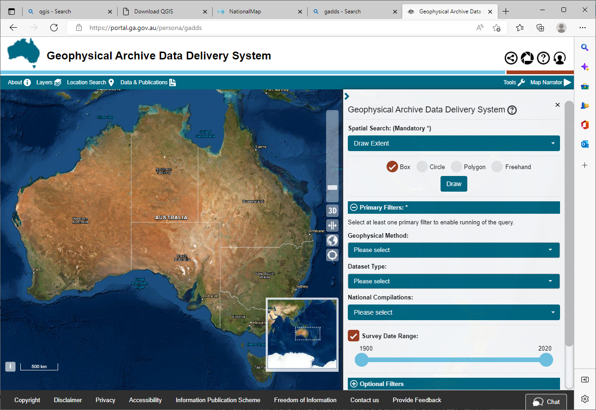
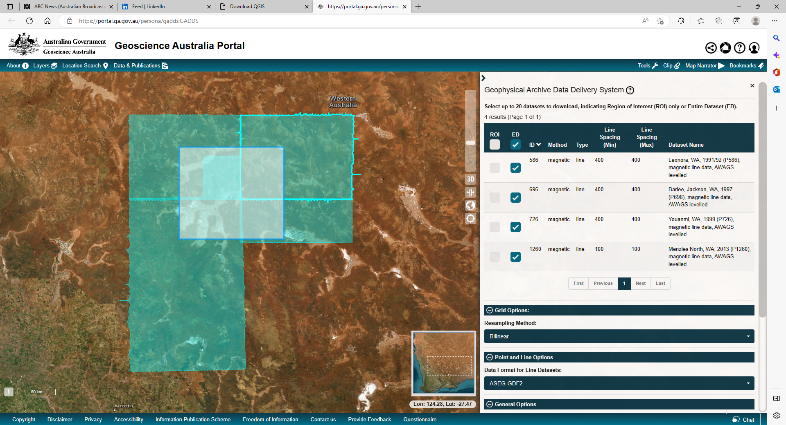

====================
Geoscience Australia
====================

Geoscience Australia (GA) provides an extensive array of national datasets via `data.gov.au <https://data.gov.au/>`_.

Digital elevation data is also available across Australia from `Geoscience Australia <https://elevation.fsdf.org.au/>`_ at a resolution of 1 arc second (approximately 30 m) and is available as a hydrologically conditioned and drainage enforced version (DEM-H). This is a 26 Gb zip file and can be downloaded. The author has cut this into UTM zones which are approximately 7 - 8 Gb in size each zone to improve usability. Depending upon the speed of your PC/laptop, these may need to be further cut into 1:1 million map sheet areas. The 9 second DEM (approximately 250 m) is about 0.8 Gb in size, is also available.

  Geoscience Australia, 9 second DEM

Many of these datasets are also available as `web services <http://services.ga.gov.au/>`_.

Geophysical data incorporating magnetics, gravity, radiometrics and elevation data can be downloaded as vector (point data) or as grid files. Both national and individual survey data is available for data held by Geoscience Australia via the `Geophysical Archive Data Delivery System <https://portal.ga.gov.au/persona/gadds>`_ - access via the “Tools” menu on the right hand top side of the window. DEMIRS will hold data for surveys flown for the GSWA. Data can be filtered by 1:250 000 map sheet area or by geographic coordinates. Check the projection of the dataset before you download, as it may default to geographic coordinates.

  Geoscience Australia geophysical data portal.

GA have also released a new `Digital Earth Australia data portal <https://www.nationalmap.gov.au/>`_.
