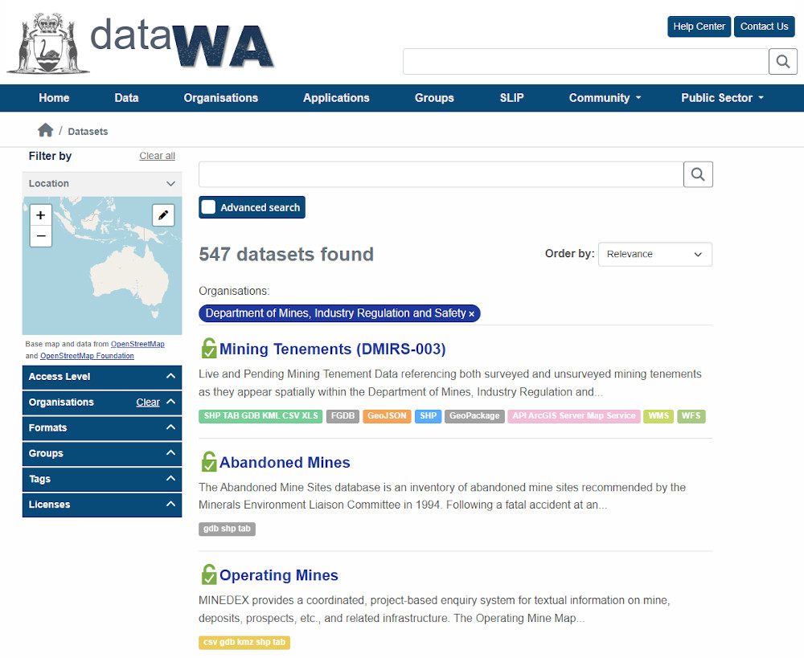
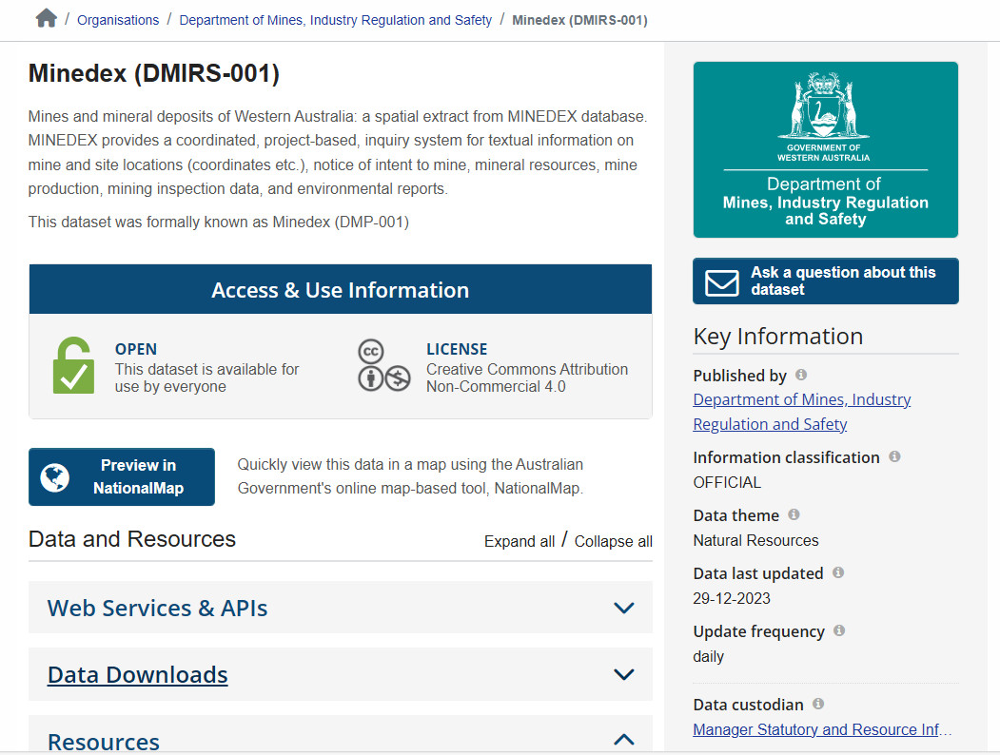
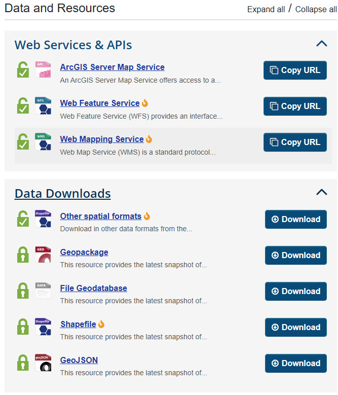
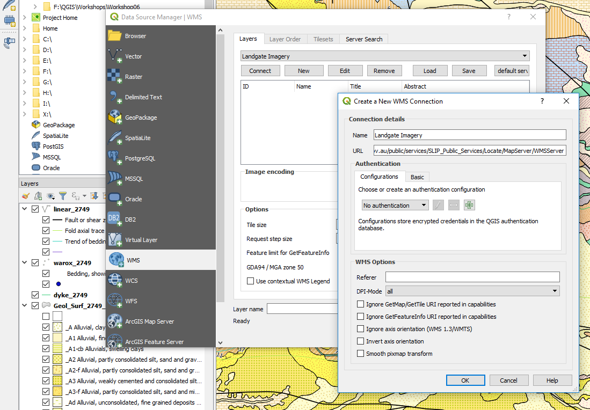
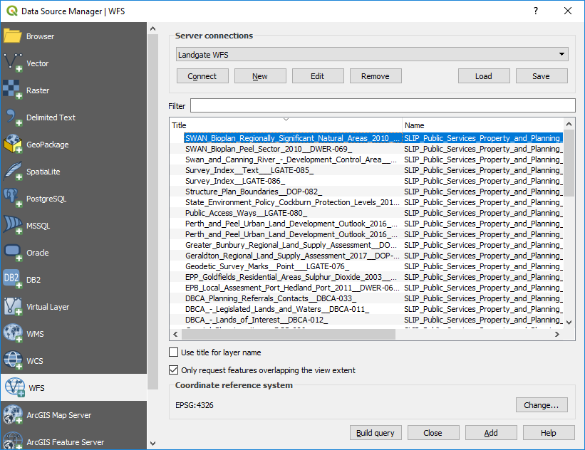

=========================
Landgate and Open Data WA
=========================

The WA government has made available a large variety of GIS datasets through their Open Data portal (data.wa.gov.au). Data from other states can be accessed in a similar manner. Searches can be made on this site and both vector data and web service links are supplied. More detailed datasets are available for WA from Landgate, but they may require a subscription. Many datasets are however free, and registration is no longer required for the free datasets.

Links to some of the WA web services are as follows;

https://catalogue.data.wa.gov.au/dataset/?organization=department-of-mines-industry-regulation-and-safety

Use the search option to seek a particular data set, e.g. tenements.

Using Minedex as an example, this link allows you to connect to web services or download data (where available).

Imagery

https://catalogue.data.wa.gov.au/dataset/locate-wa-mosaic

To add WFS and WMS layers to QGIS, use the Layer > Add Layer > Add WMS/WMTS Layer.

.. image:: img/add_wms.png
  :align: center

An example of linking to the Landgate imagery is shown below.

Some services may require you to register for a username and password.

Access to WFS vector data is via the add WFS (web feature server) option. See below for the list of publicly available data (no sign in required) from the Landgate server.

