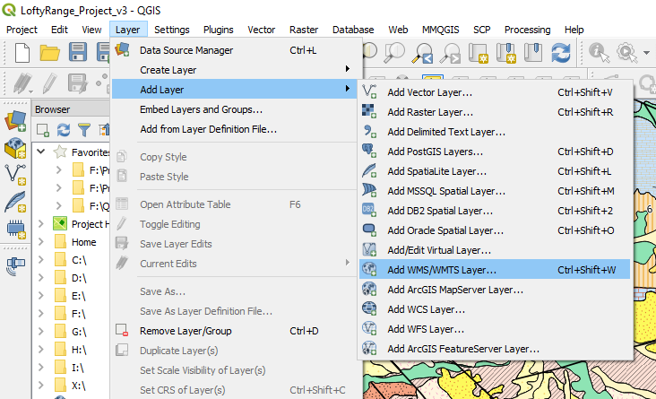

=========================
Landgate and Open Data WA
=========================

The WA government has made available a large variety of GIS datasets through their Open Data portal (data.wa.gov.au). Data from other states can be accessed in a similar manner. Searches can be made on this site and both vector data and web service links are supplied. More detailed datasets are available for WA from Landgate, but they may require a subscription. Many datasets are however free, and registration is no longer required for the free datasets.

Links to some of the WA web services are as follows;

Web Map Server Links

Public: https://services.slip.wa.gov.au/public/services/SLIP_Public_Services/Property_and_Planning/MapServer/WMSServer

Imagery: https://services.slip.wa.gov.au/public/services/SLIP_Public_Services/Locate/MapServer/WMSServer

Web Feature Server Links

Maps

https://services.slip.wa.gov.au/public/services/SLIP_Public_Services/Property_and_Planning_WFS/MapServer/WFSServer

Imagery

https://services.slip.wa.gov.au/public/services/SLIP_Public_Services/Imagery_and_Maps_WFS/MapServer/WFSServer

Australian Bureau of Statistics: https://www2.landgate.wa.gov.au/ows/wfsabs_4283/wfs

To add WFS and WMS layers to QGIS, use the Layer > Add Layer > Add WMS/WMTS Layer.

An example of linking to the Landgate imagery is shown below.

.. image:: img/wms_landgate_image.png
  :align: center

Some services may require you to register for a username and password.

Access to vector data is via the add WFS (web feature server) option. See below for the list of publicly available data (no sign in required) from the Landgate server.

.. image:: img/add_wfs.png
  :align: center
