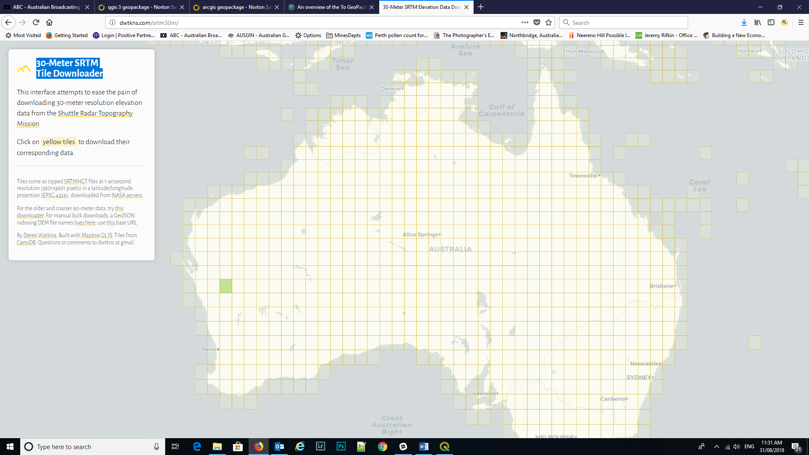

=========================
30m SRTM Tile Downloader
=========================

The SRTM-Downloader plugin allows the user to download tiles into their map window and these can be saved. Note that you will need a USGS EarthExplorer portal login (free). The dtm tiles are downloaded in one degree tiles in hgt grid format (which QGIS reads with no problem).

You can also use `this link <http://dwtkns.com/srtm30m/>`_ to access the 30m SRTM tile data. You will need to add your USGS EarthExplorer username and password.

These images are in jp2 (jpeg2000) format which have the image registration information incorporated in the file. QGIS reads and registers these images.
