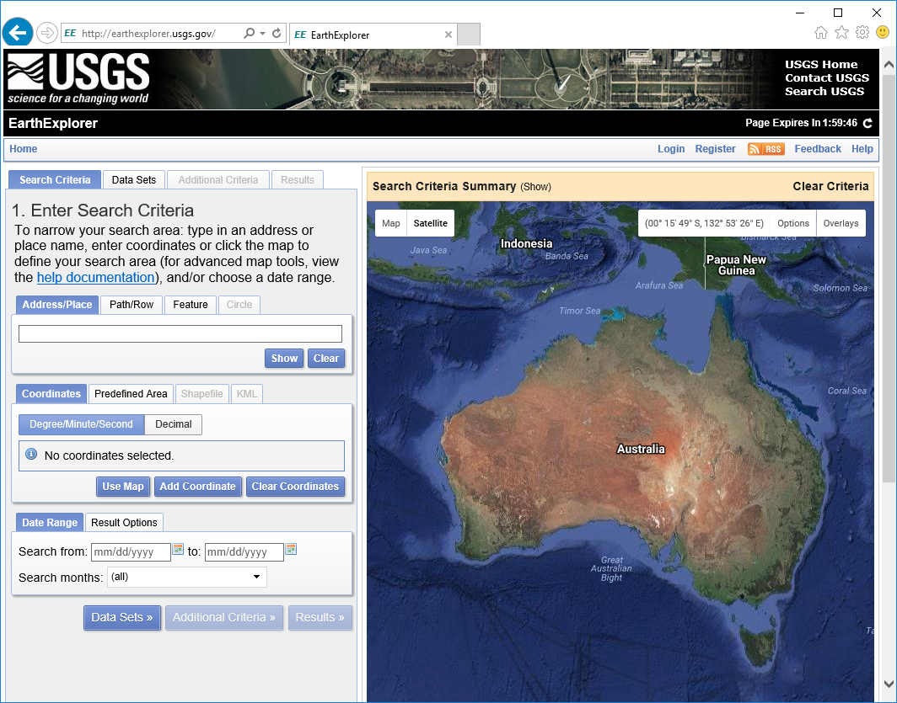
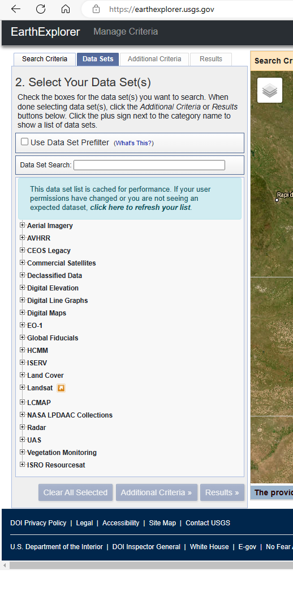
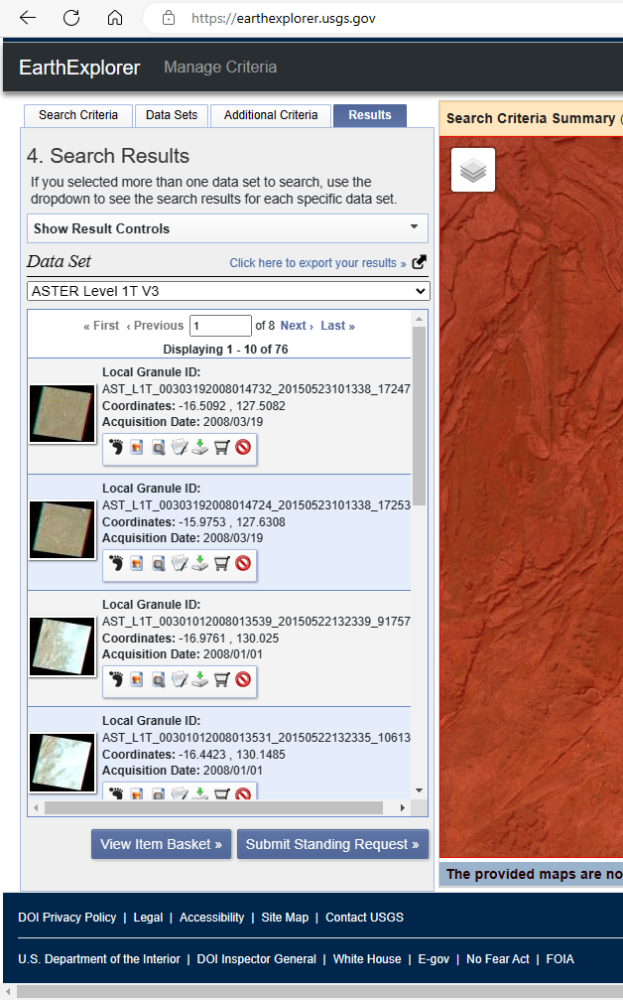

======================================
United States Geological Survey (USGS)
======================================

The USGS hold an enormous amount of free data, most of which is accessible via its `EarthExplorer portal <http://earthexplorer.usgs.gov/>`_. To download the data, you are required to register (free) and select a username and password.

ASTER and Landsat data are two of the remote sensing datasets available from the USGS. These datasets are also easily accessed via the Semi-Automatic Classification plug-in in QGIS (see Section 11.1). Digital elevation, radar and Lidar data are also available from the USGS. Note that Sentinel 2 data is now no longer available from the EarthExplorer portal.

Use the Register button to create a free account or log in if you have an existing EarthExplorer account. Logging in allows you to download datasets.

Enter the search criteria by using a Landsat path/row identifier, or by using the map or by a coordinate. Once you have selected an area, choose the data set you are seeking, add “Additional Criteria” if you want to filter your search, e.g. by date range.

Each of the data categories have a range of datasets available. The image below shows an example of searching for ASTER data.

If there is data available from your search request, you can then examine the thumbnails of the scenes and select which dataset is the best one for your purposes. The footprint icon will show the area covered by the scene and notepad and pencil icon brings up a better view of the data including its metadata. Click on the download icon to download the data. The format of the data will depend on the data type and this needs to be researched by the user.
