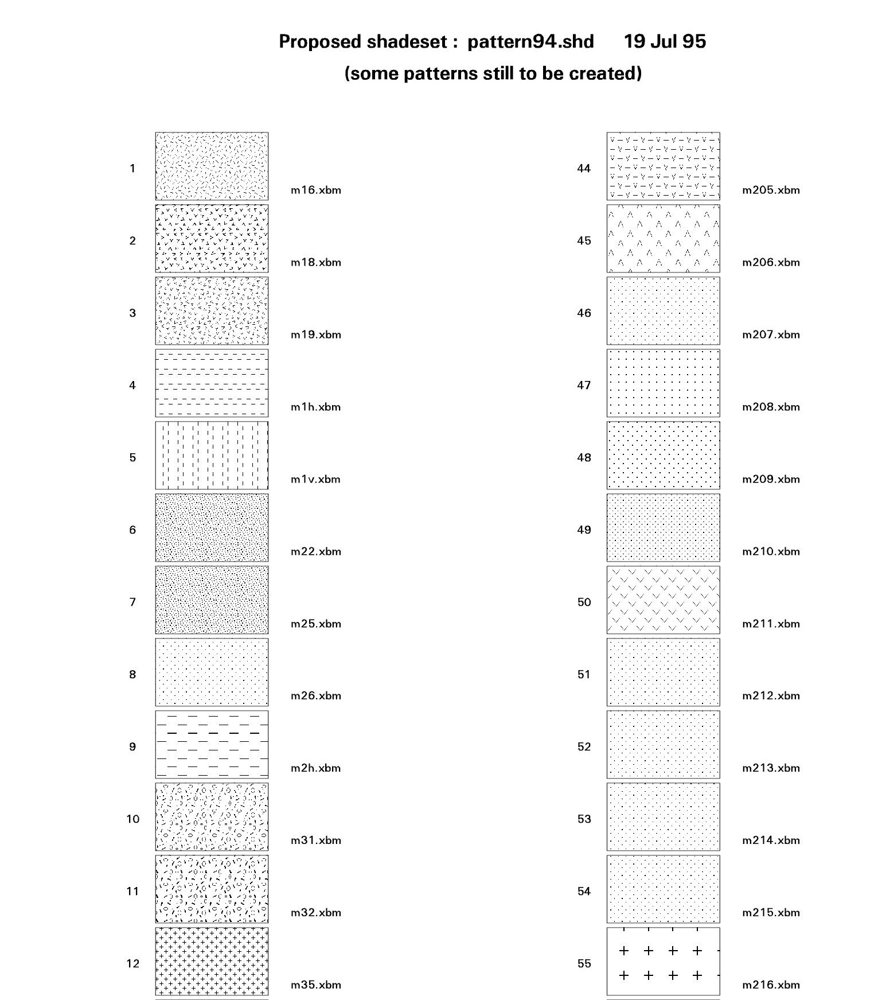

.. _appendix:

=======================================
Lithologic Patterns for Geological Maps
=======================================

USGS (FGDC STD-013-2006)
------------------------

 `37 - Lithologic Patterns (.pdf)`_

.. _37 - Lithologic Patterns (.pdf): https://pubs.usgs.gov/tm/2006/11A02/FGDCgeostdTM11A2web_Sec37.pdf

 `38 - Explanation for Pattern Chart (.pdf)`_

.. _38 - Explanation for Pattern Chart (.pdf): https://pubs.usgs.gov/tm/2006/11A02/FGDCgeostdTM11A2web_Sec38.pdf

Geoscience Australia
--------------------

Proposed shadeset: pattern94.shd

Geological Survey of Western Australia
--------------------------------------

`GSWA style guides`_

.. _GSWA style guides: http://www.dmp.wa.gov.au/Geological-Survey/GSWA-style-guides-29119.aspx

`Guide to editing maps`_

.. _Guide to editing maps: http://www.dmp.wa.gov.au/Documents/Geological-Survey/Guide-to-editing-maps.pdf

Guide to editing maps, pg.94

