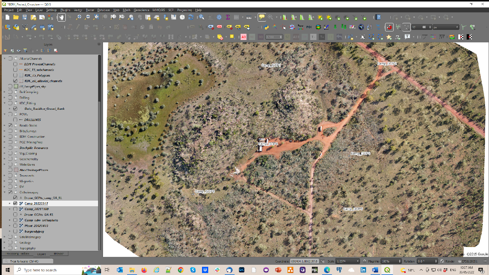
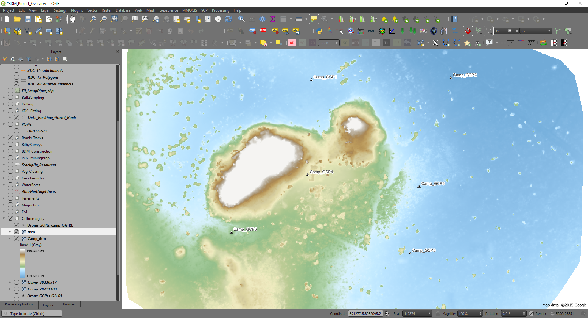
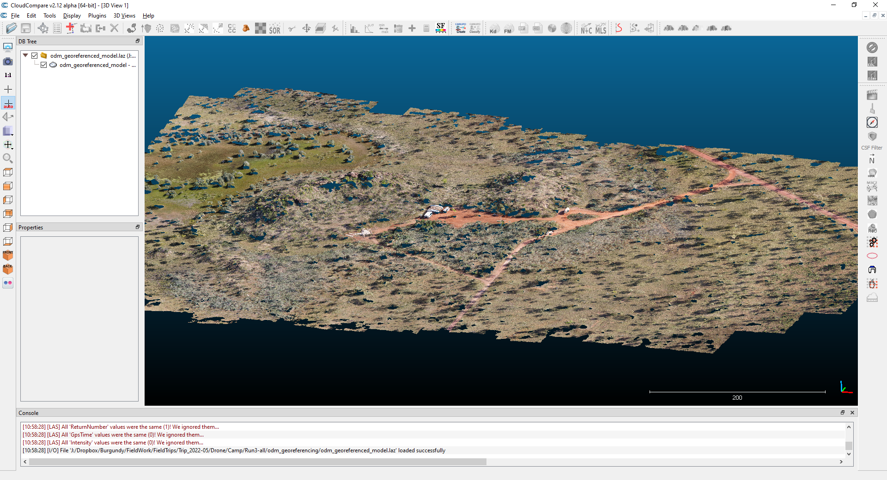
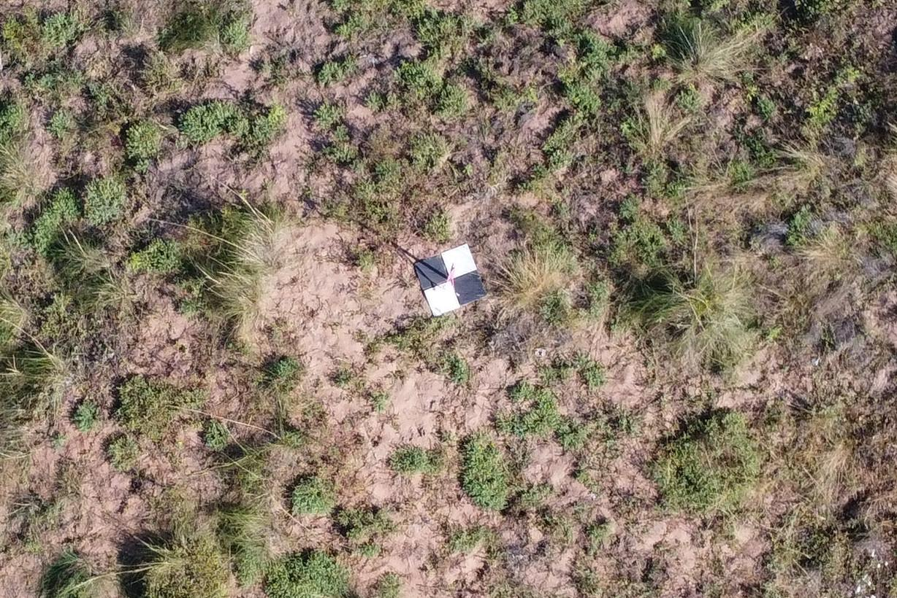
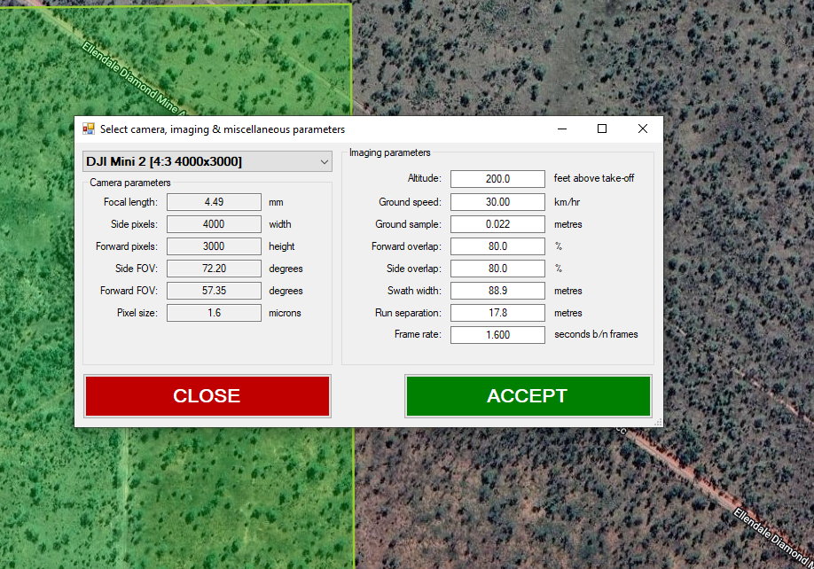
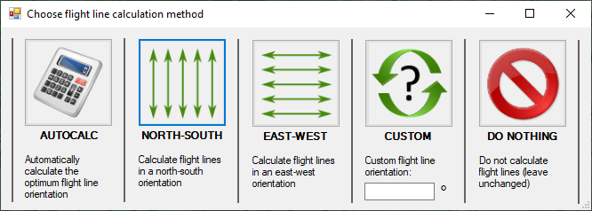
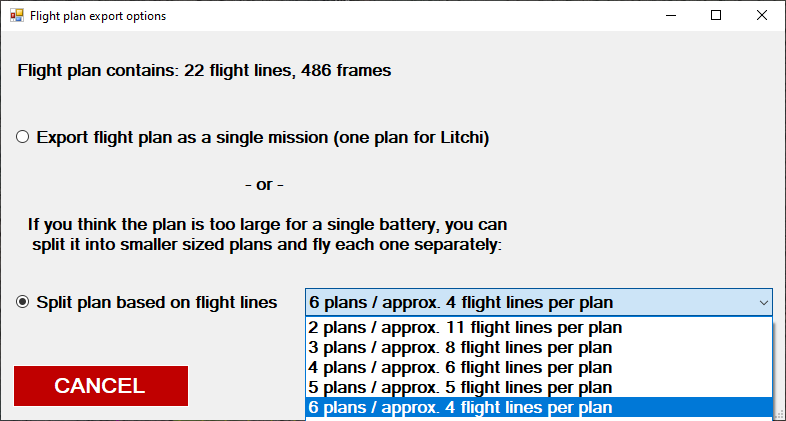

.. _drone_mapping:

================================
Drone Mapping in QGIS
================================

The use of drones is now becoming commonplace for mapping, particularly with the inexpensive drones now available on the market. Drone derived orthophoto maps, digital terrain models, digital surface models and point clouds can be read directly into QGIS.

  An example of an orthophoto created with the DJI Mini 2 and 6 ground control points.

I have a DJI Mini 2 with which I have been experimenting with lately to create orthophoto maps for various projects and found it particularly useful when documenting mineral exploration activities, environmental disturbance and/or construction progress. In my experience I have been able to get accuracies of the order of 5 m with the built-in drone GPS and this can be improved with ground control points located by handheld gps. Greater accuracies will be achieved if the ground control points are accurately surveyed with 10 cm being achievable. In many cases 2-3 m accuracy will be suffice. Oblique aerial views are also very useful to document progress and for public relations images.

  Example of digital terrain model (DTM) from drone survey.

It is important to understand your drone and be a capable drone pilot before trying any drone mapping. Note also you will require government accreditation, e.g. via the Civil Aviation and Safety Authority (CASA) in Australia, before you can fly your drone. Please check your local regulations.

  Example of digital surface model (DSM).

There are numerous YouTube videos that explain the map making and drone process. I have found with my DJI Mini 2, I can fly at 120 m agl (above ground level, maximum allowed) with a 50 m line spacing and that will allow the creation of an orthophoto with a 4 cm per pixel ground resolution and sufficient photo overlap to allow good orthophoto creation.

  Example of a point cloud for the above examples using CloudCompare program.

My workflow comprises whether to mark out ground control points, at least 6 to cover a rectangular area, if moderate accuracy is required. Ground control points need to be clearly visible from the air and I have been trialling 4 x 30 cm square ceramic tiles, two white and two black, to create a checkerboard pattern which are clearly visible from 120 m agl. These tiles will also be resistant to the weather and the GCP's should be useable over a number of years.

Note that if you have surveyed mining tenements, for example a mining lease boundary, these will have been accurately surveyed and as such are useful ground control points.

  Example of a ground control point using 4 x 30 cm ceramic tiles.

I use three software applications; DJIFlightPlanner, to create pre-programmed flight missions, the Litchi app for my smartphone, and WebODM to carry out the photogrammetry calculations to create orthophotos, DTM, DSM and point clouds of the collected data. None of these are free but they are low cost.

There are a number of flight planning software options available, and these programs create a pre-programmed flight so that the drone knows where to fly, how high and other variable like speed and camera photo intervals. The output from the flight planning software is transferred to the flight controller app - the Litchi app - on your smartphone which will send the flight information to the drone.

Once the photos have been collected, they are checked and then loaded into the photogrammetry program WebODM.

Mission Planning
----------------

To plan your drone survey, create a KML (Google Earth) polygon file in QGIS and import this into DJIFlightPlanner. Select your drone camera from the drop-down list on the left and check the suggested flight parameters in the right-hand side of the pop-up box.

I would typically adjust the “Altitude” to my preferred altitude of 120 m (roughly 390 ft) and a ground speed of 20 kph, which allows a photo interval 7 seconds to give a suitable photo overlap (70%).

The flight line direction can then be selected.

The flight lines and photo points are then calculated.

.. image:: img/litchi_screenshot.png
  :align: center

These flight lines are then exported using the “Export” to “CSV for Litchi” option. I would then create a time-based flight and use the split the flight plan into 4 flights per plan.

The reason for multiple plans is that I know the Mini 2 batteries have an endurance (flight time) of about 20 minutes, so I design each plan to have a flight time of around 15 minute to allow for drone return to home and any unforeseen headwinds. The battery will be replaced after each flight and with 6 batteries, this allows me to fly six flight plans before I need to recharge my drone batteries.

Creating the Flight Plan
------------------------

The output from the DJIFlight Planner, the csv file, is imported using the `Litchi Mission Hub web portal <https://flylitchi.com/hub>`_ and the Mission > Import option.

Within the Litchi Mission Hub, you can fine tune what happens at each waypoint, e.g. the height and photo interval. The return to home (RTH) option is set in the Litchi app on your smartphone so at the end of each flight plan, the drone returns to home. Note this window displays the length of the flight plan and the flight time.

.. image:: img/flight_lines.png
  :align: center

When all the details are correct this is saved to the mission hub and can be downloaded to your smartphone when you next open up the Litchi app (making sure you do this while you have an internet connection). The background Google Earth image will be cached in your phone if you open up each flight plan while you have an internet connection.

Flying your Mission
-------------------

Before you fly, make sure all your batteries are charged and the weather is suitable. Check for any helicopter activity in the area before you fly. After take-off, check all your aircraft settings are correct, such as photo type (single, timed image, 3000x4000 aspect for DJI Mini 2). Fly your missions.

Processing the Images
---------------------

After collecting the photos and downloading them to your computer, check the photos and remove those that are not necessary, like those collected during ferry trips etc. Identify the images with the ground control points (GCP) so they can be used in the creation of the ground control point file. GCP's will usually be identified in about 4 images for each GCP and this is required for WebODM to be able to rectify the orthophoto.

The orthophoto above was created using WebODM from a collection of 266 images and a ground control point file. Processing on my laptop (64 Gb RAM, Core i7 processor) took about 6 hours, so I usually run it overnight. A desktop PC with a large amounts of RAM and disk space, plus multiple cores may make this processing a little quicker.

The default setting with WebODM will create an orthophoto, a digital surface model (dsm), a digital terrain model (dtm, ground level) and a point cloud.
