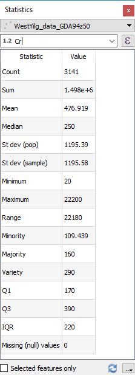
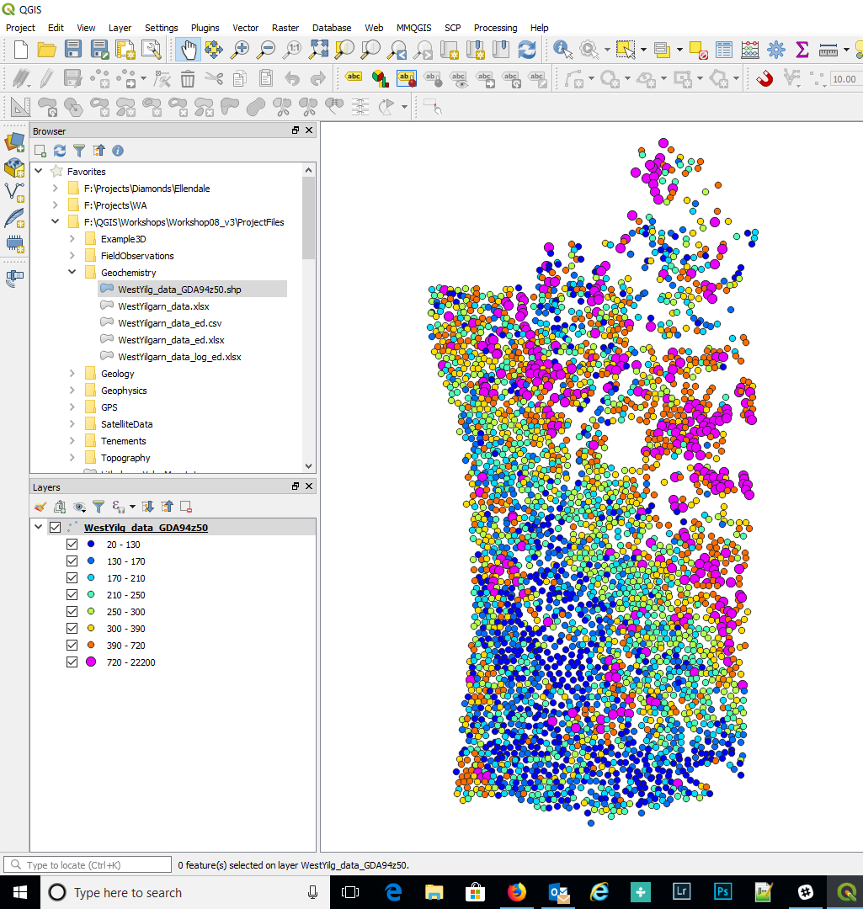
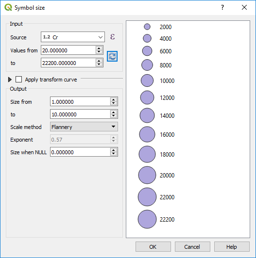

==============================================
Importing and Styling Geochemical Assay Points
==============================================

Geochemical data is usually in the form of an excel spreadsheet or as a text file. Open the file in QGIS via the “Spreadsheet Layers” or CSV file open options depending upon the format of your data. See section 6 above for opening spreadsheet and csv files, and the potential use of CSV format files (\*.csvt) for large complicated csv files. If you have problems importing large csv files exported from Excel, save the file as a tab-delimited text file and import this into QGIS.

IoGAS has created a QGIS plugin for its export files and can be downloaded from the `ioGAS website <https://reflexnow.com/download-qgis-plugin-for-imdex-iogas/>`_. This provides a live link between QGIS and ioGAS.

When loading your data, ensure the data has been loaded into QGIS as the correct field type, i.e. as a number, not as a string (text) field. This can be checked using the layer's Layer Properties > Fields tab.

When the data has been imported into QGIS, make sure you check the correct coordinate system has been selected.

Use the View > Statistical Summary option to display the statistics for a particular field. This helps to identify potential problems with the data such as negative values representing below detection limit data.
Geochemical point data can be displayed as points and can be coloured or sized according to value.

To filter out bad data, use the “feature filter” in the Source tab of the Layer Properties to filter out all the negative numbers (below detection or not assayed) - see the following image as an example for the Cr data.

.. image:: img/filter.png
  :align: center

Use the query builder, as shown below. Note that this has only been done for Cr values in this example.

This is important for geochemical data so the negative values do not influence the statistics of the data.

Univariate statistics can be calculated using the View > Statistical Summary panel. This opens a panel under the browser panel, where you can select the layer and data field for which field you want to calculate statistics. The mean, standard deviation, first quantile, third quantile and the Inter Quartile Range (IQR) are among some of the calculated results.

To examine the statistics of the data, use the View > Statistics Panel and select the field to be queried.

In this example note that the first and third quantiles are 170 and 390 ppm Cr with an IQR (inter quartile range) of 220. Geochemists would say that any values over 720 ppm Cr (Q3 + (1.5 * IQR) are anomalous.

To colourise your data, use the Layer Properties > Style tab to select the way you want the data displayed. The simplest way is to use the “Graduated” option and colour the point values. Note that this works on numeric values only. Select the column you wish to colour the points by and the desired colour ramp and hit the “Classify” button. Under the display window, you can also select the way the points are coloured. You can use a variety of methods. You can also manually edit the ranges in the display window.

To colour the geochemical data by assay value, select the Style tab in the layer properties panel. Select the Graduated option in the top drop-down box. Select “Cr” as the field to be displayed. Select a suitable “colour ramp”, select Mode “Quantile (Equal Count)”, change Classes to 8, hit “Classify” (if you forget to hit Classify you will not any colours!). You will note that the boundary between the second and third quantile is 170 ppm (Q1) and the boundary between the sixth and seventh range is 390 ppm (Q3). Other display modes may be more applicable, and this will depend upon your data and how you want to display the data.

The top two classes are below 170 ppm (25th percentile) and the bottom two classes are greater than 390 ppm (75th percentile). You can manually edit the second last range so that its upper value is 720 ppm (anomaly threshold) and it will automatically update the eighth data range.

In the figure above I have selected the >720 ppm and enlarged the symbol.

Other options are available for the display of the data - see the “Mode” drop-down box.
Note you can vary the displayed number of decimal places in the legend by using the “Precision” option in the dialog box.

The drawing order can be varied so that all the high values are plotted on top. To do this scroll down the Symbology dialog box to the “Layer Rendering” option, turn on the “Control feature rendering order”, then click the “sort” icon on the right-hand side.

Select field to use for the ordering and whether you ascending or descending order.

Points can also be classified by size. Click in the Symbol box (where it says “change”) to bring up the symbol selector window. Highlight the “Marker” layer in the top left, then click on the far-right hand side of the Size options where there is a little square box with a down arrow. This is the “Data Driven Override” button. Click on this and scroll down to “Size Assistant” where you can select the symbol size by the field “Cr”. Select the field to use for the size, then refresh so that QGIS can calculate the data range in that field. Select OK to apply. Close the layer properties window.

