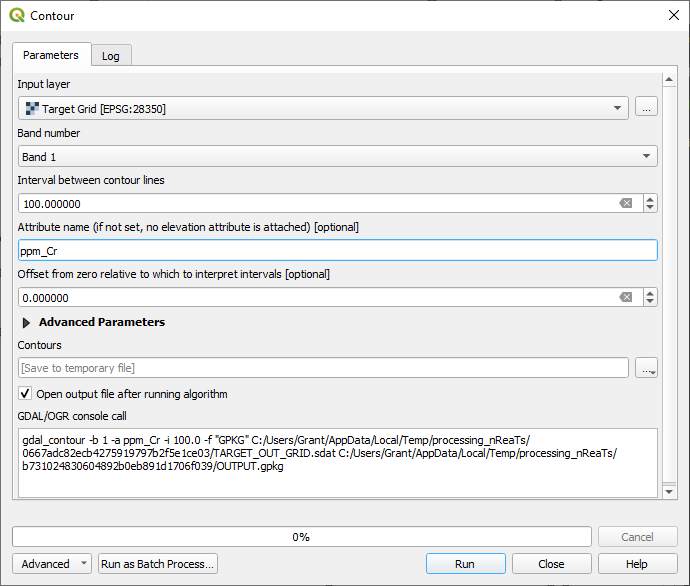
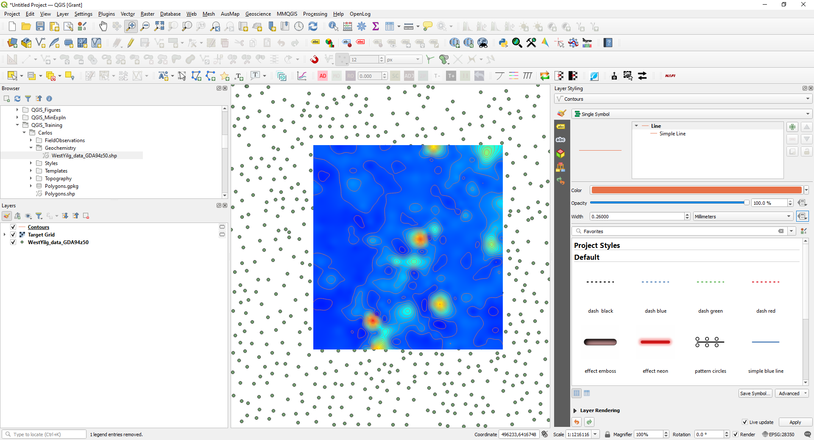
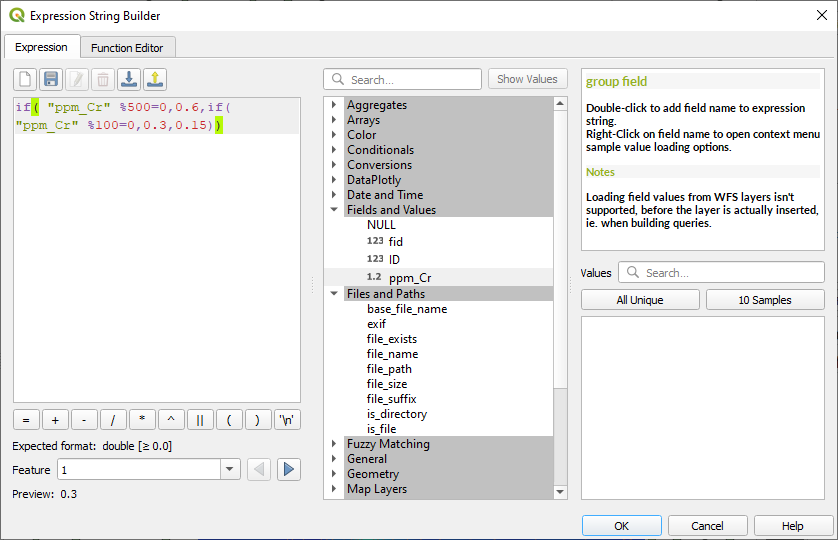
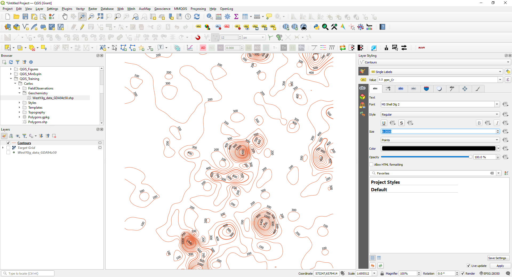
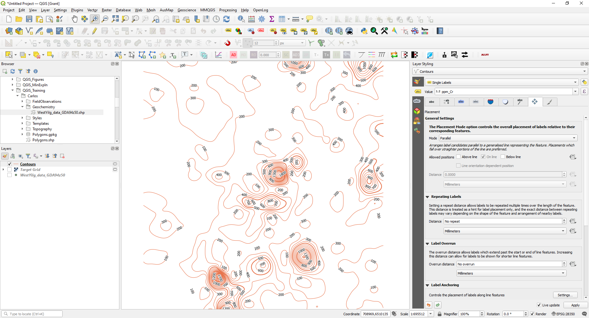

===================================
Contouring Surface Geochemical Data
===================================

To create contours of the data, use the Raster > Extraction > Contour menu item.

In this example I have used a contour interval of 100 ppm and called the contour field name “ppm_Cr”. This can be saved as a temporary file to check the results before saving a final version.

To emphasise significant value contours, like every 500 ppm for example, use the Data Driven Override box to the right of the “Width” option in the Layer Styling panel. Open the edit option to bring up the Expression String Builder.

The code is saying if the contour value (ppm_Cr) is divisible by 500 with a zero remainder, i.e is a multiple of 500, then use a line thickness of 0.6 mm. The % symbol returns the remainder after a division. If the number is not a multiple of 500, then test if it is a multiple of 100. If it is, then use a line thickness of 0.3, otherwise use a line thickness of 0.15.

We can now annotate the contour lines using the Layer Styling panel and select the Label tab and choose the Single Labels option and the ppm_Cr field for the value to be plotted.

The default view is shown above. To tidy this up change the font size (on the first tab “abc”) to 8, choose a white buffer of 0.8 (third tab along) and the placement (on the 8th tab, four directional arrow), set to Mode Parallel, tick on “On Line, uncheck the “Above Line” setting.

This looks a lot better and can be fine-tuned depending on your data.
