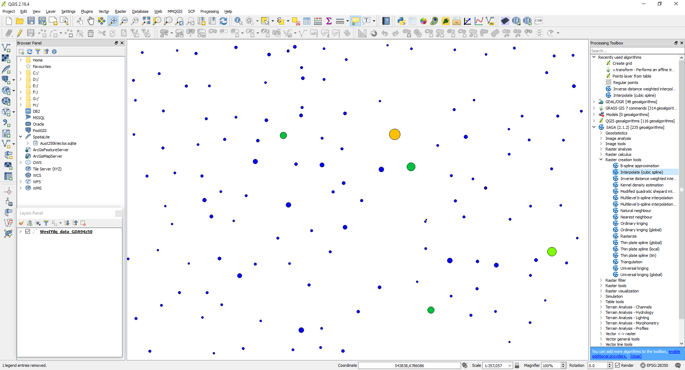
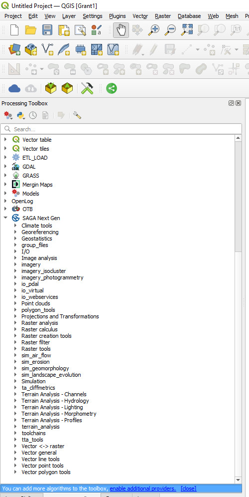
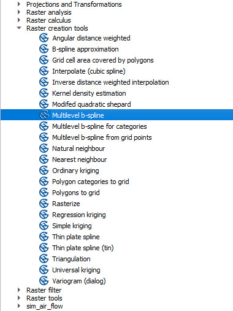
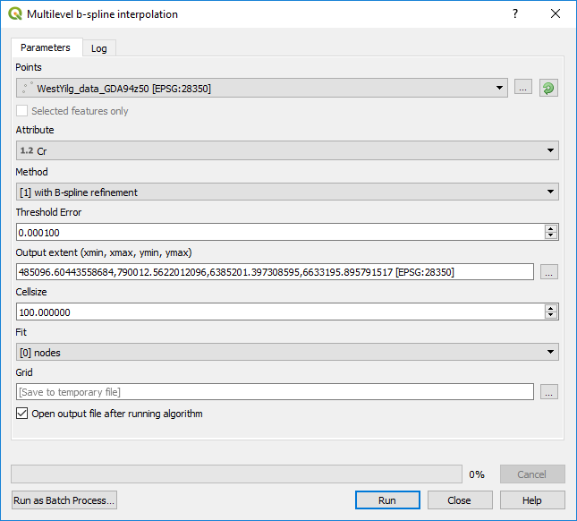
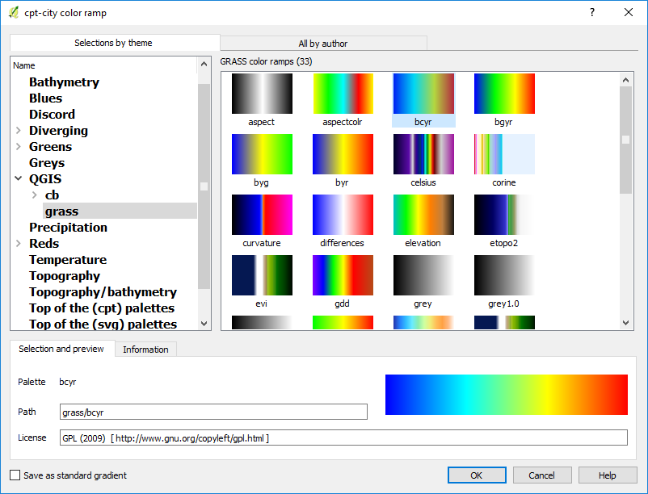
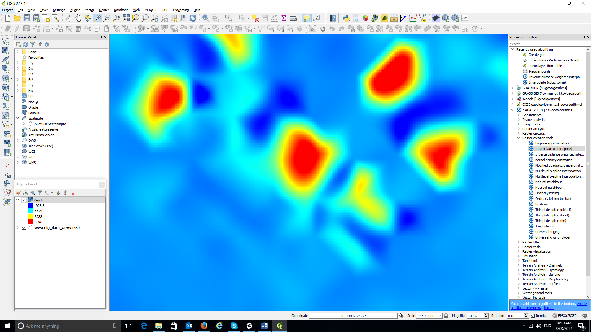

=================================
Gridding Surface Geochemical Data
=================================

To create a grid of the geochemical data, zoom to an area of data that you want to grid and open the Processing Toolbox > SAGA Next Generation > Raster Creation Tools > Multilevel b-spline. Note SAGA Next Gen is not installed by default and you may need to go to your plug-in manager and install/enable. 

Select the field to grid and click select and enter a file name (if you want a permanent file output) and location to where you want to write the grid file. It is important to make sure QGIS can write to the folder (not the default Program Files folder), otherwise the operation will fail. Note there are many gridding options available in QGIS, this is one example.

Zoom in to a subset of the data, as shown in the figure below.

To limit the area over which the grid will be calculated, use the canvas extent for the “Output extent” (click on the … to see the extent options).

The default grid colouring is greyscale. To add colour to the grid, open the Layer Property > Style tab and select pseudocolour as the render type. If you can't see the desired colour ramp, scroll to the bottom of the colour ramp display box and select “New Colour Ramp”, then Colour Ramp Type “cty-city”. A large range of colour ramps can then be selected.

A common ramp to use is the QGIS > grass “bcyr” colour ramp. Save this as a standard gradient (lower left-hand tick box) and save “Save Color Ramp” with a suitable name (e.g. Default Colour Ramp).

There are a variety of gridding option in QGIS (see menu item raster > interpolation) but I have found the SAGA gridding tools, which includes b-spline, inverse distance and kriging, to be the best for geochemical data. Note that the spline method will not be exact and will overshoot and undershoot some of the point values. Check a few different methods to find one that suits you best.
