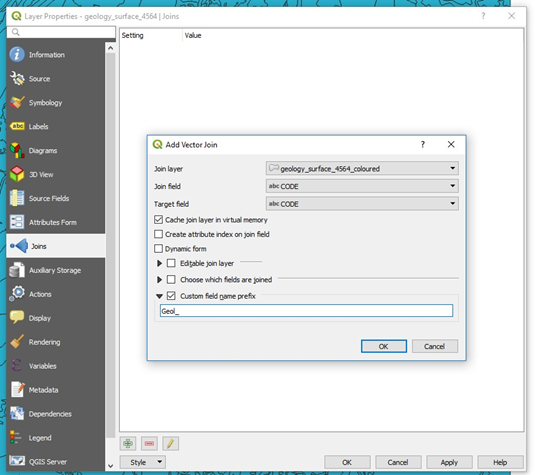
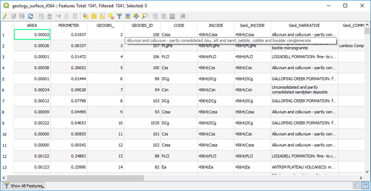

====================================
Joining Spatial and Non-Spatial Data
====================================

Joins are done via the Layer Properties dialog box. Open both the spatial file (i.e. the layer that is spatially located) and the non-spatial file (without spatial reference). The non-spatial file can be opened by the spreadsheet or text file import and with “No geometry” selected. The non -spatial layer will appear as a spreadsheet icon in the Layer properties panel. Select the spatial layer in the Layers panel you wish to join, open its Layer Properties > Join tab, press the green plus to add a new join, select the join fields (which must have data in common in both layers to allow it to join).

The example below (Bow 100k map sheet) shows the join of the geological polygons with the geological descriptions (from an Excel file) for each of the geological codes for the polygons.

Individual fields can be selected for the join using the “Choose which fields are joined”. Select the “Custom field name prefix” and change it to a short abbreviation, remembering that shapefiles can only have a maximum field name size of 10 characters and this may cause problems later as field names may have been truncated.

After clicking “Apply”, examine the join results by opening the layer attribute table and ensuring the join has been successful.

To make this a permanent join, use the “Save As” option by right-clicking on the layer name in the layers panel, and saving the file as a new shapefile layer. If you do not save this joined file, the join will not be permanent, as it is a virtual join only. You may also need to copy the polygon styles from the original shape file to the new spatial file. To do this, right click on the layer name, go to Styles > copy styles > all style categories, then right click on the layer where you want to apply these styles, and paste > paste styles > all style categories. Remember to use the layer properties
> Style tab and “save as default” to create a qml file that will automatically apply these styles when the file is re-opened.
