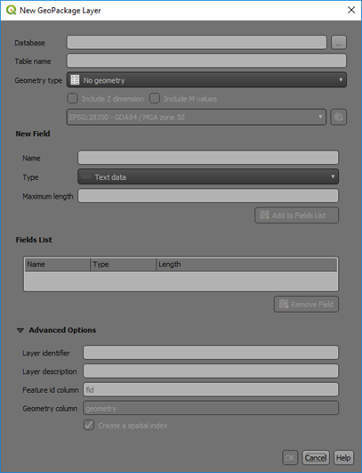
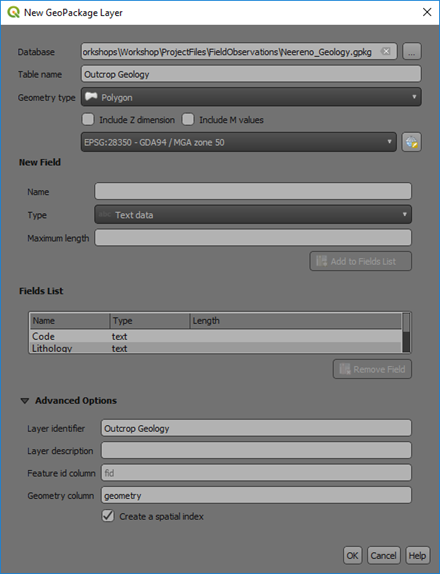
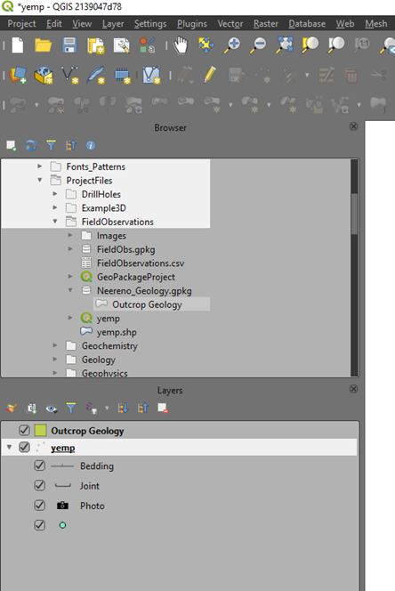
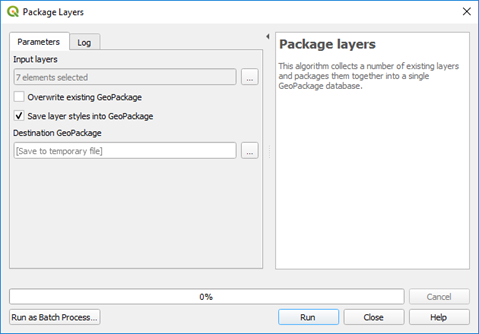

===========
GeoPackages
===========

The following is from the `Open Geospatial Consortium (OGC) website <https://www.geopackage.org/>`_.

*GeoPackage is an open, standards-based, platform-independent, portable, self-describing, compact format for transferring geospatial information.*

*The GeoPackage Encoding Standard describes a set of conventions for storing the following within an SQLite database:*

- vector features
- tile matrix sets of imagery and raster maps at various scales
- attributes (non-spatial data)
- extensions

*To be clear, a GeoPackage is the SQLite container and the GeoPackage Encoding Standard governs the rules and requirements of content stored in a GeoPackage container. The GeoPackage standard defines the schema for a GeoPackage, including table definitions, integrity assertions, format limitations, and content constraints. The required and supported content of a GeoPackage is entirely defined in the standard. These capabilities are built on a common base and the extension mechanism provides implementors a way to include additional functionality in their GeoPackages.*

What all this means is that you can create a GeoPackage with vector data containing point, line and polygon data with their respective styling, and also include raster data files.

Field names are not restricted to 10 characters, as is the case with shapefiles.

GeoPackages can be used to transfer complete projects with all the data and display attributes - see the end of this section for details.
When digitising into a GeoPackage file, the id field is automatically incremented. The data is spatially indexed so panning and window refreshes are much faster.

GeoPackages have a .gpkg file extension.

To create a new blank GeoPackage, use the Layers > Add New Layer and select GeoPackage. The following dialog box will appear.

The database name will be the new GeoPackage name and make sure you selected the three dots to the right of the entry field to ensure you know where it will be saved. The table name will be the layer within the GeoPackage. Ensure you select the correct geometry for the layer and the correct CRS of the data. Add your required fields for the table/layer and press OK to create a GeoPackage.

Once a GeoPackage has been created, shapefiles in the layers panels can be selected and dragged into the browser panel and added to the GeoPackage file by overlying the layer on the GeoPackage name (a small plus symbol will be displayed when overlaid in the correct place).

GeoPackages can also be used to store complete projects. Currently this requires three steps.

Firstly, use the Processing Toolbox > Database > Package Layers algorithm to package all the vector layers into a GeoPackage - this algorithm only saves the vector layers. Ensure you tick the “Save layer styles into GeoPackage” (only available in versions 3.8 and higher).

The next step is to drag the raster layers into the new GeoPackage, then close the original layers.

The last step is to re-open them using the GeoPackaged files. Reorder the layers as required and save the project into the same folder as the GeoPackage.

You will then have a GeoPackage file ***.gpkg and an associated project file (***.qgz) which when moved together will be the complete project data package.

.. note:: GeoPackages can only be edited by single-user at a time.
