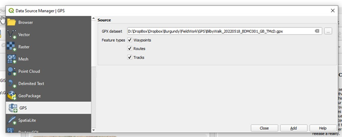
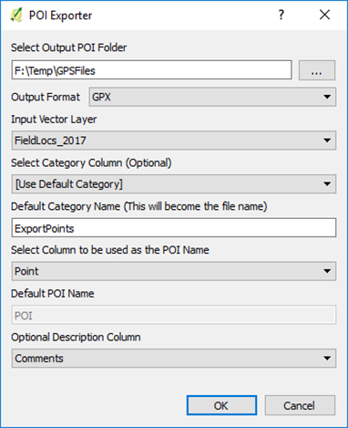
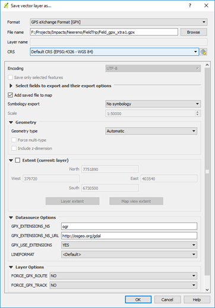
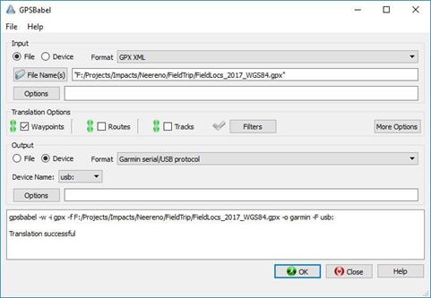

================================
Importing and Exporting GPS Data
================================

To import points and tracks from a gpx file collected using a GPS unit, use the Data Source Manager and the GPS tab, select the gpx file to upload and the data type (tracks or waypoints). After you have imported the point or track file to QGIS, save it as a shape file to enable editing of this data.

To send data to your GPS device, use the POI (“point of interest”) plug-in. The plug-in allows you to select the layer you want to upload, the column containing the point names (or ids ) and an optional comments column (up to 254 characters). The plug-in creates a gpx file which can then be easily uploaded to your gps via a direct file transfer or GPSBabel (for older models). The projection of the layer does not need to be in WGS84. Select the folder where you want the file to go, select the layer to export as a gpx, enter the filename in the “Default Category Name” box, then select the column to be used as the “POI” name. The “Optional Description Column” can be used to upload other columns such as a site description into the “Comment” and “Description” fields of the gpx file.

If you have problems with the gpx files, you may have to download the free `“GPSBabel” utility <https://www.gpsbabel.org/>`_ or purchase the `GPS Utilities program <http://www.gpsu.co.uk/>`_, US$60. The GPS Utilities program has a vast array for GPS formats that you can read or write. After you imported the GPX file into QGIS, remember to save the GPS layer as a shp file to allow for editing of the data.

.. note:: When uploading points to a GPS via a gpx file, you may need to save the shape file in a WGS84 (Lat/Long) projection and add two new text fields for “Name” and Desc”. To include a long description in the DESC (Description) field, such as an outcrop observation, ensure you make the string length to be 254 characters. Some GPS units will only display a certain number of characters, for example the Garmin etrex Vista C only displays 30 of the 254 characters.

Copy your point id's from your location reference column into the “Name” field using the attribute table. Do the same to copy any comments into the “Desc” field. Save the shapefiles as a gpx file with GPX USE EXTENSION “YES” before uploading to the GPS. The point id's will then appear as your waypoint names and the comments will appear in the notes section.

Open GPSBabel and select the gpx file to be uploaded, check Device “Garmin serial/usb” and device name “usb”.

The lower window will confirm if the upload has been successful.

A live link to your GPS can be accessed via the View > Panels > GPS Information panel with various connection, display, and digitising options. This allows the user to have QGIS running and a live map link via the gps.
