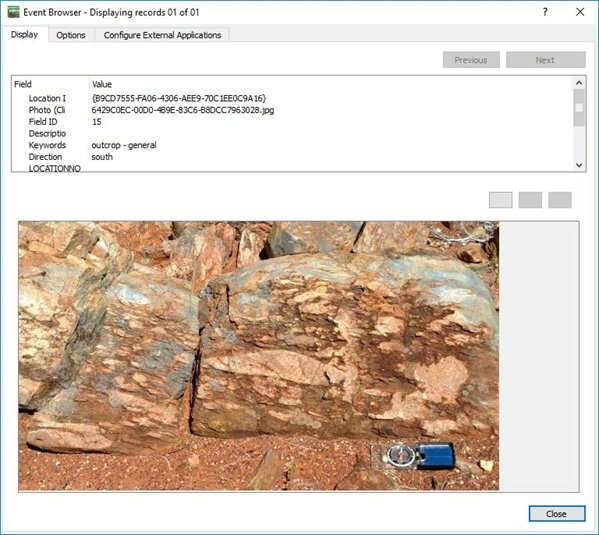

=====================================
Using the GSWA WAROX and WAMINES data
=====================================

The WAROX (2019 edition) database contains the GSWA field locations, sample sites, outcrop photos and petrography reports. The Microsoft Access database supplied by the GSWA contains pre-defined queries to make it easier to access the data. The query “qry_detailed” allows the user to extract the GSWA observation sites and “qry_summary” indicates if photographs have been taken of outcrops. The query “qry_photos” contains the photo information. Note the location of the photos is in the LocationID field and needs to be joined to the “ qry_summary” to assign a location to each photo. To import this data into QGIS, export the query as a csv (qry_detailed.csv), ensuring you select the first row as field names, and then import this into QGIS via the CSV import option. Change the projection to GDA94 from the default WGS84. The Access queries can also be modified to allow the extraction of observation sites with photos only.

In QGIS, open the layers attribute table, make editable and add another column (called something like “SourceFile”) of type string (text) with width of 100 characters. Save this update. This “SourceFile” column will hold the file location and photo number that will allow QGIS to display the photo for this location. The next step will concatenate the directory path and photo file name into the “SourceFile” column.

Click in the column selector to select the “SourceFile” column and then enter the following expression in the expression editor “concat(' directory location'||”SourceFile”) substituting the directory location to point to where you have saved the WAROX photos. Note you need to change the default back slash (\) to a forward slash (/) in the directory path or you will get “?” replacing the back slashes. Save the file.

You may want to Categorise the points into those with and without photos using a “Rule based” styling using photo SourceFile is Not Null for points with photos (meaning there is a photo link), and no photo when SourceFile is Null (no photo link). I have used a photo icon to indicate if there is a photo available at a particular location.

Use the methods above to display photos linked to that site. The Action properties for the layer can also be used to display photos. An example below shows the WAROX points displayed to indicate whether a photo was available at that location.

A similar process can be used to display linked petrographic reports and photos in the WAMINES database. See below an example from the WAMINES database. To display pdf files, you will need to add the pdf display program in the “Configure External Applications” tab.

PDF files can also be displayed via the Action tab, add the cmd /c command to the action text.

