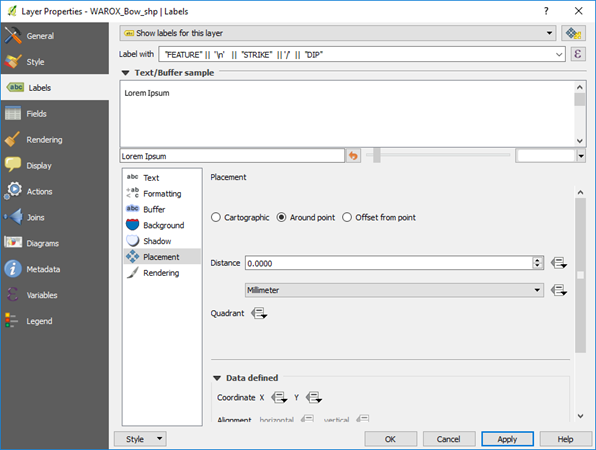

==================
Labelling Features
==================

Features can be labelled via the Labels tab in the Layer Properties window for each layer. There are many ways to place labels and format them. I will give some examples typically used in geological applications below but there are many other options which you are encouraged to explore (see QGIS User Guide - section 12.3.3 and Graser and Peterson 2016 - Part 2). Note that you can have the labelling panel open and docked by pressing F7, and when you make changes to the labels these are immediately displayed in the map widow. This method removes the requirement to click OK/apply to see changes.

Labelling points
----------------

The Labels tab shows a variety of labelling options such as font type and size, whether you want a halo around the label (buffer) which is useful when the labels are over a coloured background. The Formatting section allows you to specify multi-line labels and word wrap options. The Placement options allow you to test different ways to display your labels.

Note that to manually move individual labels, use the “Move Label or Diagram” option in the labelling toolbar.

There are three placement options, and it is suggested to test these options for each application. The “Cartographic” option (points only) will move labels to suit the display. If you need a “halo” around the labels, use the Buffer option. To rotate all the text labels, use the Labels > Placement
> Offset from point > Rotation option. This option is useful for labelling drill holes along grid lines.

Multi-attribute labels can be created using the expression editor. Note the “Output Preview” in the lower left of the dialog box which shows how the labelling will appear.

An example is shown below displaying the structure type with strike and dip.

In the Layer Properties > Label there is an option to add “call-outs” where lines can be automatically created to join a point to a label.

Labelling drill holes with collar names and depths of holes can be achieved using the expression editor in the labelling tab. Note to check the Preview to ensure your syntax is correct.

"Drill_Hole" || ' - ' || maximum ( ( "Hole_Depth") ,group_by:= "Drill_Hole" ) || ' m'

