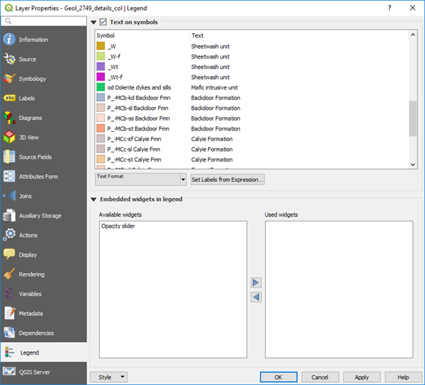
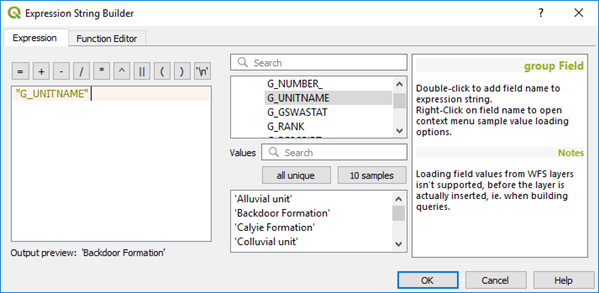
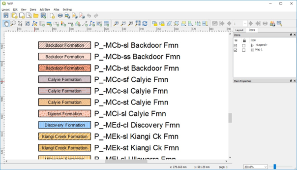
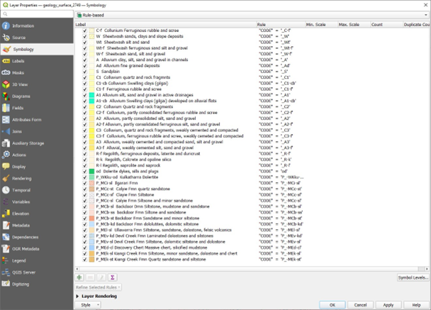
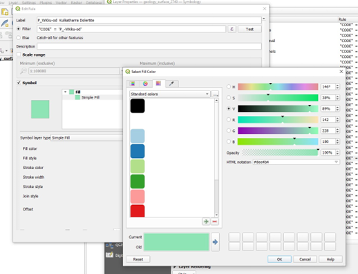

==================
Geological Legends
==================

Geological legends in QGIS can be created but the program really needs a plugin to create a geology specific style of legend. Geologists use QGIS very differently to the majority of QGIS users and this would need to be pushed by the geoscience user community. Detailed geological information, e.g., formation names, can be imported into the legend using the Legend tab in the Layer Properties > Legend tab. Note that you may have to join the geological information to the geological polygons, as in the case of GSWA geological data, before you create a more detailed legend.

In the window above, the label text has been selected using the “Set Labels from Expression” which then opens the expression builder window (below).

The legend will be displayed in the print layout window as shown below.

Work is in progress to automatically assign geological patterns and descriptions from the GSWA polygon colouring information and pattern fills with the vector data for their digital maps.

Adding user defined polygon colours
-----------------------------------

If the geological polygon layer is imported from ESRI or MapInfo, the styling information is lost. Some suppliers of this data create qml or qlr files to accompany the shp files to allow custom colouring. To apply custom colours, it is necessary to do a categorical style on the polygon layer based on geological code or name, and then use the rule-based renderer to edit the colour information and polygon name for each geological unit.

**Don't forget to save as “default” to save the styling information!**
