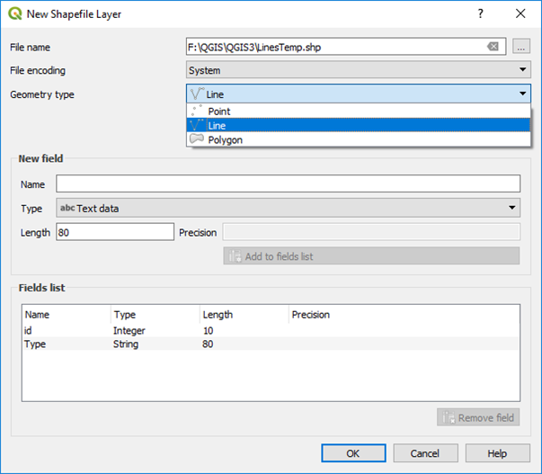
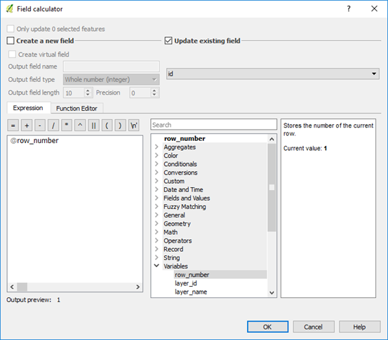
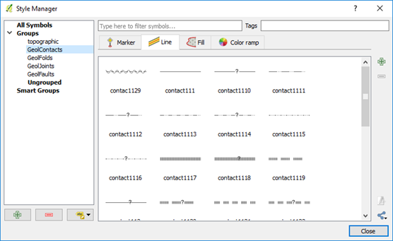
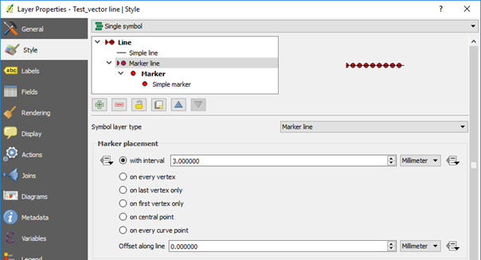
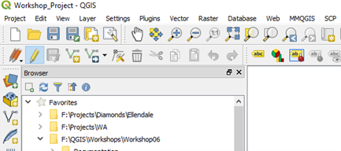

=========
Line Data
=========

Line data includes such items as contacts, faults and trend lines and are usually plotted on aerial or satellite imagery overlays. Surface mapping data can be digitised by scanning in the hard copy photo overlay into QGIS (via raster registration) and tracing the linear features, or by direct digitising on screen using the field mapping data as a guide.

When creating a new vector layer to digitise the data, ensure the layer is the correct type, line type for example, has the correct map projection and add the necessary columns to be able to enter the relevant field data for each feature. Save the file with an appropriate file name.

If you are digitising into a shapefile, QGIS can automatically assign a unique id numbers for each line after the creation of a group of lines. Open the Layer Properties > Fields, select the id field and click on the field calculator icon and choose “Update existing field”, select the id field, select the “row number” operator in the Variables list. Now when you save the file it will allocate a unique id to each feature. Thanks to Chris Franklin for noting this feature. If you are digitising into a GeoPackage line file, the id field will be autonumbered.

Specific line styles can be added via the top menu Settings > Style Manager option. Geological line styles have been created as xml files and are imported using the “import” option, selectable from just above the Close button in the Style Manager dialog box. Import each style to a category,
e.g. Contacts, so they are easier to locate.

Contact the author, if you would like to download these style files for contacts, folds, joints, or faults which are based on the USGS symbol sets.

Note that the line direction can be reversed to get the tick symbols to plot on the opposite side of a line, e.g. fault ticks, using the “Reverse Line Direction” in the Advanced Digitising Toolbar (v3.4 or higher).

Line styles can also be created directly via the Style tab of the layer menu. Add an extra layer (using the green plus button) to combine lines and markers. There are numerous styles and options to choose from. Remember to save the style using a “\*.qml” or “Save as Default” option when finished editing the line style.

You can combine many line styles into the one vector line file, providing you have a column by which the lines can be classified, e.g. feature type “contact”.

Lines can be edited by first highlighting the layer in the Layers panel and clicking the enable editing icon (pencil). A pencil symbol will then appear next to the layer being edited in the Layers panel. Remember to save your edits when exiting the edit mode. When the line is editable, there will be red crosses on the vertices. Click on the “node” tool (seventh button along from left, next to rubbish bin) then click near a vertex to highlight the vertices, select the vertex you want to move and simply click where you want to move it to. Note QGIS v3 uses “click-click”, not “click and drag” methodology. To add more vertices, hover over the line and click on the small red cross that appears. This will create a new point which can then be moved.

.. note:: See the `QGIS User Guide <https://docs.qgis.org/latest/en/docs/user_manual/>`_ for up-to-date information on editing.

