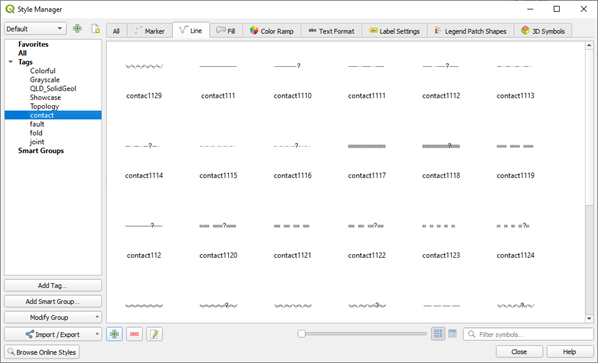
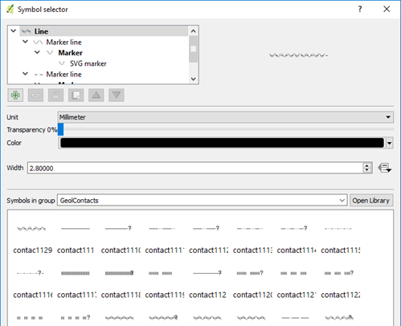

======================
Geological Line Styles
======================

Linear geological features can be displayed by manually editing the line style in the Layer Properties > Style tab, or by using line styles set up in the top menu Settings > Style Manager window. Full details of how to construct various line styles can be found in a comprehensive document put out by the USGS and can be found `here <https://ngmdb.usgs.gov/fgdc_gds/geolsymstd/fgdc-geolsym-all.pdf>`_.

Style (\*.xml) and symbol (svg) files can be found here at `Stefan Revets' site <https://sourceforge.net/projects/qgisgeologysymbology/files/>`_ and in the NSW QGIS Symbols in the “\QGIS_Symbols\FGDC_GeologySymbology\svg” folder. Line styles include geological contacts, faults, folds, and joints and are based on the FGDC symbology.

On the main menu, go to Settings > Style Manager and select the Import option in the small box down on the lower left-hand side of the dialog box (looks like two blue lines with dots). Save each group with a name (“tag”) so that you can easily identify which line style group you want to display.

Navigate to where your line styles are stored. Import each one (e.g., contact, fold, fault and joint). Remember to add a “tag” so they can be easily selected in the Style Manager.

In the Symbol Selector dialog, select the “Symbols in group” drop-down box, select “contacts” (or whatever you called this line style group). Select the line style you want and hit OK. This method can be used to modify all the other line styles. To save these line styles remember to save the Style as default in the main Style tab window (under Style > Save as Default).

If you have multiple line styles, make sure you have a column in your table to allow the line types to be “Categorised” so that specific line types can be allocated to different line types.

Any of these line styles can be edited manually by selecting the layer in the top window.

.. note:: You can change the line direction, e.g. fault ticks on other side, by using the “Reverse Line Direction” in the “Advanced Digitising Toolbar”.
