===================
Outcrop Photographs
===================
Photographs of outcrops and report pdf files can be attached to an observation point and allow a
point and click to access the photo or report.

There are three ways to display photos at points. There are two options using the Import Photos
plugin, and the third option is going via the Layer Properties > Actions (thanks to Mike Erceg for
explaining this process) The last two options require the full path to the photo file to be identified.

Import Photos Plugin
--------------------

If your photos are geo-tagged, i.e., they have their coordinate locations embedded in the file, then
another alternative option is to use the “Import Photos” plugin. Most smartphones take geo-tagged
photos unless the location data option has been turned off for photos. I use a Pentax K-1 DSLR
and that camera has an in-built GPS, so all photos are automatically geo-tagged. Most smart
phones will have embedded GPS coordinates in the photos unless this location feature has been
turned off.

To use the Import Photos plug-in, run the “Import Photos” option and select the directory where
the photos are located and where you want to store the resulting shape file (this will have all the
photo information extracted from the photo file). Choose a suitable filename and press OK. The
layer will them be created and using the Plug-Ins > Import Photos > Click on Photos (use a double
click), the photos in those locations will be displayed

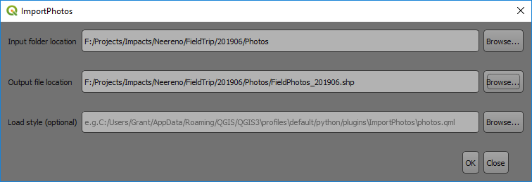

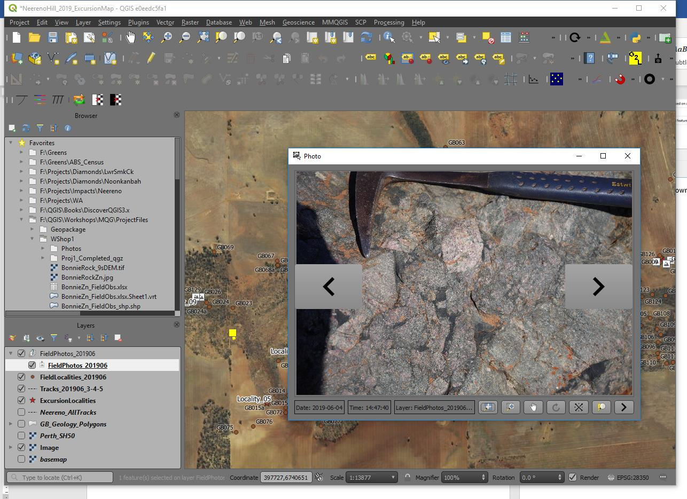

Import Geotagged Photos
-----------------------

This is the simplest option if your photos are geotagged. Most smartphones automatically geotag
photos unless this “location” feature is disabled. Use the Processing Toolbox > Vector Creation >
Import geotagged photos algorithm. The resulting table will be created as below.

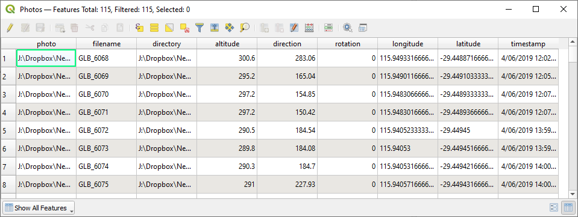

To display photos, you use a widget in Layer Properties > Attributes Form. In the above example,
the “photo” contains the link to the photo and we can use this to tell QGIS where to find this photo.
Open the Layer Properties of the file and select the “Attributes Form” tab. Select the field with the
link to the photo (“photo”), then change the widget type to “Attachment”.

Leave everything else as default, see image below.

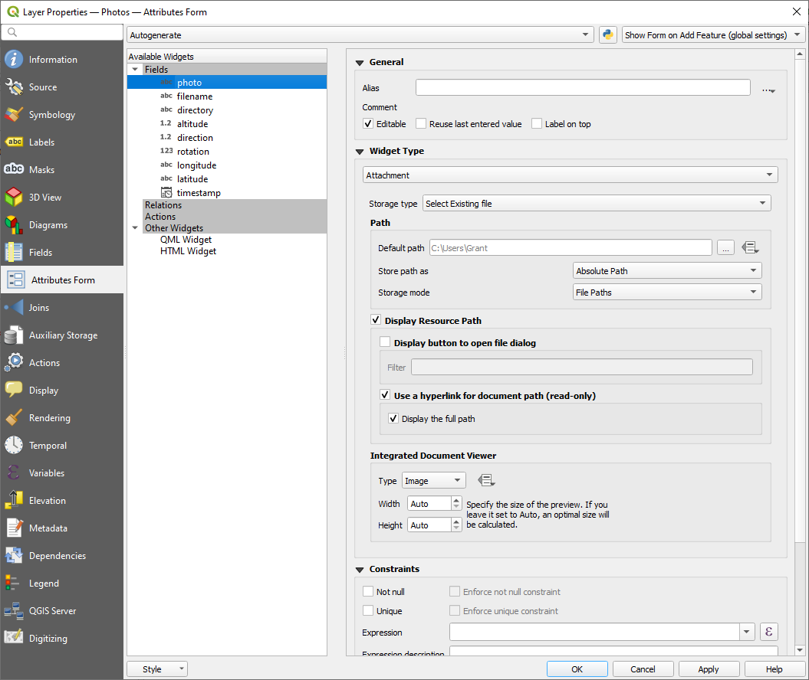

If you are importing photos via a different method, you will have to change some of the field values.
For example, the default path to the image folder, tick “Relative paths” and “Relative to default
path” option.

.. note:: The central dialog scroll down box can be difficult to locate but note the scroll bars on the right-hand side.

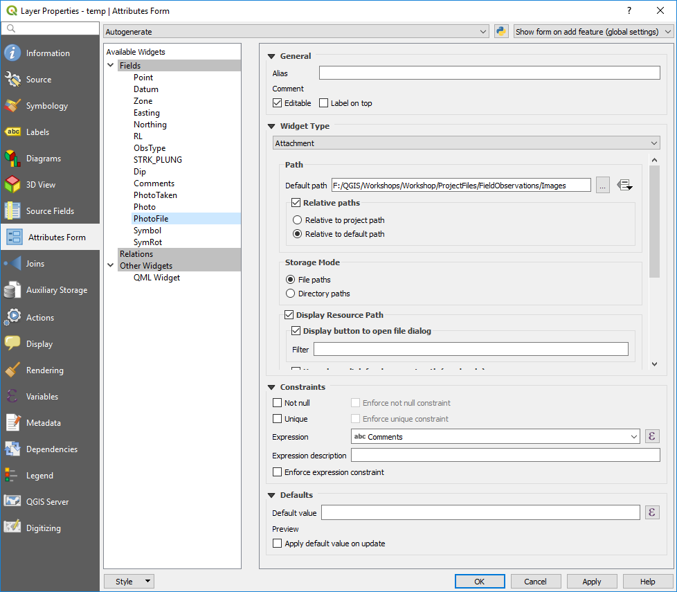

Scroll down the window the central part of the dialog box, past the “Storage Mode” to the
“Integrated Document Viewer” section and select “Image”. Leave the sizes to Auto.

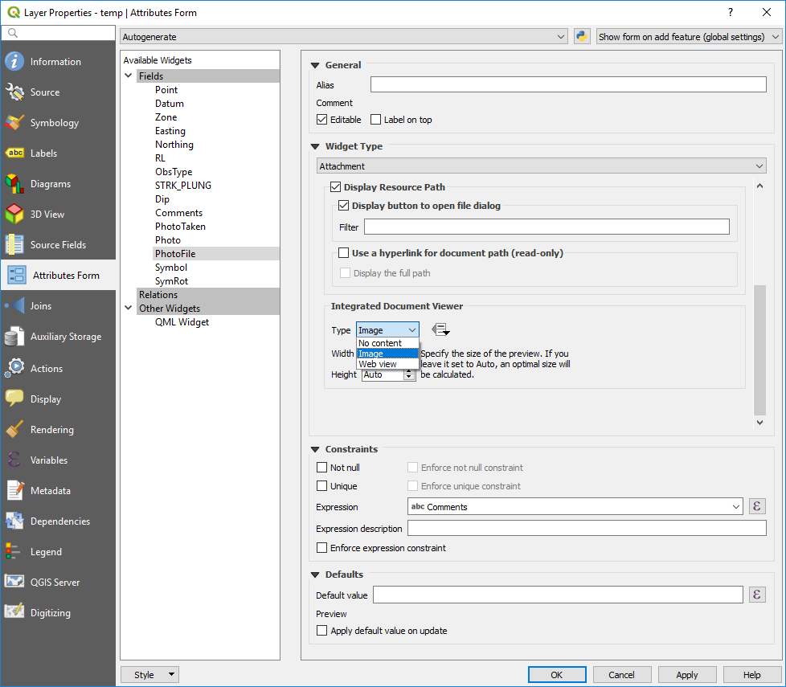

Apply the changes. In the map window, use the “Identify Features” icon to click on a point with a
photo (this should open an Identify Features dialog box), then in the identify features dialog box,
highlight the point (if you have multiple points in the Identify Features dialog box), open the “form
view” (top left icon in the Identify Features dialog box). This will open a new dialog box which may
require re-sizing to see the image. If the point with the image is not at the top of the list, select the
point and then open the form.

Once you have modified the Attribute Form, to display the photo, use the “identify” tool to click on
the point (with the Layer highlighted in the Layers panel). If there is more than one point selected,
QGIS will display the “identify Results” window showing the various points selected. Highlight the
photo point you wish to display and then use the “View Feature Form” icon to show the information
for that point and the photo. The form can be re-sized to enlarge a photo display.

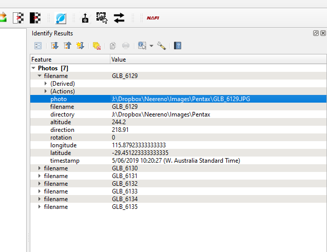
.. image:: img/photo_layer_info2.png
  :align: center
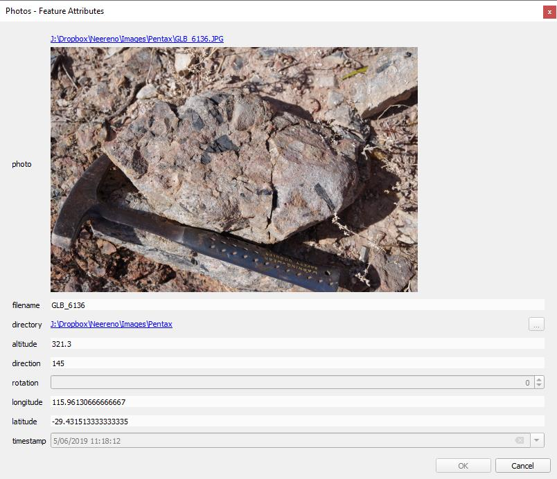

This method of displaying photos can also allow you to display the comments for example that
accompany an image.

.. note:: This link is saved with the project and not in the layer properties.

Forms for Improved Viewing Photos Using the File Widget and Tabbed Pages
------------------------------------------------------------------------

You can display photos and data in tabs using a widget in Layer Properties > Attributes Form.
Select the “Drag and Drop Designer” option from the top combo box.

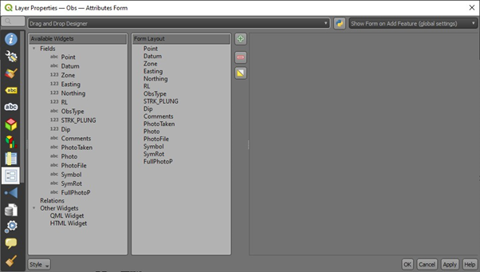

Using the green plus symbol, create two new “Container” items - “Data Entry” and “Photo”. Drag the “Photo” and “Comments” into the “Photo” item (by click hold and drag over the item name) - this will display the image with the comments. Drag the other fields into the “Data Entry” item - you can remove fields by using the red minus button.

This will result in a tabbed window opening where we can switch between the data and the photo and makes it easier to see the photo. This works well in QField on a tablet device where space is limited.

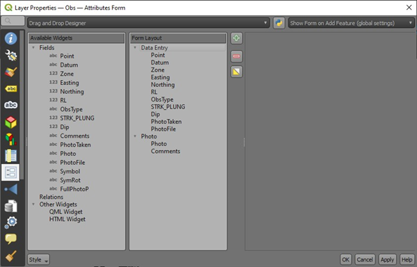

Select the field with the file location, e.g. “PhotoFile” field, then change the widget type to “Attachment”. Enter the default path to the image folder, tick “Relative paths” and “Relative to default path” option. Note the central dialog scroll down box can be difficult to locate but note the scroll bars on the right-hand side.

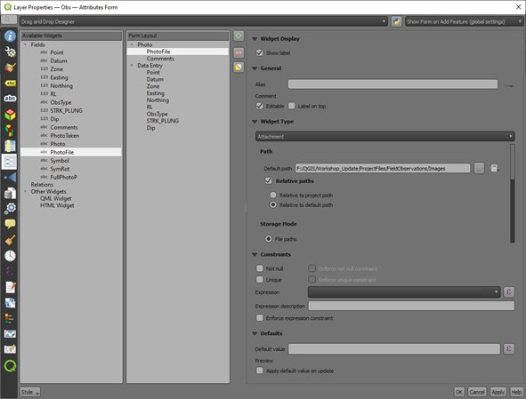

Scroll down the window the central part of the dialog box, past the “Storage Mode” to the “Integrated Document Viewer” section and select “Image”. Leave the sizes to Auto.

Drag the “Photo” item under the “Data Entry” item. This will then open up the image by default.

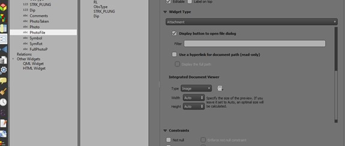

Apply the changes. In the map window, use the “Identify Features” icon to click on a point with a photo (this should open an Identify Features dialog box), then in the identify features dialog box, highlight the point (if you have multiple points in the Identify Features dialog box), open the “form view” (top left icon in the Identify Features dialog box). This will open a new dialog box which may require re-sizing to see the image. If the point with the image is not at the top of the list, select the point and then open the form.

Note that you need to save a new style file to remember these settings.

If there is more than one photo/point at the location, you need to select the point in the “Identify Results” window and hit the “open feature form icon in the top left-hand side of the Identify Results window.

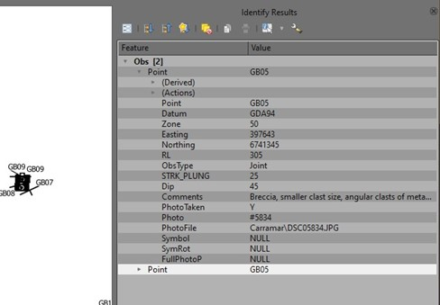
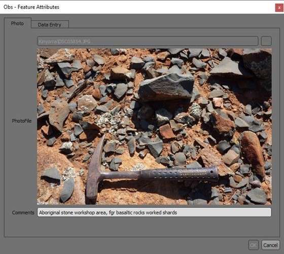
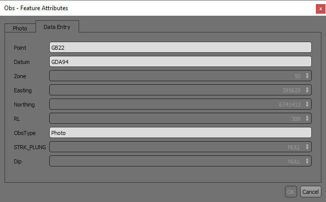

This method of displaying photos allow you to display the comments for example that accompany an image.

.. note:: Note this link is saved in the layer properties but only if you **save the style**.

Viewing Photos by the Action Tab
--------------------------------

The third method to display photos is to use the Action option, open the Layer Properties of the layer and select the Action tab. Double click on the Open URL - Open File option.

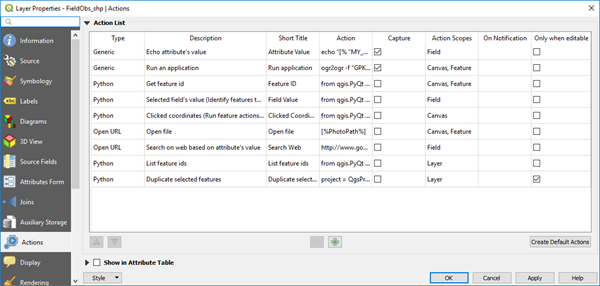

This will open the dialog box shown below.

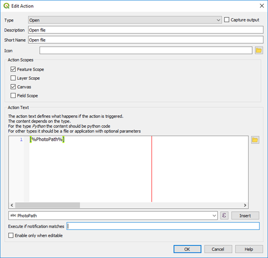

In the dropdown box near the bottom of the box, select the field with the photo location and click “Insert” to put the path into the Action Text window. Use the Windows file explorer to navigate to the directory that holds the photos, copy the path and paste it in front of the square brackets that holds the photo file name (as shown in the image below).

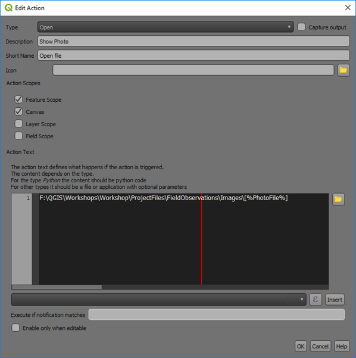

With the “Identify Features” activated for the cursor, right click on a point with a photo and the following will be displayed over the point.

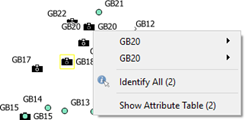

Note there are two photos at this location.

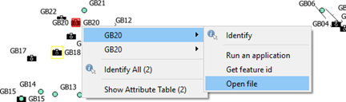

Select the “Open File” option and the photo will be displayed.

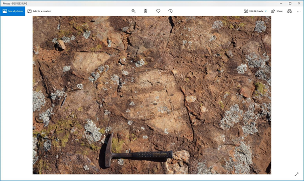

Opening pdf attachements
------------------------
  To open a pdf attachment, such as a report linked to a point, the action must include the executable file.

  Add the path to the executable, e.g. 'C:\\Program Files (x86)\\Adobe\\Acrobat Reader DC\\Reader\\AcroRd32.exe'
