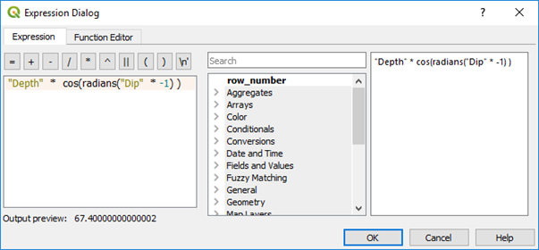
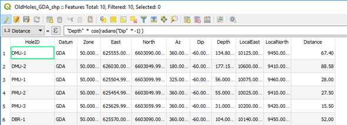
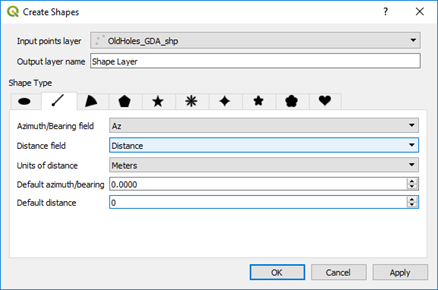
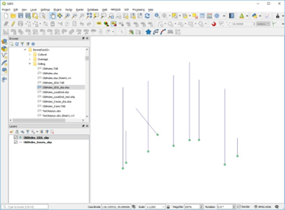

=================================================
Alternative Way to Plot Drill Hole Traces on Plan
=================================================

Surface drill hole traces can also be plotted on plans using the Shape Tools plugin. To plot drill hole traces, a collar file with collar coordinates, azimuth and horizontal projected distance columns are required. The horizontal distance - trace length - is calculated using the following formula;

Trace length = hole length * cos(radians(dip))

.. note:: If down dip is negative, multiply the dip by -1 (as in the above example).

Using the Shape Tools plugin (from icon task bar) select the Create icon and the Line tab.

Select the Azimuth column for the hole azimuth and the distance field for the length of the hole trace. Check the units of distance is in metres. The result should look something like below with the hole traces created in a new virtual file - remember to save it with a relevant name.

