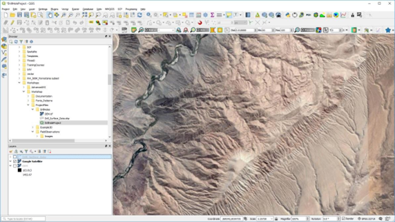
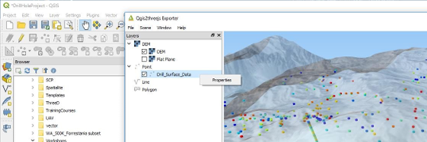
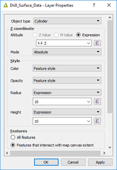
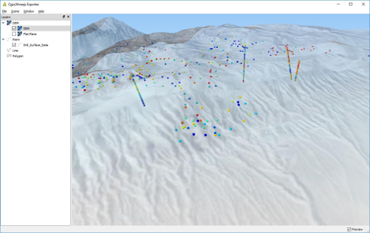

==================================
Displaying Drill Hole Traces in 3D
==================================

It is also possible to display drill hole data in 3D using the “QGIS2threejs” plugin. All that is required it to have the 3D coordinates for the sample points to be calculated. This is a simple display option and will hopefully be superseded with the development of the drill hole and cross section module planned for the future (“OpenLog” plug-in being developed by Oslandia). The QGIS2threejs plugin displays the centre points in XYZ coordinate space. The sampling data can be coloured according to any attribute in the file, e.g., assay values of Cu.

To display the downhole data, the 3D coordinates are required for the drill hole traces. In the example below, the XYZ mid-points have been calculated for assay intervals. In the main map window, then DEM, Google Earth satellite image and the file containing the 3D coordinates of surface and drill hole samples have been loaded. The DEM layer and sample layer are not displayed (but loaded).

When opening the QGIS2threejs plugin, select the DEM for the elevation and right-click on the samples layer to select the z coordinate.

The 3D image can then be rotated and tilted as desired. The surface satellite image has been set to 30% transparency to be able to see through the surface.

Always remember to save your project regularly.
