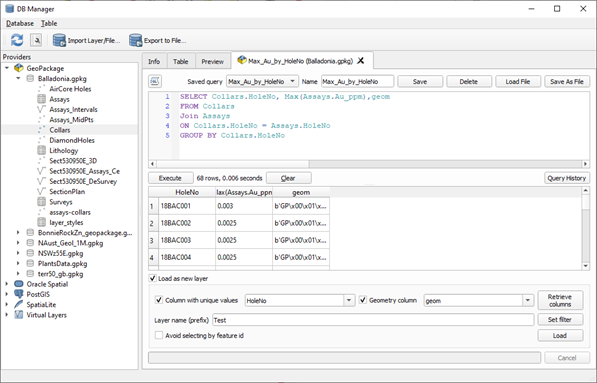
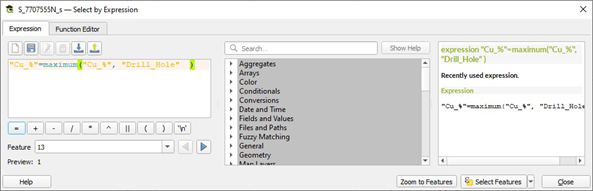

=========================================
Extracting Maximum Values for Drill Holes
=========================================

This can be done at least two ways. The first way is to calculate the drill hole statistics and group by drill hole (algorithm “Statistics By Category”). This method requires coordinates for all assay points.

The second method is to use an SQL query on a GeoPackage file. Save the collar file and the assay file into a GeoPackage, then use the DB Manager to connect to the GeoPackage. Open the SQL Window, second icon from left, and then run the SQL query as shown below. Do not forget to add the “geom” column to the query so the resulting layer can be plotted. Ea ch point will have the max value attached.

To select the maximum assay value by drill hole, use the “maximum” function.

