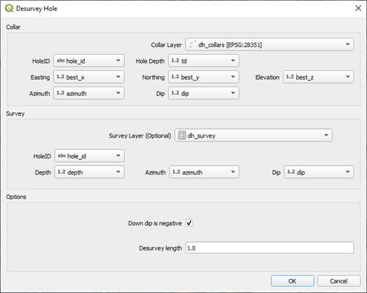
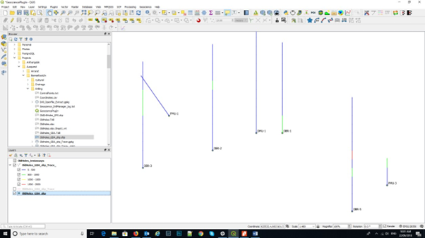
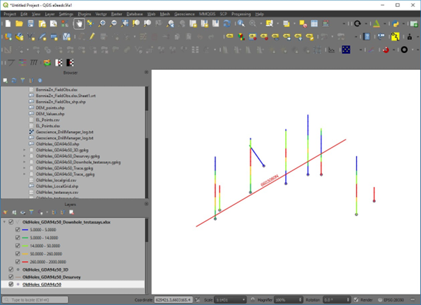
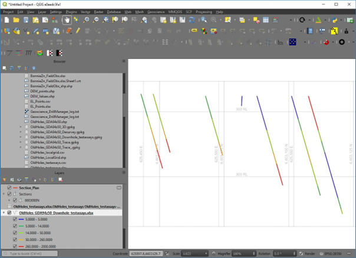
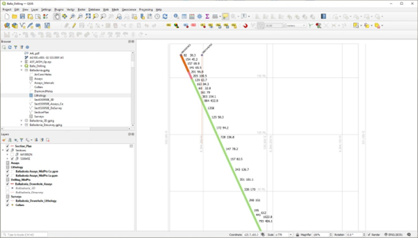

=================
Geoscience Plugin
=================

The “Geoscience” plugin (with thanks to Roland Hill) has allowed the plotting of drill hole traces and colour coding of the drill hole traces in QGIS easy. Cross sections can also be created. The drill set up screen allows you to select the collar and survey files. You will need to install the plugins in the Plugin Manager.

If your tables have commonly used field names, then the plugin will pick the fields. If you have collar elevations in both the collar file and drill hole survey file, make sure these values are the same, otherwise the points may not be plotted.

The Desurvey option calculates the 3D trace of the drill hole. The 3D coordinates of each sample are calculated when you “attach” the downhole data, like assays or lithology, to the drill hole trace. Top, bottom and mid-points of each downhole interval will be calculated in xyz coordinates. The data to be displayed down the drill hole trace needs to be imported as a non-spatial file with hole id, from, to and data fields. Down hole data can be assays, lithologies, or other data. If the downhole data fields are in a csv file format, make sure this is imported vis the Data Source Manager > Delimited Text option so that QGIS interprets the correct field types, particularly for the from and to fields which must be numbers. The help menu for the plugin describes the workflow and a link to the `web page <https://www.spatialintegration.com/>`_. Mid-point coordinates are calculated and can be downloaded using the downhole data output as a csv file for use in other programs like ioGAS or LeapFrog.

To enable labelling of assay results down hole, use the 3D mid-points of the assay intervals. This will then allow the display of multiple assay values by duplicating the assay -mid-point layer and choosing the data to be displayed. To display the lithology as a hole trace colour, make sure you include the lithology layer in the desurvey option, then use the symbology tab to colour by lithology (by categorise).

The drill hole traces (the desurveyed layer with the down hole data attached) can be coloured via the “Symbology” tab using any attribute. Note that when you import the downhole data, e.g. assays, make sure the “from”, “to” and assay values are recognised as numbers not text.

To create a cross section, use the “Section Manager” and using the “Use Map Canvas” and select the envelope width, draw the required section line.

The cross section will be created in a “new” location on the map. To get back to the collar positions, right click on the collars layer and “zoom to layer”.

Cross section plot with the hole trace coloured by lithology and the assay values of two elements displayed using their mid-point locations.
