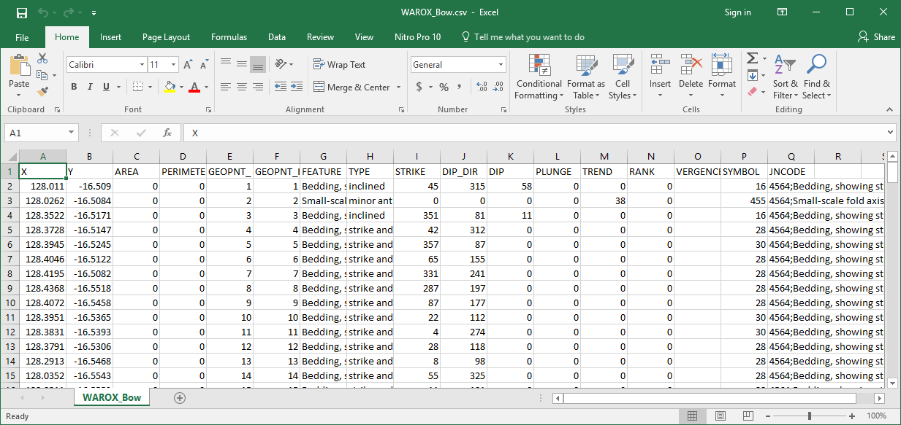
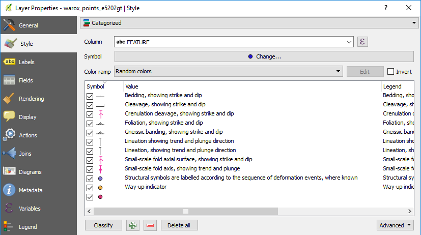
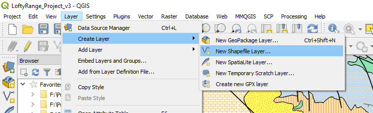
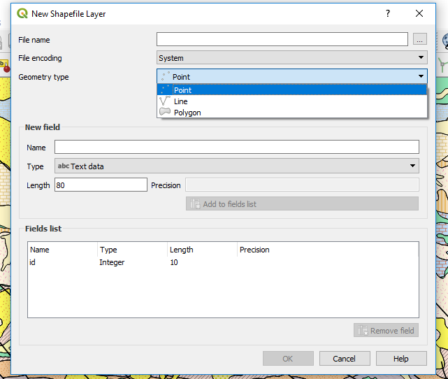
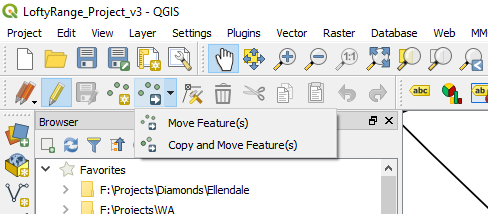
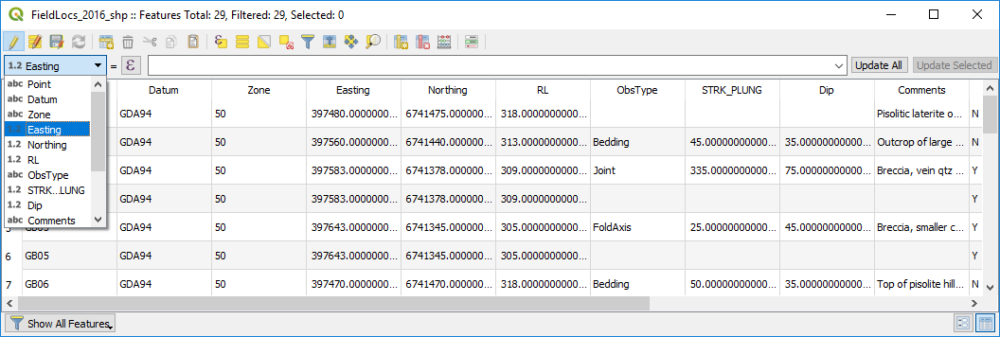
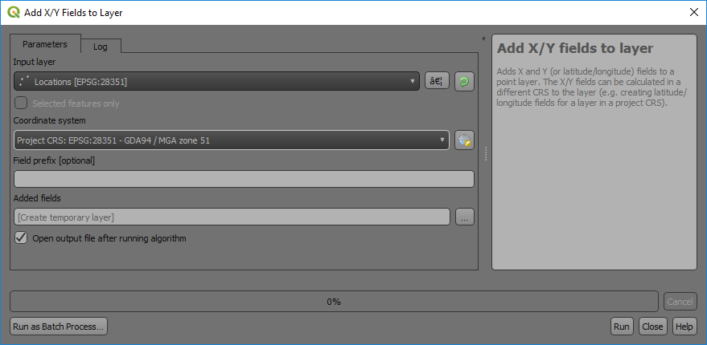

==========
Point Data
==========
Field mapping data is collected by various methods. The most basic version and that used by the “old school” is to collect data in a field book and then enter it into a spreadsheet for import into a GIS. Field data collectors vary in their formats and so the user will need to determine what is the best option for their data import. Always include the datum and projection zone (if applicable) when compiling vector data.

When importing data into QGIS, it must be decided whether the layers will created as shape files or created in a Geopackage. Shape files are in the original ESRI file format and has a number of limitations, such as field names limited to 10 characters. Geopackages do not have these restrictions but are typically single user files only, i.e., one user access at any one time.

GPS points collected in a GPS are easily brought in to QGIS by importing a GPS “gpx” file or in some cases direct download of the GPX file from the GPS. Tracks and waypoints downloaded from the GPS in gpx format can be opened via the Data Source Manager and the GPS tab. GPX files from Garmin GPS units are usually in WGS84 geographic coordinates (Longitude and Latitude, decimal degree format) by default. GPS points can be uploaded to a GPS using the POI plugin.

Comma separated variable or “CSV” files are a good simple way to import point data and can be an alternative way to import spreadsheet data when there are problems importing Excel files. If you do have a problem with importing an excel file, save the file in CSV format and import into QGIS. Note there can be problems importing large Excel or csv files, e.g. with QGIS scrambling column data, if this is the case, then use the tab delimited text export option from Excel. Complex CSV files containing a variety of field types can be imported using CSV format files (\*.csvt). QGIS can read field data types from an OGR CSV driver compatible "csvt" file. This is a txt file alongside the data file, but with a "t" appended to the file name extension. The file should just contain one line which lists the type of each field. Valid types are "integer", "real", "string", "date", "time", and "datetime". The date, time, and datetime types are treated as strings in QGIS. Each type may be followed by a width and precision, for example "real(10.4)". The list of types must separated by commas, regardless of the delimiter used in the data file. An example of a valid format file would be: "integer","string","string(20)","real(20.4)".

Another option for importing csv data is to load into Excel and check the field types for each field before importing. Excel files are imported using the “Spreadsheet Layers” plugin. This is found under the Layer > Add Layer > “Add spreadsheet layer” menu. It is especially important to check the data is being correctly imported.

Point geological mapping data such as bedding, joints and outcrop observations can be entered via a spreadsheet where columns can be created to cater for items such as coordinates, observations, and photo references. Remember to always include the datum and map projection data in the file. Symbol file names (full path required) can also be entered into the spreadsheet that will allow QGIS to select the correct symbol and then orientate it using a rotation angle for the correct strike or plunge. An example is shown below of the WAROX (GSWA mapping data, csv format) data from the GSWA Bow 1:100k geological map. Additional columns would be required with symbol file names to allow QGIS to select the appropriate symbol, or alternatively you can choose a “Categorise” symbol style option and edit the symbols for each category manually.

Below is an example of the “categorised” features of the WAROX data for the GSWA Lissadell 250k map sheet with features manually changed by clicking on each symbol. Once this has been done, remember to **save** the symbols by using the “Style” button and “Save style” to a QGIS ``.qml`` style file (e.g. GSWA_WAROX.qml). This style file can then be used to recall these styles. You can choose the “save as default”, which creates a qml file with the same file name as the shape file and when you open the shape file, the qml file will be used to determine the way the features are displayed for this layer. Styles can also be saved to a GeoPackage file.

To create a new empty points layer, use the menu item Layer > Create Layer > New Shapefile Layer and select a point layer type **(especially important to check the geometry type! And CRS)**. Add the required data columns and data types (text, integer, decimal number, date) to attach to each point. Remember shapefile column names are limited to 10 characters and any names longer than this will be truncated. When creating a new vector layer to digitise data, ensure the layer is the correct type, i.e. point, line or polygon, that it has the correct map projection and add the necessary columns to be able to enter the relevant field data for each feature. Save the file with an appropriate file name. Note that additional fields can be added later if needed. When digitising into a GeoPackage file the feature id will be automatically incremented.

.. note:: Note the Type “Real”, Length and Precision options where you can restrict the size of the data entered (e.g. UTM eastings length 9 - 6 figures, decimal point and two decimal places). A negative sign, as per the dip, does not use a length, so the dip field in this example could have a length of 5 (00.00 to -90.00).

Points can be moved in the map window by using the “Move Features” icon in the point edit menu. The layer requires to be set as editable. Note that the coordinates in the underlying table will not change and these coordinates need to be updated using the “$x” and “$y” geometry tools in the “Attribute Table”.

The move tool is highlighted in editing toolbar above.

If you do move points, remember to update the Easting and Northing values in the table using the geometry operator “$x” for Easting and “$y” for Northing. Remember to select the correct column to update! If you fail to do this the coordinates shown in the table will be incorrect. Remember also that the updated coordinates will be in the project projection coordinates. Also remember to save your edits.

There is an algorithm in the Processing Toolbox that will create X-Y columns from point data and this is accessed via the Processing Toolbox > Vector Table > “Add X/Y Fields to Layer”.

