============
Polygon Data
============

Polygon data is added by creating a new polygon layer ( Layer > Create Layer > New Shapefile Layer or New GeoPackage Layer), selecting type “polygon”, set the projection information and enter the additional fields for the polygon file. Note that if you are creating a GeoPackage file, QGIS will auto-number every new feature when digitising.

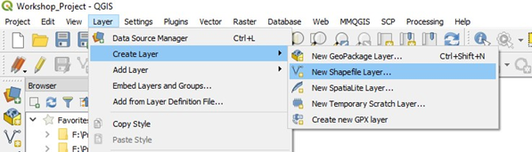

The additional columns might hold data such as geological code, geological descriptions, etc. Remember to select the correct field type (string, number, and precision, etc) and, remember that field names are limited to a length of 10 characters in shapefiles - but not in GeoPackage files.

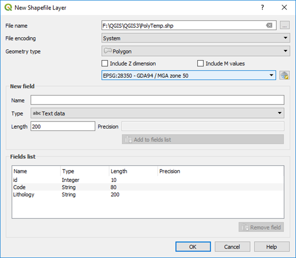

When creating new objects in a shape file, every new polygon should be assigned a unique “id” number. If you keep these unique, then it is easier to select and alter polygons which can be then selected by their id. Note that digitising into a GeoPackage file will automatically number the id field.

To add a new polygon, highlight the polygon layer in the Layers panel, and toggle the editing button (pencil icon). Numerous polygon options are available - see the second row of menu. To add a new polygon, use the Add Polygon Feature icon. Hover over each icon for an explanation of the icon actions. If not all the digitising and advanced digitising options are not show, check the top menu View > Toolbars options.

QGIS can also assign a unique id numbers for each polygon in a shape file after digitising is compete. Open the Layer Properties > Fields, select the id field and click on the field calculator icon and choose “Update existing field”, select the id field, select the “row number” operator in the Variables list. Now when you save the file it will allocate a unique id to each feature. Thanks to Chris Franklin for noting this feature.

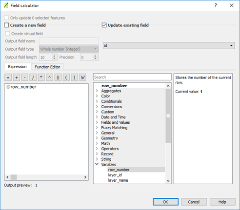

If you want to calculate areas of polygons, add an “Area” column to the polygon table. Note you must set the projection to a metre projection, e.g. UTM, not geographic degree units, and select your units in the Project Properties > General > Measurements dialog box. You can then populate this field by using the calculation option in the Attribute Table option. Make the layer editable and then use the $area function to calculate the relevant field area.

Note that the units of area are set in the Project Properties > General > Measurements dialog box. These units can be changed on the fly, but you need to refresh the values in the calculated area column to reflect the new units. The area can also be viewed by selecting the Layer Properties > Display > Field option so that the area can be displayed when you hover the mouse over the polygon when the Info Tool is activated.

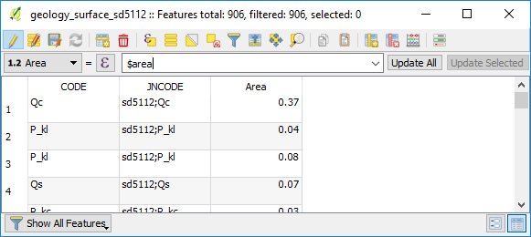

Areas can also be calculated via the “Calculate Geometry” plugin. Right click on the layer name in the Layers Panel and select “Calculate Geometry”. The Calculate Geometry plugin allows you to select your area units. Perimeters can also be calculated this way. Make sure you do some check areas to ensure your results are correct.

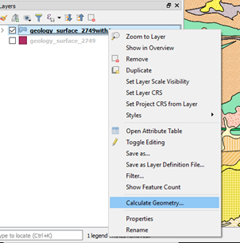
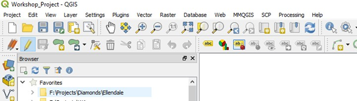

To digitise a polygon, make the layer editable and choose the “Add Feature” polygon icon (4th from the left). Click around the polygon using left mouse clicks and finish the polygon with a right mouse click. Nodes can be shifted and added-deleted using the node icon, as per the line editing options.

Creating Drop-Down Lists for Data Entry
---------------------------------------

A **drop-down list** can be created in QGIS to allow for the attribution of vector items. The use of a drop-down list prevents typographical errors in data entry and can be used to restrict non-standard item names. You can use data from an existing layer or use a csv file for the source of the drop - down box data.

The example below shows a csv file that has been used to apply attributes to the polygon layer.

.. image:: img/lith_value_map_txt.png
  :align: center

In the Layer Properties, select the Attribute Form tab, and change the widget type to “Value Map”.

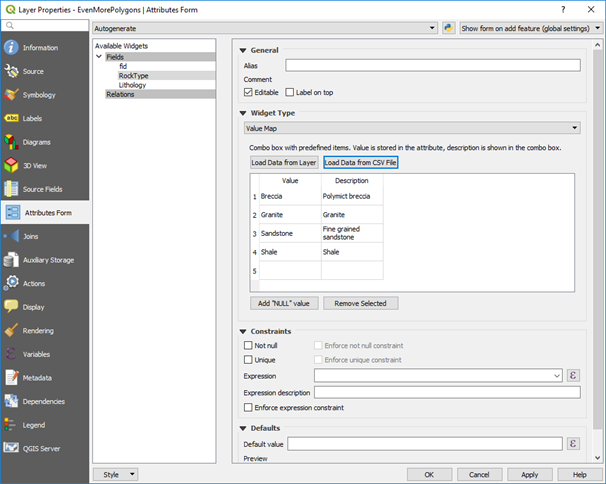

The Form Value Relation is used to apply multiple nested dropdown boxes for use in pre -set data entry options. This is useful for entering specific rock types, geological codes or formation names.

The following is from North Road Consulting who completed a crowd funding campaign to get this feature into the core component of QGIS.

*"What happens is you have pick lists that can change based on other values. Have a pipe? It can be made out of W, X, Y, and Z. Is it a Water Pipe? It can only be made of X and Z. Wastewater Pipes can only be made of W and Y.*

*Here is my walk through. I have a point layer and that point layer has a type and a subtype. I stored this all in a GeoPackage by the way. The type drives the subtype. You select A and you can only have red or blue. Maybe B is green and white. There are two tables to help with this process tableA is 2 fields: a primary key and a value. TableB has three fields: a primary key, a value, and a foreign key that relates back to Table A. From that you can see Type A can only have a value of Red and Blue. Type D can only be Black and Gray.*

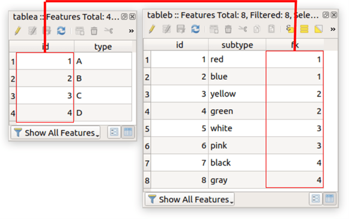

*The point layer has two attributes of concern: type and subtype. Type will be A,B,C, or D. Subtype will be a range of colours that Match the Type picked. If you right click the layer and select attribute forms you can assign a form for data entry. In this case for type the key column is the primary key and the value is the type. Note the Widget type is Value Relation!*

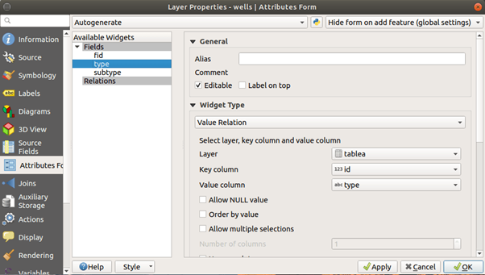

*Lets looks at the subtype field. The key column is the Foreign Key (the part that relates it back to table A). The value column is the subtype. The magic is this - if you look at the filter expression:“fk” = current_value('type'). See below.*

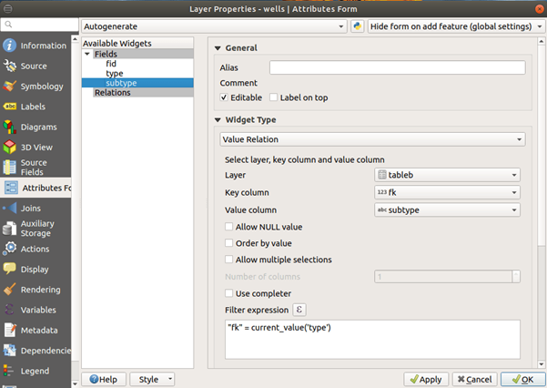

*The foreign key equals the value of the type widget. When you add a point, you'll see the type drives the subtype.*

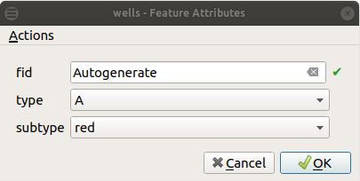

*In summary, if you select type A, you will only get an option to select colours red and blue."*

Value Maps and Form Value Relations are useful tools for adding data. For geological data, you might have a list of rock classes (igneous, sedimentary, etc) and a list of lithologies (basalt, granite, sandstone, etc) for polygon data, or observation type (bedding, joint, vein, etc) for point data.
