==========================================
Geological Symbols and Geological Patterns
==========================================

Geological symbols can be either specific geological fonts (True Type Fonts) or SVG (scalable vector graphic) symbols. Geological symbols can be `downloaded from the internet for free use in QGIS <https://github.com/GISsimbology/symbols>`_. On Windows systems, geological symbol fonts need to be installed by right-clicking on the font file name and selecting Install. Note that some fonts, particularly the ESRI fonts, are proprietary and not free use.

Geological Fonts
----------------

Four font sets are available from Geoscience Australia and include ESRI Geology AGSO 1 to 3 (esri_500.ttf, ESRIGA_0.ttf and ESRIGA_4.ttf), GeoscienceMining (GEOSM\_.ttf') and MiningFossilTopo (MINIFT\_.ttf). Other geological and cartographic fonts may also be available depending upon what other software you may have installed (previous MapInfo or ESRI fonts may already be installed on your system and could also be used). Fonts installed on Windows can be accessed via the Windows run box and typing “fonts”.

Geological font symbols are accessed via the Layer properties > Style tab and choose the symbol layer type as “font”. All the fonts installed on your computer will be accessible and you will need to search through the installed fonts to find the relevant font file and then the relevant font symbol.

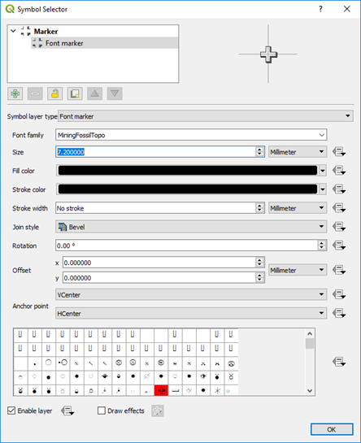

SVG Symbols and Patterns
------------------------

The USGS symbols and patterns can be downloaded from various locations on the internet but the easiest way is via the QGIS Resource Repository plug-in.

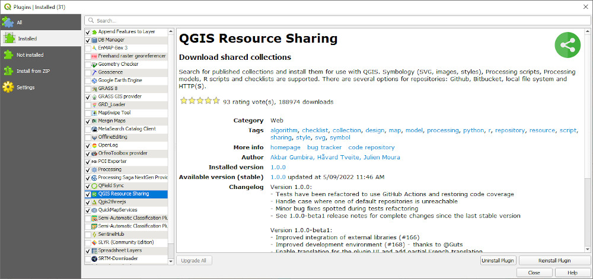

Enable the plug-in and then search for the USGS symbols under the ALL tab.

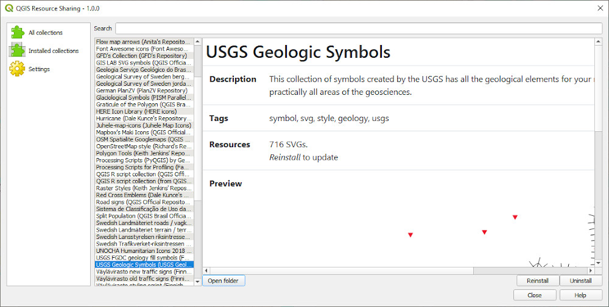

Install the symbols and these will then be accessible via the symbol selector > SVG > SVG Browser > Collections.

To install the USGS pattern fills, we need to add a new repository to the Resource Sharing plug-in.

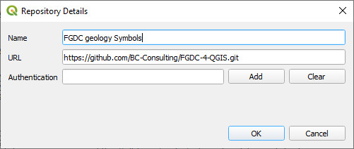

Install the pattern fills and these will then be accessible via the symbol selector > SVG > SVG Browser > Collections.

A selection of SVG geological pattern files shown in the appendix were initially sourced from `Stefan Revets' page <https://sourceforge.net/projects/qgisgeologysymbology/files/?source=navbar>`_ and modified to allow the overprint pattern to be coloured. Also see this page
https://github.com/afrigeri/geologic-symbols. An alternative location for geological SVG patterns is `here <https://github.com/BC-Consulting/FGDC-4-QGIS>`_. The NSW geological survey also supply symbols for their `state wide geological maps <https://search.geoscience.nsw.gov.au/product/9232>`_ and are based on the USGS FGDC symbols and the symbols are supplied in folders based on the FGDC documentation.

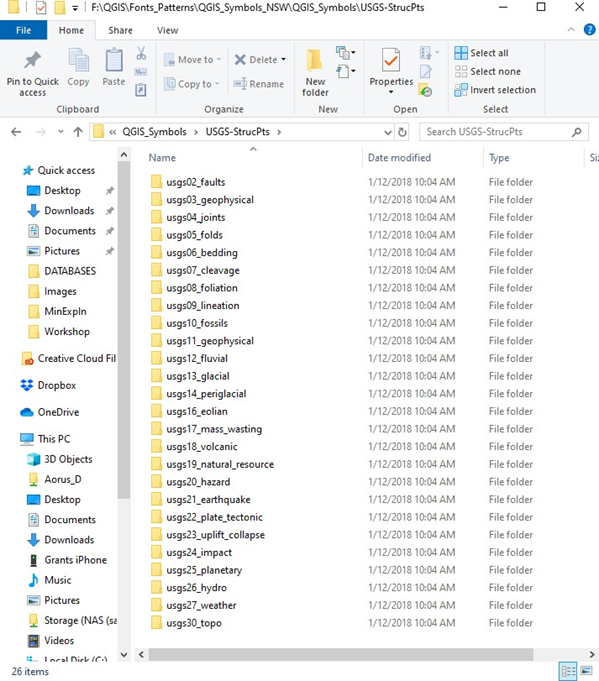

SVG files can be stored anywhere but the default location for the standalone install option is the Program folder, for example C:\\Program Files\\QGIS 3.26\\apps\\qgis\\svg. Note that if you install QGIS via the OS4Geo option, the SVG files will be located in the “C:\\OSGeo4W64\\apps\\qgis\\svg” for the long-term release version, or the “C:\\OSGeo4W64\\apps\\qgis-dev\\svg” folder for the development version. It is recommended that this folder is used for the additional geological symbol and patterns so QGIS will find these by default and you will not require to specify and additional SVG directory location. If you upgrade your version of QGIS, you may need to copy your extra SVG files back into this folder.

Alternatively, save the SVG folder to another separate folder and point QGIS to that folder using the Settings > Options > System tab.

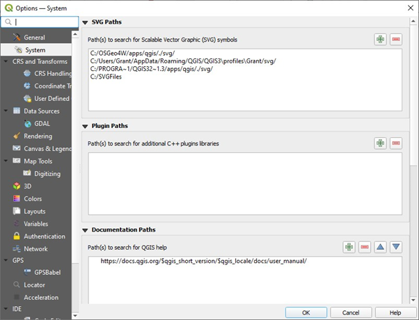

To use the geological patterns, for example, you would categorise the layer based on a geological code and then allocate each code a specific pattern fill, and background polygon layer. The image below shows the result of “Categorising” the geology and colouring each geological code type.

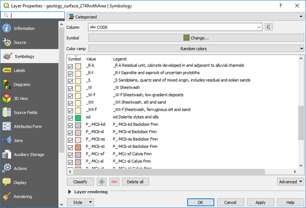
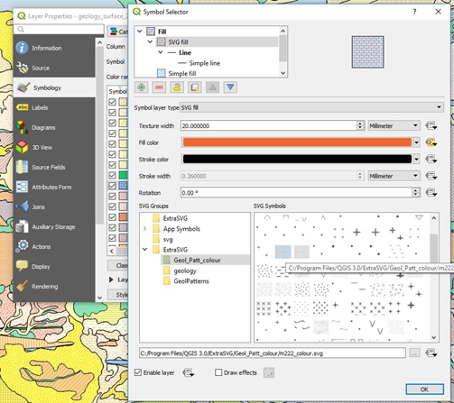

Note that you have options for size and rotation of the patterns or symbols. The SVG symbols and patterns have discrete file names which can be used to automatically assign symbols and patterns in the “Data Driven Override” of the layer properties file window.

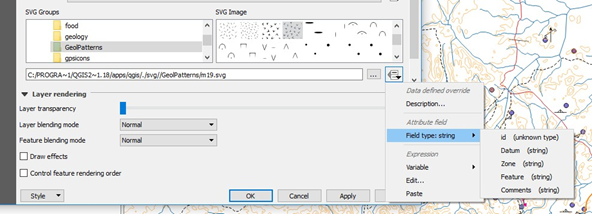

Coloured backgrounds can be added to the polygon fill by adding another layer in the Symbol Selector dialog box. Add a new symbol layer by using the green plus symbol and move it to the bottom using the down arrow key below the display box.

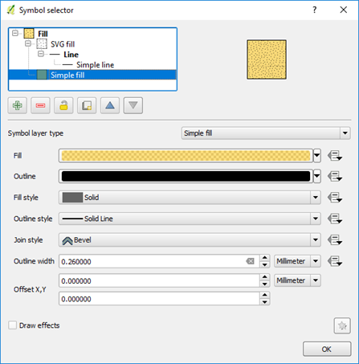

For assistance in selecting colours, go to the `“Color Brewer” website <http://colorbrewer2.org>`_ where there is a vast array of colours and their specifications available. Colour specifications can be specified in QGIS via their hex, RGB or CMYK number.

If you have favourite fill styles, these can be saved as “Favourites” which are then quickly accessible via the Symbol Selector dialog box.

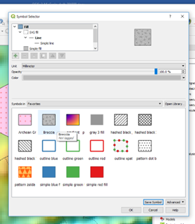

The SVG fills can also be “embedded” into the file via the “Advanced” options and this allows the files to be used by other users that may not have the relevant SVG files installed on their machines.

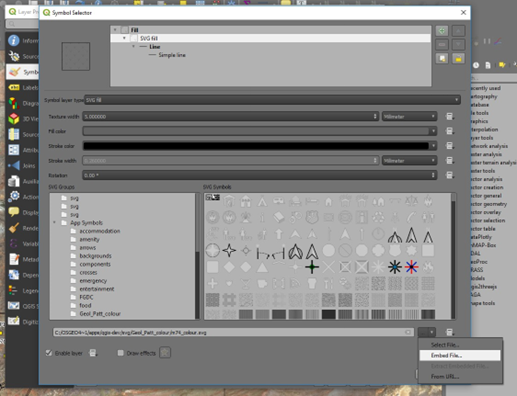
