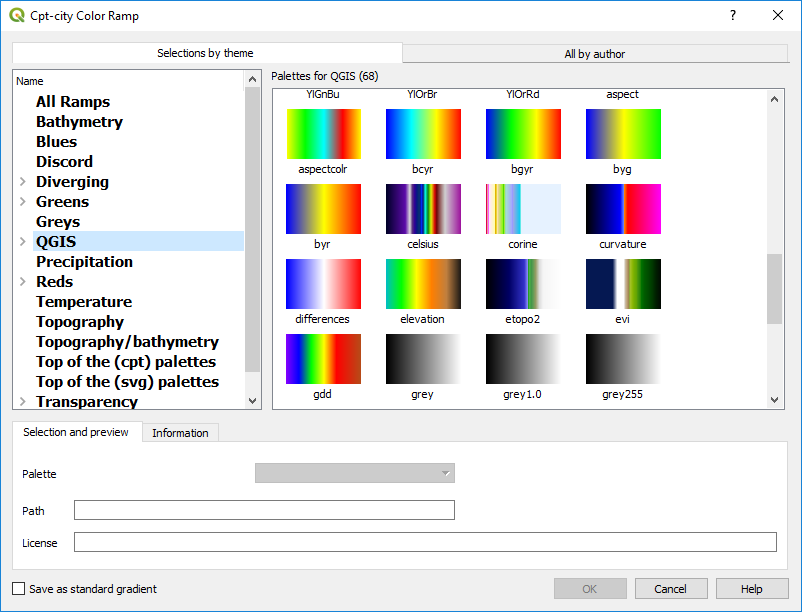
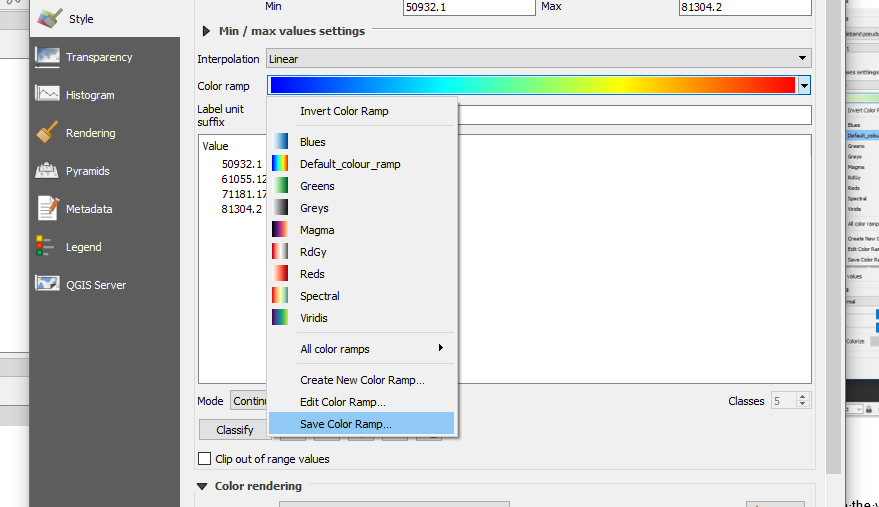
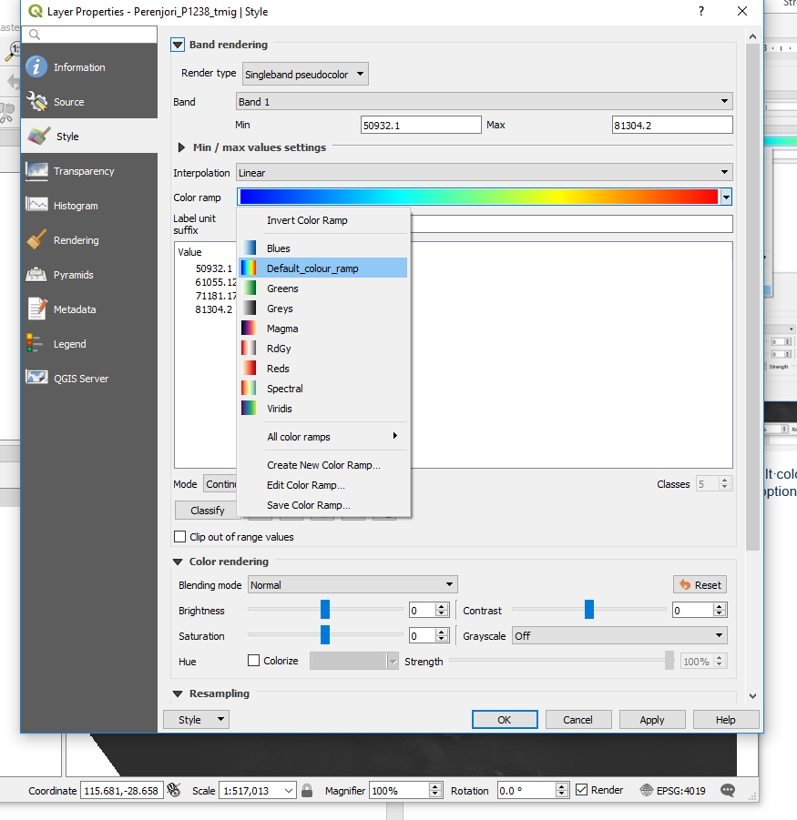
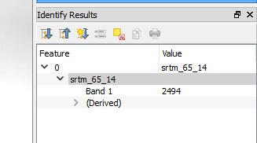
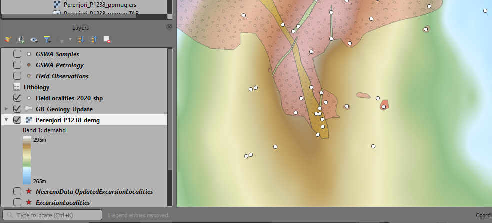
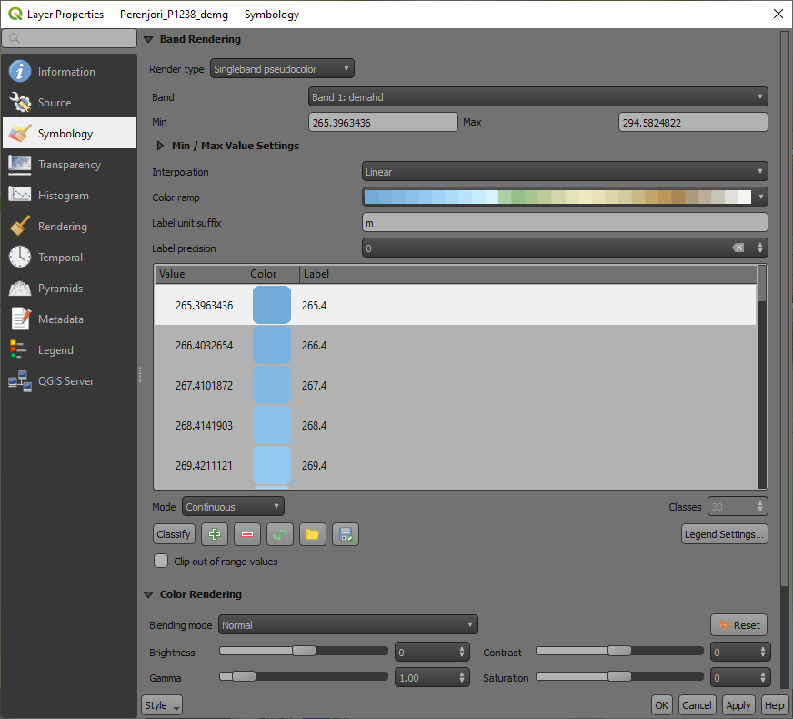
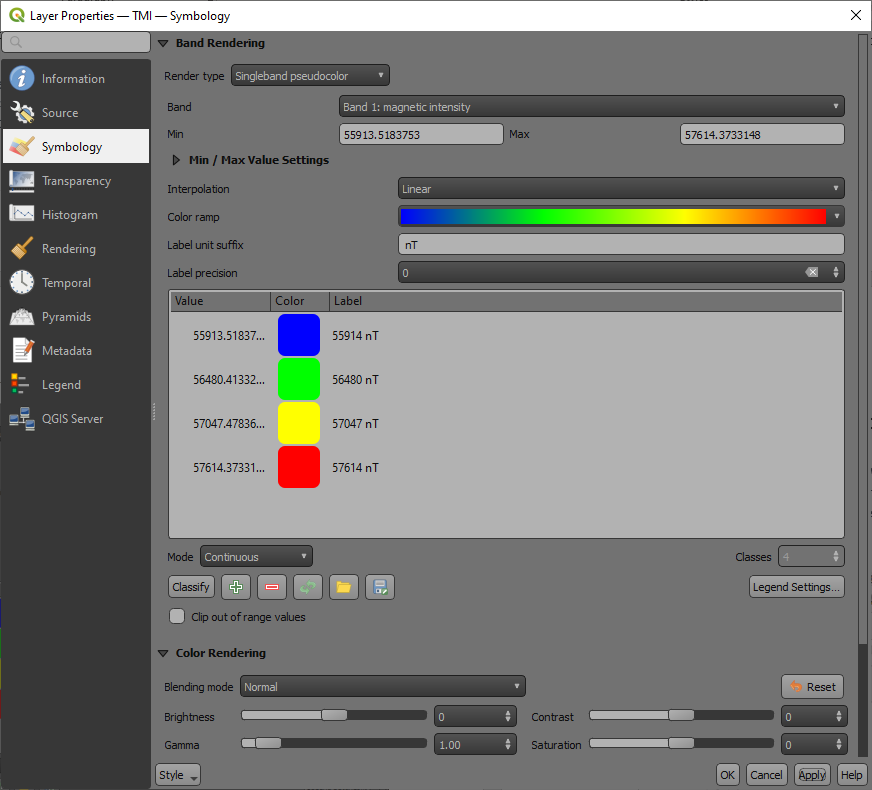
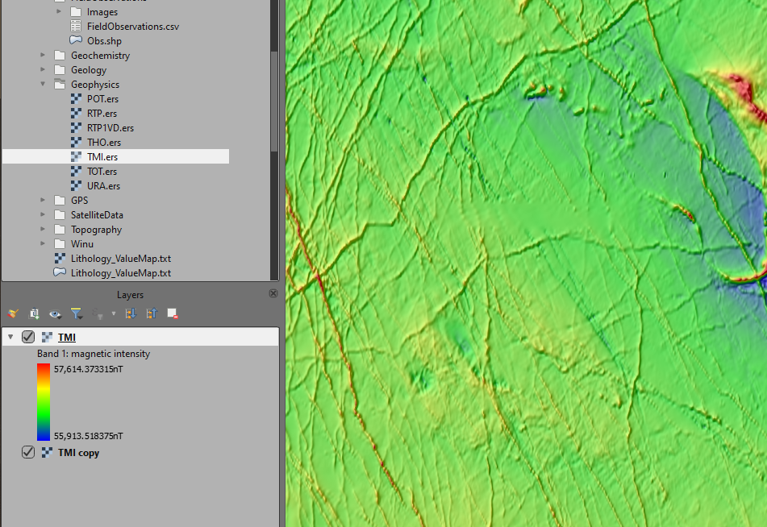

============
Colour Ramps
============

Additional colour ramps are available by clicking on the down arrow to the right of the “Color ramp” dialog box and selecting “Create New Color Ramp…”, select “Catalog: cpt-cty” from the drop-down box to display a variety of available colour ramps.

Colour ramps have also been developed by the Centre for Exploration Targeting (CET) in Perth that have better colour perception. These can be reviewed and downloaded from `here <https://peterkovesi.com/projects/colourmaps/>`_. Download the QGIS xml file and import via the Options > Style manager dialog box. My preference is to use the CET-R1 to CET-R3 ramps which are rainbow style colour ramps and they have the blue to magenta colour ranges which work well for shading magnetic images for example.

The "bcyr" is a also good option for colouring geophysical data grids. Select the “Save as standard gradient” tick box in the lower left of the dialog box, then the Save Color Ramp.

Save the color ramp with a name, e.g. default colour ramp, and “Add to favorites” so it shows up on your quick colour ramp select options.

Note that you can use the information icon to examine the values of a pixel or grid location. If the value is not displayed in the Identify panel, try minimising the left-hand side column, as sometimes the column width is too wide for the panel to display the cell value on the right-hand side.

If you open a grid file and have difficulties displaying the data, e.g. with 1VD magnetic images, zoom in to a small area of the grid and then “Stretch to Current Extent” (available as a right click on the layer name in the Layers panel) to stretch the data to something visible.

When a continuous raster layer is added to the map window, the layer panel displays the colour range.

The display of the data labels in the Layers panel and the legend can be controlled using the “Legend Settings” options in the lower right-hand side of the Symbology tab.

New in version 3.18 is to have a continuous colour bar in the Layers panel and the legend for print layouts.

In the Layer Properties > Symbology tab, select the “Legend Settings button to change the way the colour stretch is displayed and the size and orientation of the colour bar for your print layout.

  Example of continuous colour bar in the Layers panel.
