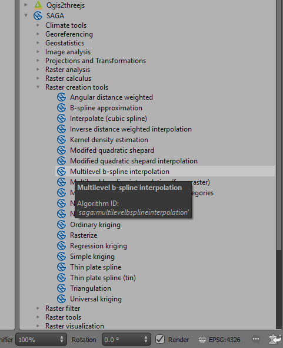

===========
Data Import
===========

Geophysical data usually comes as located data files (text) or grid files. QGIS can read many grid formats with \*.ers, and \*.tif (geotiff) files the most common, and these can be loaded by dragging the file name from the Browser Panel into the map window. Note that Geosoft (\*.grd) files cannot be read directly by QGIS. The SGTool plug-in developed by Mark Jessell at the Centre for Exploration Targeting at the University of Western Australia can be used for importing geosoft grids and various geophysical processing algorithms, such as filtering and reduction to pole. Note that some raster image files have to be opened via the Data Source manager > Raster options, e.g., BIL files.

When opening located data text files, remember that shapefiles can only have field names up to 10 characters in length. If your text files have longer field names, then it is suggested you use a free text editor like `Notepad++ <https://notepad-plus-plus.org/>`_ or `ATOM <https://atom.io>`_, for large files) to modify the field names.

Alternatively, after you have imported the located data, you can save it as a GeoPackage file which does not have the 10-character field length restriction.

There are numerous methods to create grids of located data. I typically remove the tie lines by using a filter based on the Line number before I create the grid. One method I have found useful is to use the SAGA > Raster creation tools and use the “Multilevel b-spline interpolation” option.

Grid files are treated as raster files and are usually displayed as greyscale by default. To change the display, open the layer properties dialog and select “Style”. A variety of options are available including changing the colour ramps, colour stretch and display value limits. For a coloured image, use the Render Type > “Singleband Pseudocolour” option.

You may also want to create a polygon file as an outline of the area to be gridded. This can then be used to clip the grid to the data.

