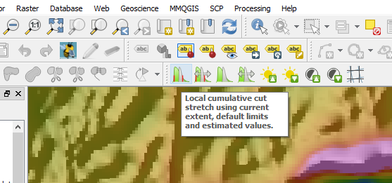
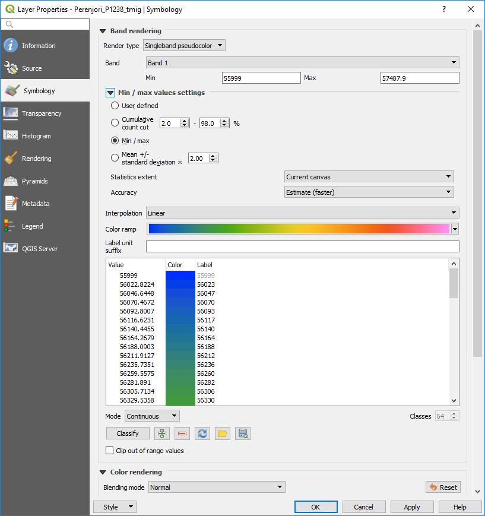

===================
Custom Data Stretch
===================

The Raster toolbar has a collection of basic display options to change how the image is displayed.

Images can be stretched to the entire image or window extent. See the mouse over for how these icons work.

Display settings can also be selected in the Symbology tab of the Layer Properties.

