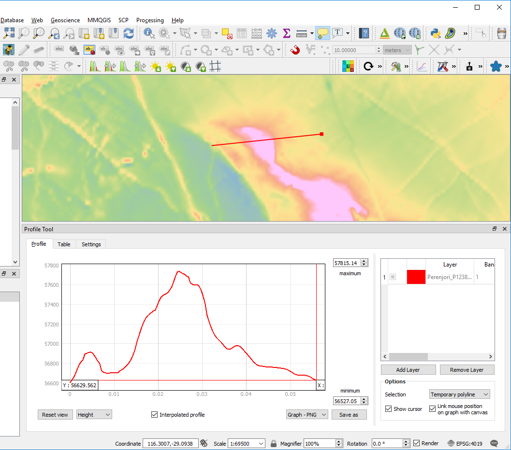

======================
Profiling Gridded Data
======================

To obtain a profile across any gridded data, use the “Profile” plugin. Open the Profile plugin (usually on the menu bar) and use the “Add Layer” button to add the layer from where you want the values extracted. Draw a line using one click to start and a double click to complete the line.

The resulting profile values can by copied to the clipboard (under the Table tab) for use in programs like Excel.

