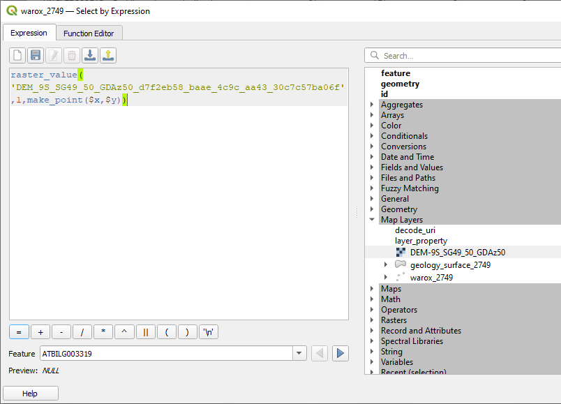
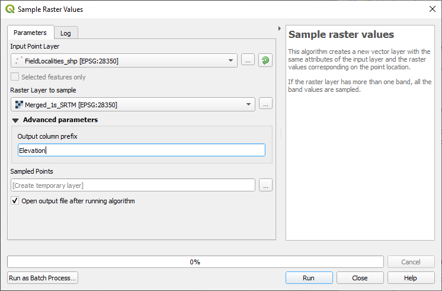
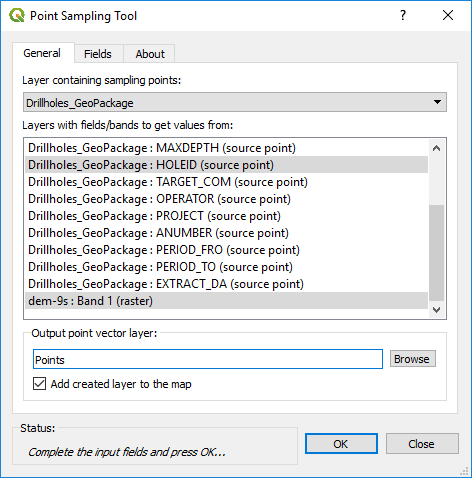

=================================
Extracting Point Data from a GRID
=================================

If you need to extract a value from a grid (raster) file e.g., drill hole collar elevations from a DEM, there are at least two options.

The first option is to use an expression in the layer expression editor dialog to populate the desired field (for example using the create new field in the attribute table) as follows;

Raster_value('dem layer',band,make_point($x,$y)) This expression looks at the dem layer or grid name, the band in the grid with the data to be extracted, and creates a point.

The other method is to use the “Sample Raster Values” algorithm or the “Point Sampling Tool” plug-in.

To find point values in a raster grid, use the Processing Toolbox > Raster Analysis > Sample Raster Values algorithm. This creates a new layer which can then be used to overwrite the original layer with the new values.

The Point Sampling plug-in tool can also be used to sample points in a grid, e.g. drill hole collar elevations using a digital elevation grid. The output creates a separate file with the resulting values. The point and grid layers need to be in the same projection. The tool is found under the Plugin > Analysis > Point Sampling Tool.

Select the layer containing the points to be used for the data extraction (drill holes), then select the fields to be exported with the points (Hole number), and then select the layer with the elevation data (e.g. dem-9s:Band 1). This will then create a file with hole number and elevation. This will then need to be joined to the drill collar file for example. I find it quicker to use the v.what.rast algorithm above, as this automatically undated the data field.
