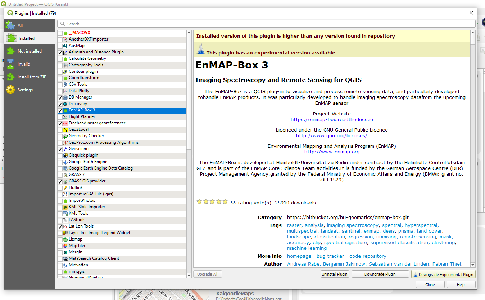
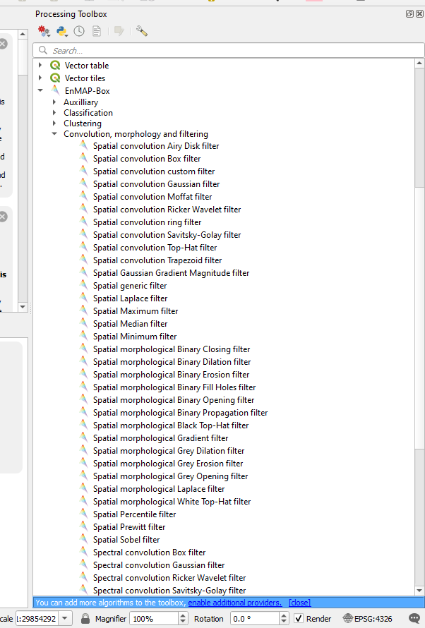

=====================================
First and Second Vertical Derivatives
=====================================

First vertical derivative images can be created using the EnMap Box plugin and can be downloaded from `this link <https://www.enmap.org/data_tools/enmapbox>`_. This plugin has been designed to cater for a new satellite that was launched in 2022 and has a large variety of tools for remote sensing data including filtering.

When the plugin is installed it puts and additional link in the Processing Toolbox.

The Spatial Prewitt filter creates a first vertical derivative (1vd) image, the Spatial Laplace filter creates a second vertical derivative (2vd) image and the Spatial Gaussian Gradient Magnitude filter creates a type of analytical signal image.

Clipping of the resultant images may be required and set the background with no data to zero or -99999 so it can be set to transparent.

Note also when creating images for use in MapInfo, create ERMapper ers grid files.
