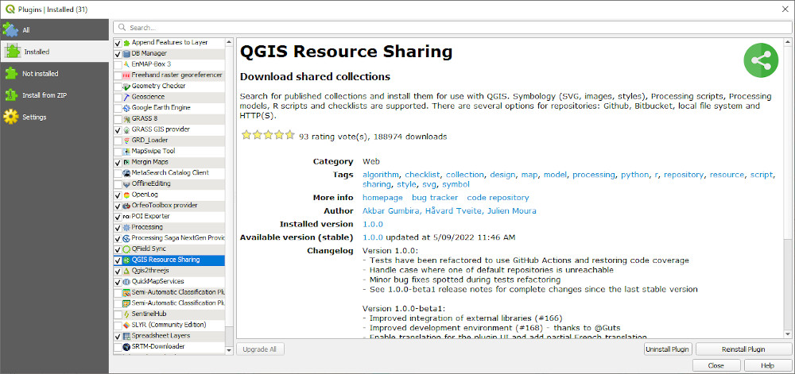
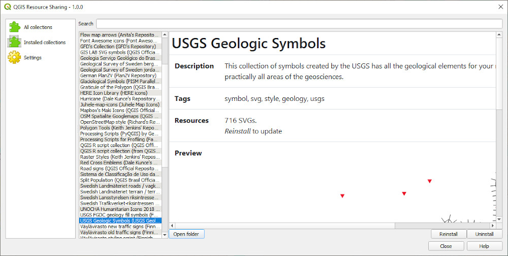
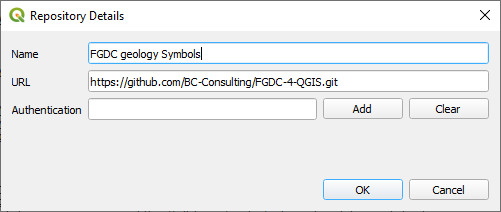

=========================================================
Downloading and Using the USGS Symbols and Pattern Fills
=========================================================

The USGS symbols and patterns can be downloaded from various locations on the internet but the easiest way is via the QGIS Resource Repository plug-in.

Enable the plug-in and then search for the USGS symbols under the ALL tab.

Install the symbols and these will then be accessible via the symbol selector > SVG > SVG Browser > Collections.

To install the USGS pattern fills, we need to add a new repository to the Resource Sharing plug-in.

Install the pattern fills and these will then be accessible via the symbol selector > SVG > SVG Browser > Collections.

