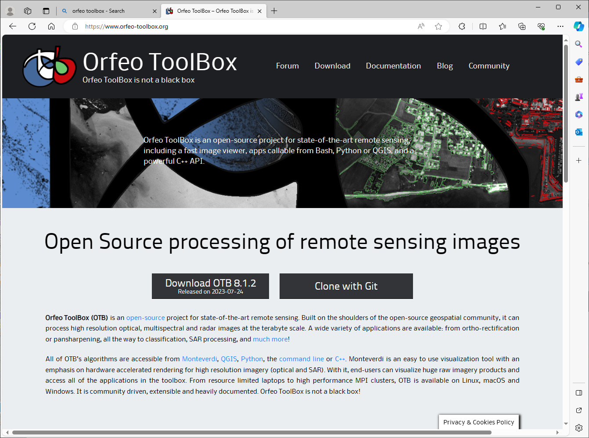
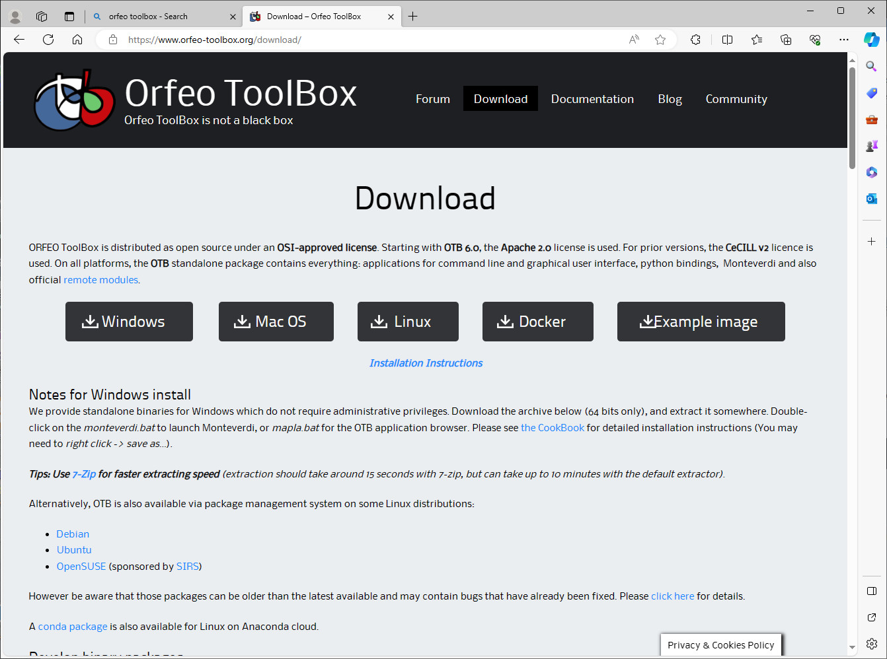
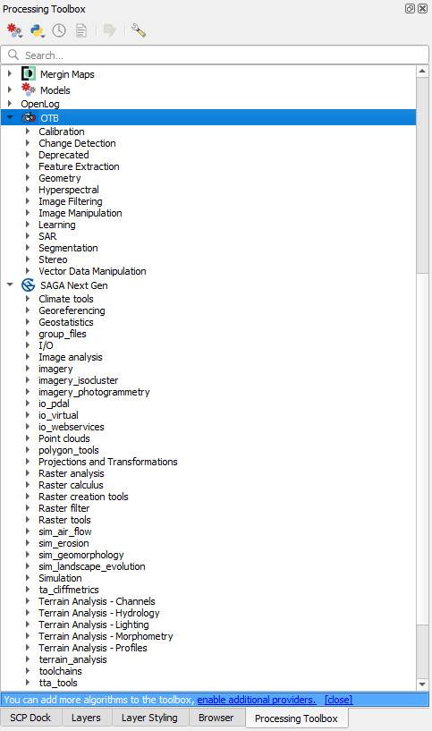

==========================
Enabling the Orfeo Toolbox
==========================

To install the Orfeo Toolbox, we have to download the binaries from https://www.orfeo-toolbox.org/download/.

Extract the files to a folder on your local machine. This example has put the folder into the C drive root directory in a folder called “OTB-8.1.2-Win64”. Next back in QGIS, open the Processing Toolbox and select the spanner (Settings) icon and enter the location of the OTB folder. You need to click in the right hand side to make the browse buttons appear.
The “OTB Applications folder” is located in the OTB xxxxx > lib > otb > applications, and the OTB folder points to the upper level OTB folder.

.. image:: img/OTB_3.jpg
  :align: center

The algoritms then become available in the Processing Toolbox.

