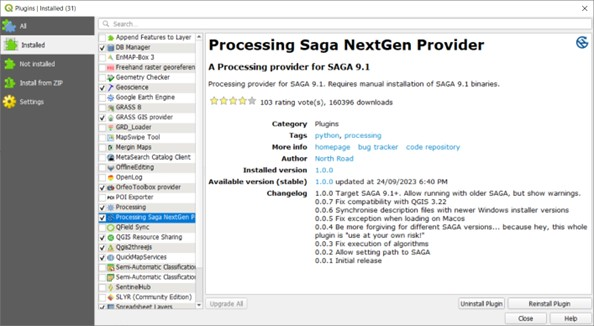
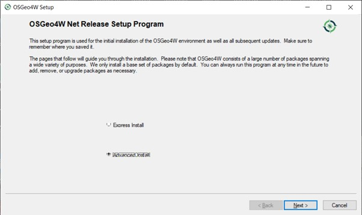
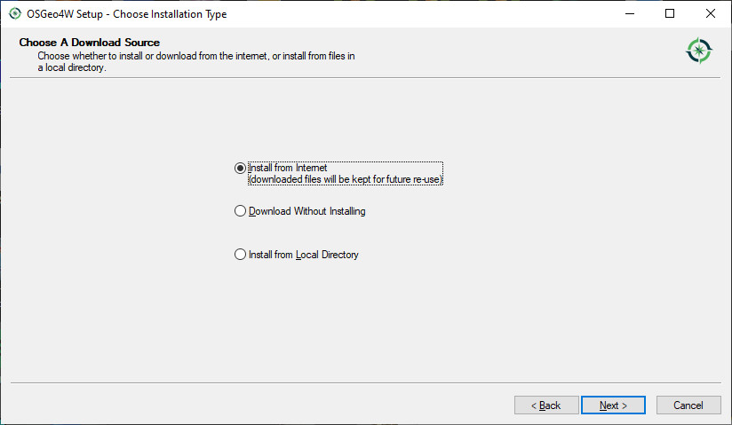
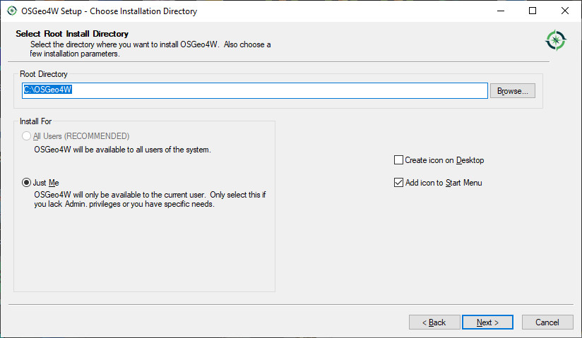
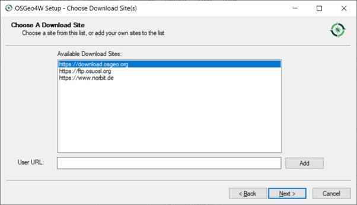
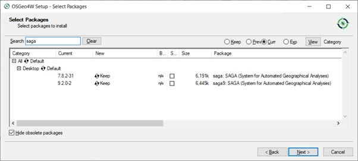
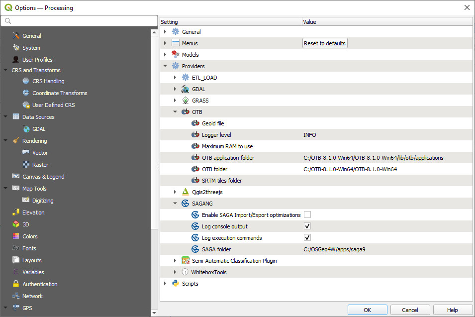

=====================================
Installing the SAGA Next Gen Provider
=====================================

Using the new SAGA Next Gen algorithms requires the installation of additional binary files. To install the SAGA Next Gen, go to the plug-ins manager and select the “Processing Saga Next Gen Provider”.

Note that the dialog box indicates that you need to manually install the “SAGA 9.1 binaries” To do this, run the “SetUp” program that was installed with your version of QGIS. This will be either on your desktop or found under the Windows > QGIS x.xx folder.

Click through a few screens.

In the screen below, type in “saga” in the search box. You may need to expand the “Desktop” folder.

To enable the SAGA Next Gen algorithms enter the location of the SAGA version 9 folder.

You may need to re-start QGIS to see the new SAGA Next Gen algorithms appear in your Processing Toolbox.
