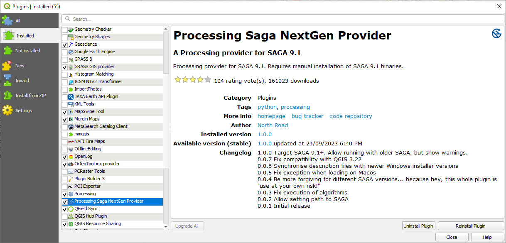
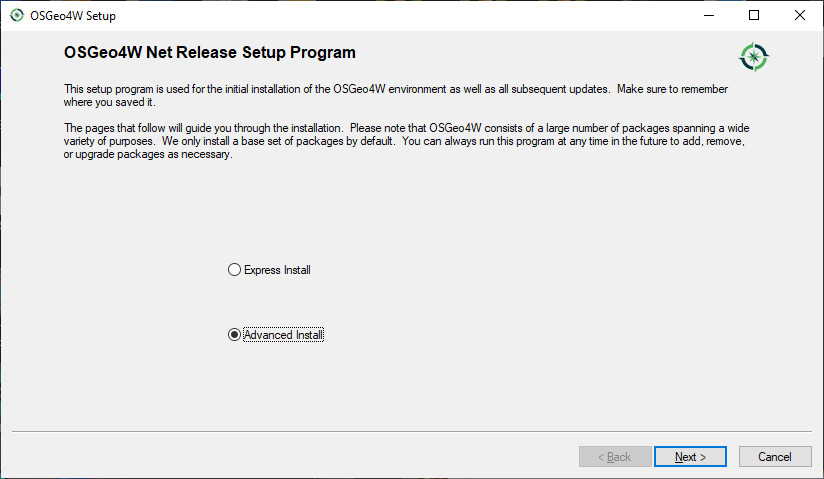
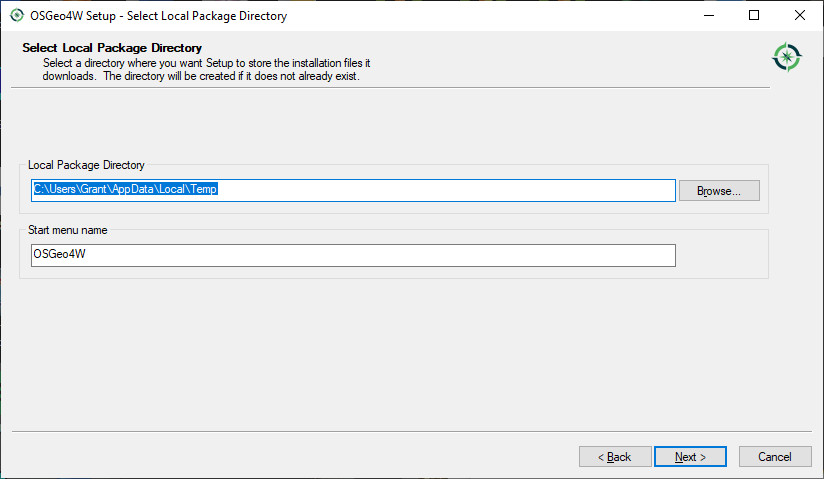
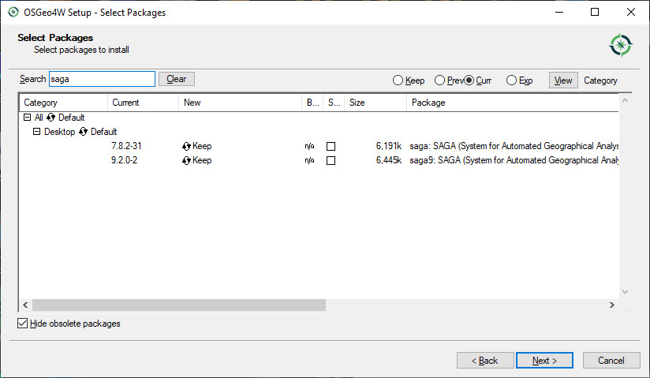

=====================================
Installing the SAGA Next Gen Provider
=====================================

Using the new SAGA Next Gen algorithms requires enabling the "SAGA Next Gen provider" in the Plug-Ins manager and checking to see if the saga9 binary files have already been installed.

To enable the SAGA Next Gen plug-in, go to the plug-ins manager and select the “Processing Saga Next Gen Provider”. Note that the dialog box indicates that you need to manually install the “SAGA 9.1 binaries”.

Next, check if the saga9 binaries are installed in your QGIS installation by looking in the "apps" folder of your QGIS installation, either in C:\\Program Files\\QGIS vx.x\\apps or in C:\\OSGeo4W\\apps. If this directory is present then you are good to go. Otherwise continue below.

To install the saga9 binaries we need to run the “SetUp” program that was installed with your version of QGIS. This will be either on your desktop or found under the Windows > QGIS x.xx folder.

Click through a few screens.

In the screen below, type in “saga” in the search box. You may need to expand the “Desktop” folder.

To enable the SAGA Next Gen algorithms enter the location of the SAGA version 9 folder.

Note this may upgrade your QGIS installation. The appearance of the SAGA tools in the Processing Toolbox may take a couple of minutes to load. You may also need to re-start QGIS if the new SAGA Next Gen algorithms do not appear in your Processing Toolbox.
