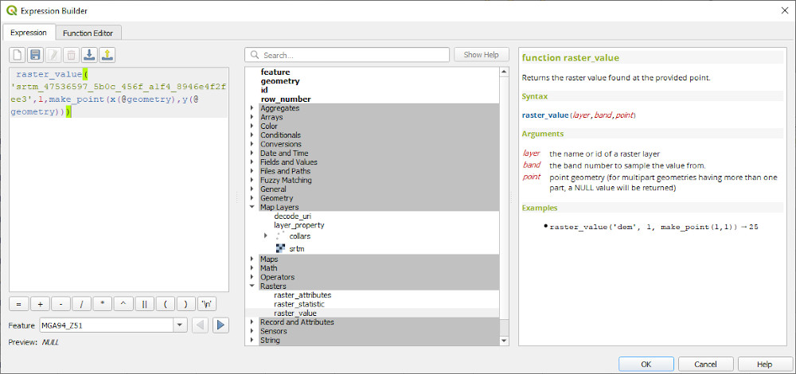

==============================
Set Drill Collar RL from a DTM
==============================

This is one way to populate your drill hole collar file using the values in a digital terrain model of the area.

Ensure your DTM is in the projection of the collar file - reproject if necessary from geographic (Lat/Long) to UTM metres.

You can create a new field or update and existing field - but make sure you have a back-up in case you make an error!

In QGIS, open up your collars table and DTM file (must be a grid not an image). Open the attribute table for the collar file and enable editing. Select the add new field icon and add a new field and set the type to decimal. Then select the new field from the drop down field list and enter in the following into the expression editor.

``raster_value('DTM layer', 1, make_point(x(@geometry), y(@geometry)))``

Run update all.

The new field should now be populated with new vales extracted from the DTM.
