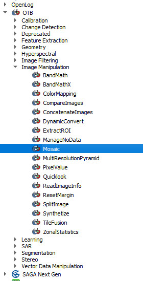
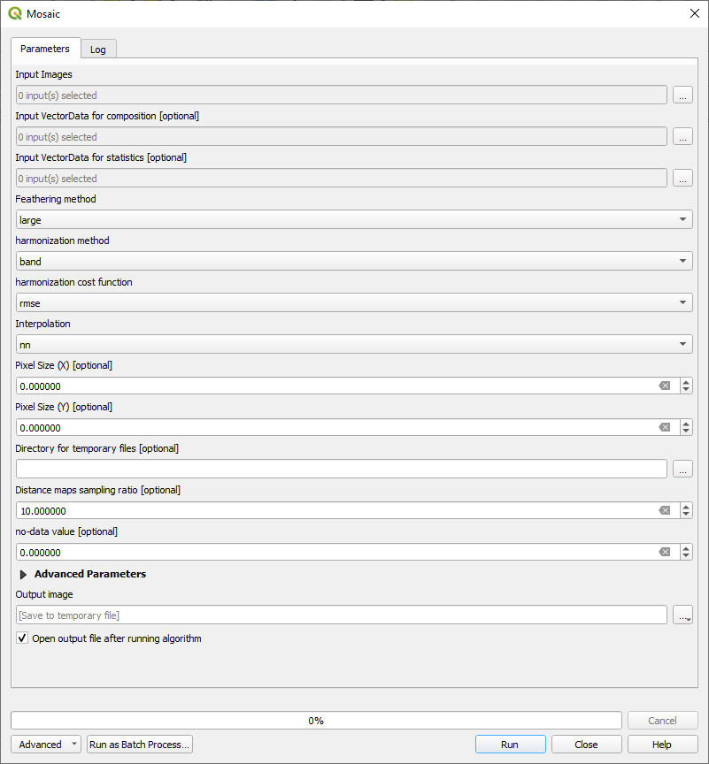

============================================
How to Merge Adjacent Satellite Image Scenes
============================================

When merging adjacent satellite scenes, it is sometime difficult to remove the join lines between images. The best way to solve this is to use the Ofeo Toolbox - installed by defaults but not enabled by default.

The settings may need to be adjusted, but initially try the following settings,

select your input files
feathering method - Large
harmonisation method - band
harmonisation cost function - rmse
interpolation - nn

