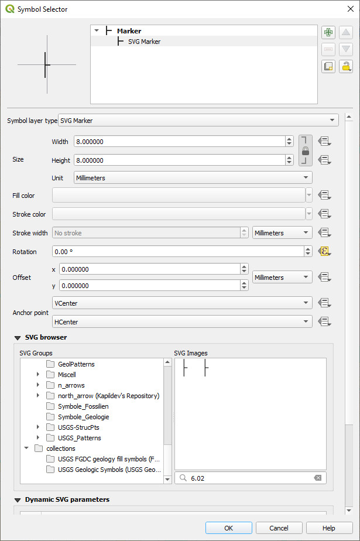

===============================
Plot oriented structure symbols
===============================

The aim here is to rotate the relevant symbol to represent the orientation of the structure.

The simplest way to do this is to have rotation amount in a data field in your layer, e.g. strike or dip direction, and tell QGIS via the data driven override widget to rotate the symbol by the amount in that rotaion field of your layer. Check that the rotation is correct.

Open the symbol selector dialog by clicking on the structure symbol and then set its symbol.

Select the data driven override widget next to the rotation box and set the field that contains the rotation amount.

  . image:: img/structure_symbols_rotation.jpg
  :align: center

Check that the symbols are correctly oriented.

  . image:: img/structure_symbols_map.jpg
  :align: center

Make sure you know the initial orientation of the symbol, as you might need to subtract 90 degrees for example to get the correct orientation.

``Dip_Direction - 90``
