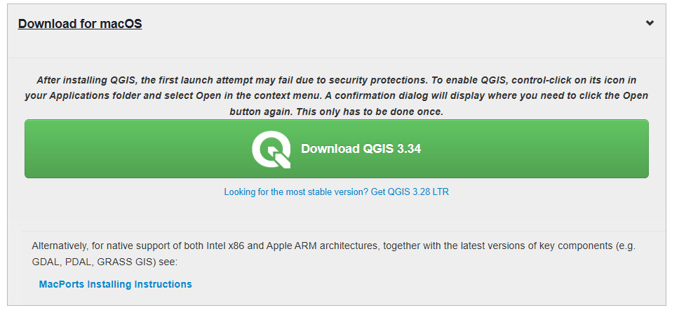

================
Mac Installation
================

Installation on a Mac is different than for a PC and it is recommended to download and install QGIS from the QGIS download window.

Install the LTR or the Latest Release version.

To install the custom (geological) SVG files on a Mac, in QGIS, go to Settings > Options > System tab and look for the location of the svg files - something like /Applications/QGIS3.app/Contents/MacOS/../Resources/svg/. Use the Finder to navigate to the Applications folder, then right click on the QGIS program icon, select “Show Package Contents”, open the “Contents” folder and the “Resources” folder. Put the custom (geological) SVG folders into the SVG folder.
