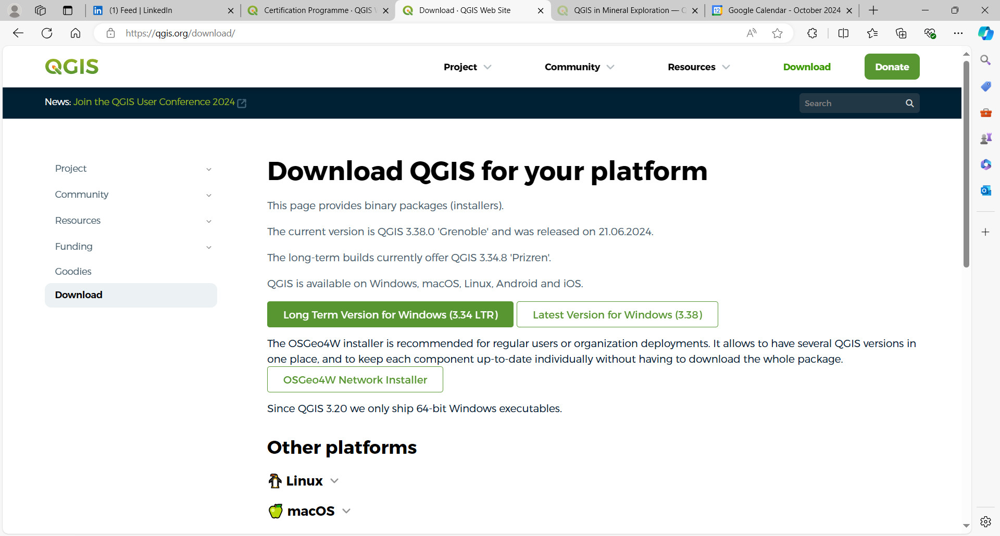

===============
PC Installation
===============

The QGIS program can be downloaded from the `QGIS Project website <http://www.qgis.org>`_ and a choice can be made between various 64 bit versions of the recent release and long term release versions.

There are two options for installing QGIS; one is called the "Standalone" installer and the other is the "Network" installer. The Standalone Installer will install the program into the Program Files folder on your C: drive and new versions will be installed into new folders. This may result in numerous QGIS versions in different folders. The Network installer installs a small execuable program (osgeo4w-setup.exe) into your downloads folder and when run, installs QGIS into the root directory of your C: drive (C:/OSGeo4W). The executable file can be run at any time to check for software updates and will update the files in the QGIS installation and not create new folders.

Note that all your user settings, plug-ins etc, are saved into your user profile in the C:/User folder, not the program folder or OSGeo4W folders. These will not be overwritten by a new QGIS version install.

The installer (“Download QGIS 3.34”) will install the program into the program files folder and create a folder on your desktop with shortcuts to the run the program. When you run the OSGeo4W Network Installer option you will see the following screen shot. For a first-time installation, choose the “Express Desktop Install” which will install the basic programs and required utility files.

After the initial “Express Desktop Install”, this window will be different and you can then check for updates by running the “osgeo4w-setup.exe” file again (usually located in the Downloads folder) where you can then select “Advanced Install” and select which products you wish to update. The OSGeo4W option can be used instead of the Standalone Installer option.

.. image:: img/osgeo4w_dialog.png
  :align: center

The select packages window (above) indicates there is an update for v 3.9.0-12 to v 3.9.0-15 in the QGIS development version (old versions by way of illustration only!).

User manual and training documents can be viewed, or pdf versions downloaded from the `QGIS web site <https://qgis.org/resources/hub/`_.

The QGIS desktop is similar to other GIS applications with menu items along the top and numerous buttons/icons to make it easier to select various options without having to navigate menus. All the menu items and panels are customisable to user preferences. QGIS has operations to import vector and raster data from a variety of formats into QGIS, with excellent editing and analysis tools from the integration of other GIS systems such as GRASS and SAGA. Some of these tools are illustrated in the right-hand panel of the figure above.

If you need to reset the QGIS window and/or panel locations, go to Settings > Options > System tab, select the Reset button (right hand side of screen) and re-start QGIS.

The appearance of the desktop can also be changed by using the Settings > Options > General tab and in the Application section find the “UI Theme” where the appearance of the desktop can be modified. A recent addition here is the “Blend of Grey” option.
