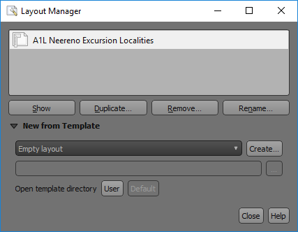

==============
Layout Manager
==============

The layout manager shows what layouts are attached to the project. You can have many layouts of different sizes and configurations all saved with the project. If you have a set layout where you need different themes on maps, you can use the duplicate button to make a copy of the layout. Note that you need to “lock” layers in a layout to prevent a refresh from re-drawing the layout display.

