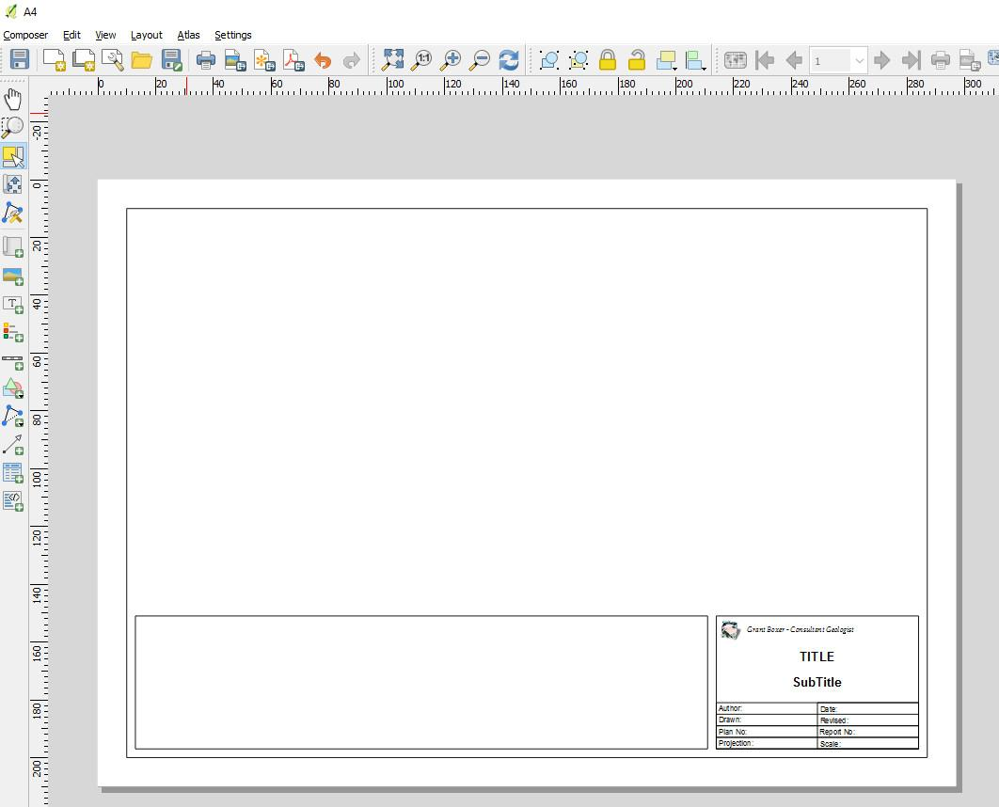
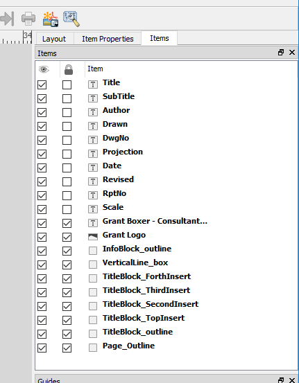
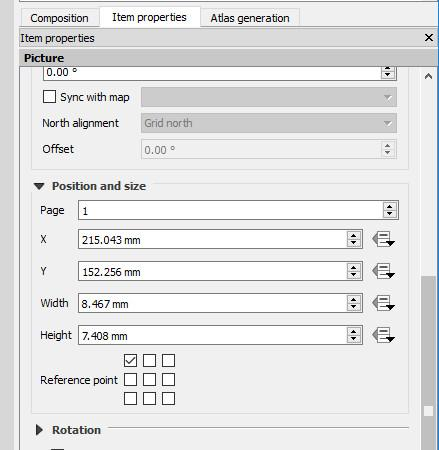
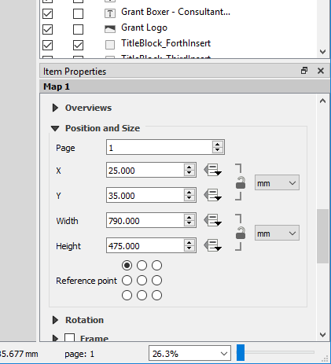
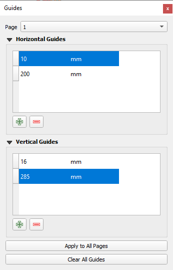

=============
Map Templates
=============

Templates can be constructed for use with a variety of map sheets sizes, e.g. A4, A3, A2, A1 and A0 in either landscape or portrait orientation. Frames and title blocks are simply constructed as rectangles and standard text boxes added into the rectangles. Shapes and text boxes are selected from along the left-hand side margin of the map composer window. The figure below illustrates an example of a template complete with title block. Templates can be dragged into the print layout window from the Browser panel, which will then automatically set the correct page size.

Each item of the template is listed in the Item panel and can be turned on or off and edited. Note that the position of the features can be set and adjusted using the “Position and Size” options in the item properties dialog box. Each item, e.g. page frame, insert box, logo, etc., has its own item properties and these can be varied independently.

The image above shows all the items that map up the map frame.

The example above is the “Logo” item (diamond image on the layout) and its location is referenced to the top left-hand corner of the page as shown in the 3 x 3 box array. It is located 215 mm to the right and 152 mm below the top left hand corner of the page, with a width of 8 mm and a height of 7 mm.

Each text box has a location and is edited as required in the Label > Main Properties window. The image below shows the “Author” field selected and the details can then be added to the existing text, or changed as required. If the text boxes require adjustment, use the position and size options attached to the item.

Note that these templates may require adjustments for different printers and plotters depending on their “print area”.

The position and size of the inserted map window can be adjusted under the “Map” item properties and using the “Position and Size” options. The reference point in the figure below shows the measurements from the top LHS of the page.

To insert a map of fixed/pre-determined size, in the Print Layout, select the View > Manage Guides and set the horizontal and vertical guidelines. The inserted map windows can then be adjusted to fit these guidelines. Grids can also be used to align map items.

