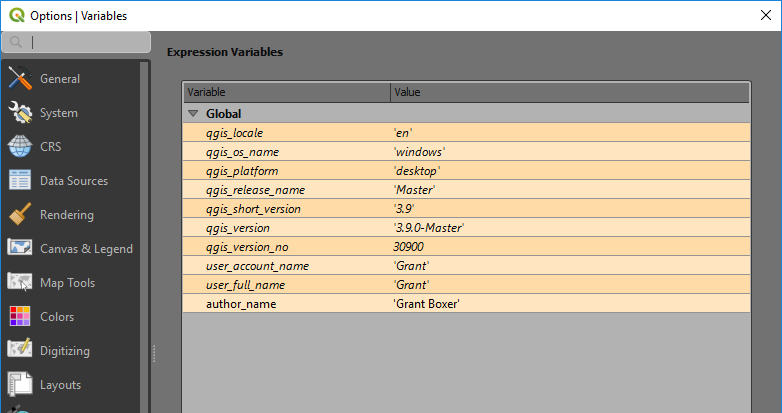
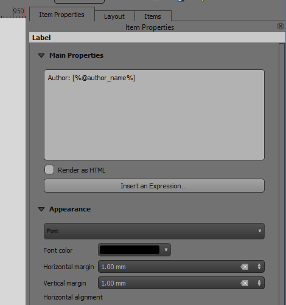
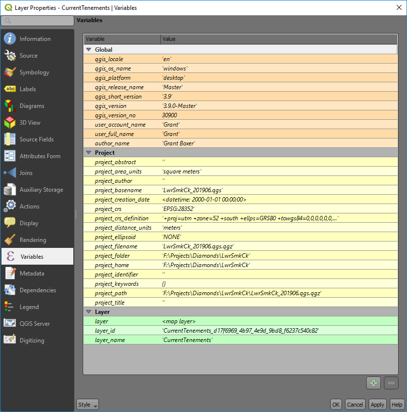

======================================
Using Variables to Display Information
======================================

Variables can be used to populate information in text boxes, e.g. the map author's name, QGIS version, or the file path to the Project file. There are various types of variable and they can be applied globally, for a specific project or layout.

Global variables apply to QGIS overall and they can be found in the main menu item Settings > Options and the Variable tab.

A number of default global variables are added by QGIS. Note that I have added a new variable name “author_name” with its value being Grant Boxer. I can then use this variable to add my name anywhere on a layout by using the [%@author_name%] statement.

There are similar windows for the Project Properties and Layer Properties.

