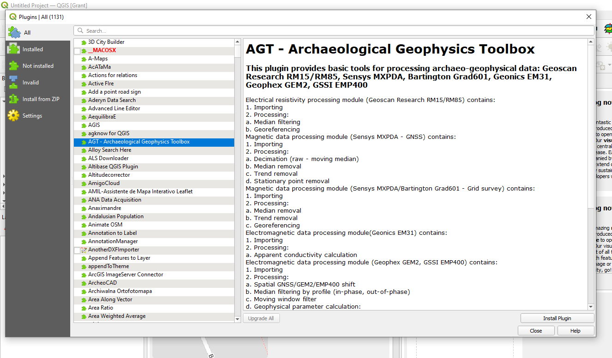
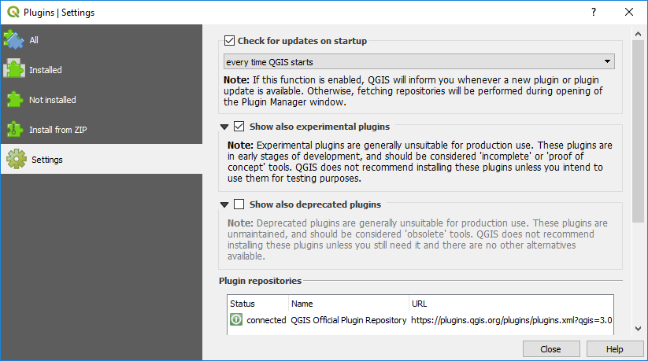

.. _plugins:

=======
Plugins
=======

Plugins are small utility programs that greatly expand the capabilities of QGIS. There are currently over 1100 plugins available for download. These plugins are all free and have usually been written to solve a specific problem or task for users. It is recommended that users peruse the plugins list to see what plugins might be applicable to their workflow.

Ten "core" plugins are installed by default in version 3.34, listed below.

- DB Manager
- Geometry Checker
- GRASS8
- GRASS GIS provider
- MetaSearch Catalog Client
- Offline Editing
- OrfeoToolbox provider
- Processing
- Topology Checker

To use these pre-installed plugins, you may need to “enable” them in the Plugins > Manage and Install Plugins > Installed window. Enable the plugin by selecting the check box next to the plugin.

Additional plugins that are recommended are as follows;

- Data Plotly (graphing of data)
- Geoscience (for plotting drill holes on plans and sections)
- QuickMapServices (add additional services under the extra services option)
- QGIS2Threejs (3D viewer)
- Semi-Automatic Classification (satellite data selection and processing)
- Shape Tools (creation of numerous types of vector objects)
- Spreadsheet Layers (used to import Excel spreadsheets)
- SRTM Downloader (for accessing SRTM elevation data)

If the QGIS start-up is being significantly delayed during start-up (saying “Loading Plugins”) then they can be temporarily disabled by going to the Plugin Manager and un-tick those that are not needed or infrequently used. They can be turned on when needed.

In the Plugins > Settings page, check the “Check for updates on start-up” and “Show also experimental plugins”. This will then alert the user to updates of existing plugins and the release of new plugins whenever QGIS is started. Note that when you first open the Plugins manager, you may see a “New” tab to show you what new plugins have been released since you last opened the Plugin Manager. If you are working off-line with no internet, turn-off the “check for updates on start-up” to skip the web search and update function.

Some managed IT systems block the loading of the Plugin's repository data. If this happens, try selecting the Settings > Options > Network, and check the “use proxy server”. Try again to download the repository. If this loads the repositories, then uncheck this box and try again to install the plugins.

Network managers may also restrict the installation of plugins. If you have problems, contact your network manager.
