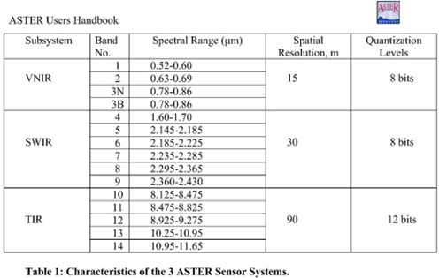
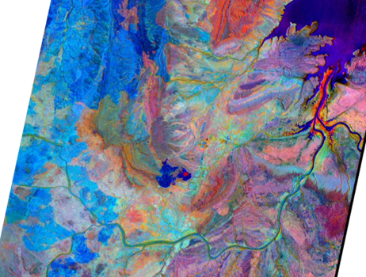
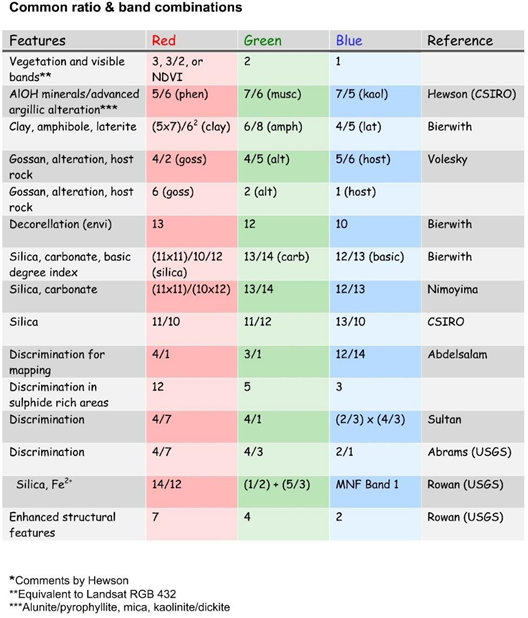
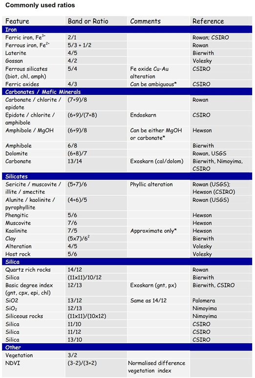

==========
ASTER Data
==========

Details of the ASTER (Advance Spaceborne Thermal Emission and Reflection Radiometer) scanner bands are shown in the figure below (from Abrams and Hook 2016).

.. hint:: ASTER data is now freely available worldwide but note that the SWIR sensor (bands 4 to 9) became inoperable on 1st April 2008, and therefore only data acquired before this time will be suitable for mineral mapping.

An example of ASTER band combinations using ratio 4/7 (red), 4/3 (green) and 2/1 (blue) around the Argyle mine area.

ASTER bands and band ratios for geological applications are shown in the tables below (from ASTERDataProcessing_GA7833.pdf available from Geoscience Australia).

Band ratios are easily calculated in the SCP plug-in. My personal experience for using the ASTER data in Western Australia and Peru, is that the discrimination ratios using ratio 4/7 (red), 4/3 (green) and 2/1 (blue) works well in most situations. The AlOH minerals/Advanced argillic alteration combination and the Alunite-Kaolinite-Pyrophyllite image also works well for detecting alteration associated with porphyry copper mineralisation.

| **Other possibly useful ASTER band calculations and combinations are listed below.**
|   - Abrams Ratio - 5/7, 4/5 and 3/1 in RGB
|   - Sabin Ration - 5/7, 3/1 and 3/5 in RGB
|   - Porphyry Alteration Index - 4, 6 and 8 and RGB (advanced argillic and phyllic alteration in pink to red colours)
|   - Alunite and kaolinite enhanced by 4/5 or 4/6
|   - Sericite - phyllic alteration enhanced by 5/6
|   - Propylitic alteration enhanced by 5/8

| Mineral Indices of Ninomiya (2004)
|    - OH Minerals Index - (Band 7/ Band 6) * (Band 4/Band 6)
|    - Kaolinite Index - 4/5 * 8/6
|    - Alunite Index - 7/5 * 7/8
|    - Calcite Index - 6/8 * 9/8

.. note:: Remember the resulting images may have artefacts caused by low sun angles, clouds, etc. so be cautious in using the data. Remote sensing vendors can undertake more advanced processing and interpretation of this data, and the rough processing described herein should be used with caution.
